# 실습용 Virtual Machine에 연결하기
## 1. Windows에서 remote desktop 연결 
원격 데스크톱 연결화면에서 다음의 정보를 입력하고 연결 버튼을 클릭합니다.  
 
 컴퓨터 : 할당받은 VM IP  
 사용자 이름 : user01  
 [v] 자격 증명 저장 허용  

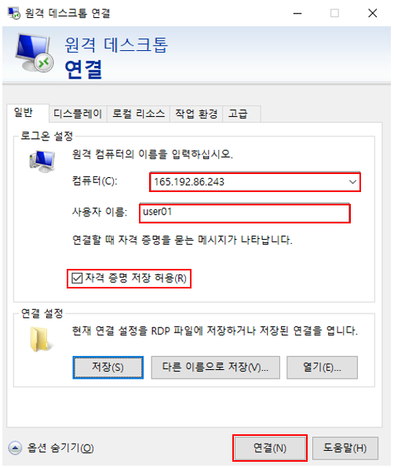

이 컴퓨터로의 연결을 다시 묻지 않음을 선택[v]하고 예(Y) 버튼을 클릭합니다.  

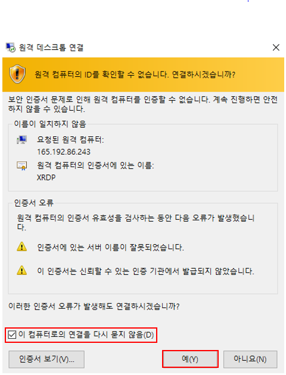

VM 로그인 정보의 비밀번호를 입력하고 확인 버튼을 클릭합니다.  

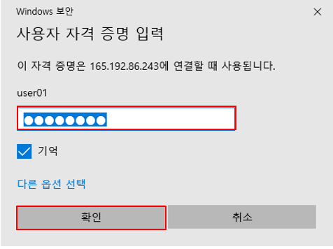

xrdp 화면에서 VM의 비밀번호를 입력하고 OK버튼을 클릭합니다.  

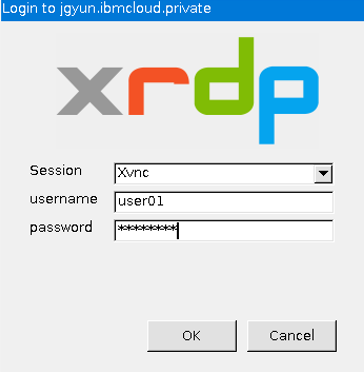

## 2. 맥북에서 remote desktop 연결

다음의 [remote desktop app 설치](https://apps.apple.com/kr/app/windows-app/id1295203466?mt=12)를 클릭하여 remote desktop app을 설치합니다.  

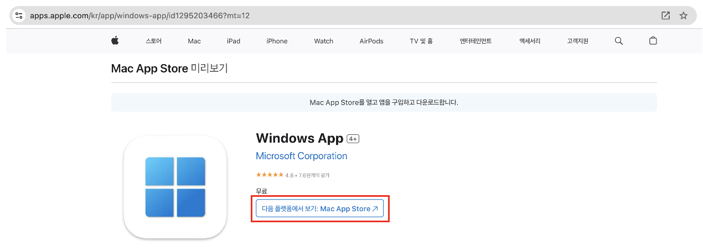

[**참고**] Mac에서 기존에 사용되던 "Remote Desktop Application"이 "Windows App"으로 변경되었음 .

remote desktop app 링크를 클릭하면 다음과 같이 **open app store** 팝업화면이 나타나면, **Open App Store** 를 선택합니다.  
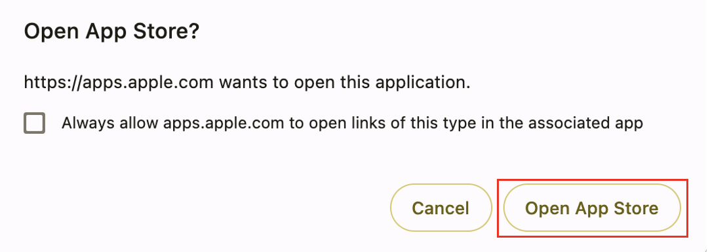

device 목록 화면이 보입니다. 
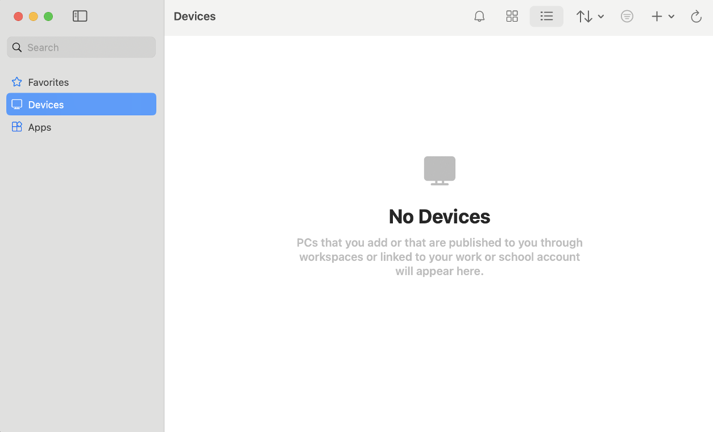

할당받은 vm을 추가하기 위해 **Add PC** 를 선택합니다.  
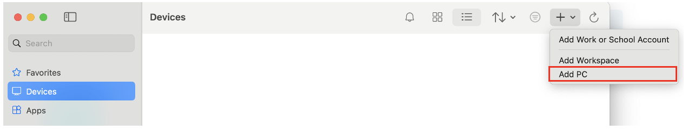

**Add PC** 화면에서 아래의 같이 정보를 입력하고  Credentials 항목에 Add Credentials 버튼을 클릭합니다.  

- PC name : 할당받은 VM IP  

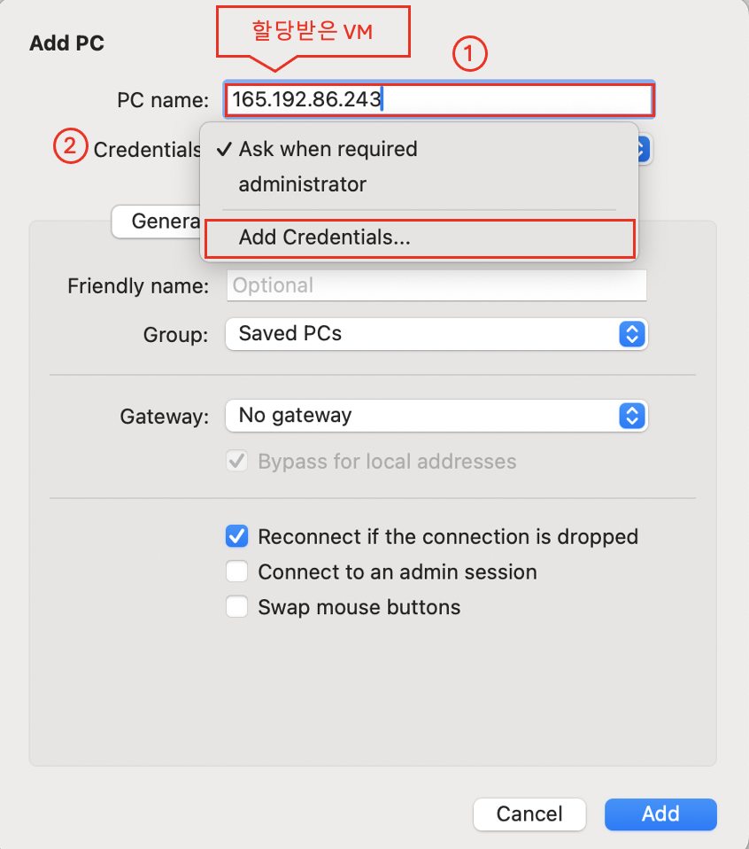

**Add Credentials** VM 의 로그인 정보를 입력하고 Add 버튼을 클릭합니다.  

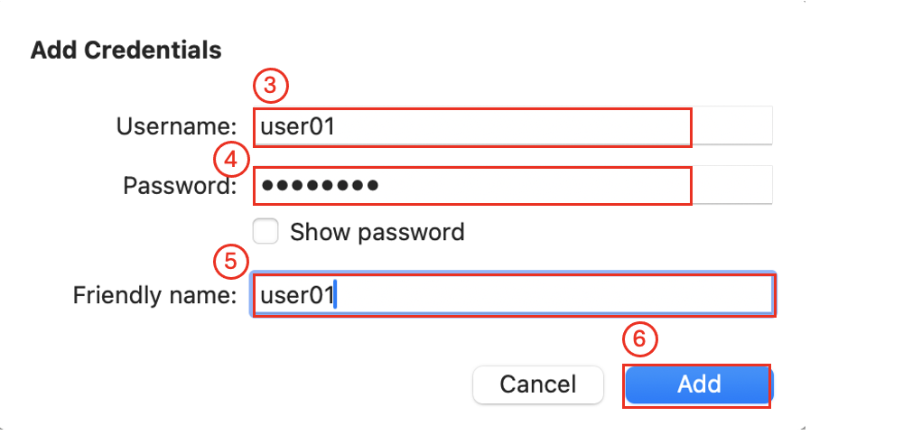

**Add PC** 화면에서 아래의 정보를 입력하고 Add 버튼을 클릭합니다.  
   Friendly name : user01  

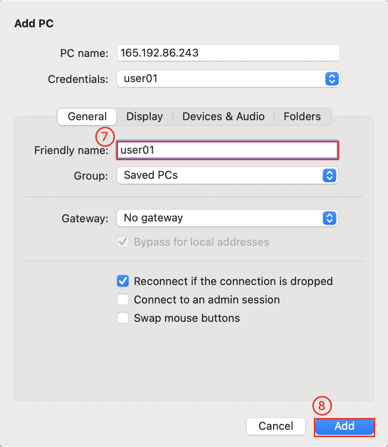

할당 받은 VM을 추가하면 다음과 같이 device 목록화면에 추가된 것을 확인합니다. 등록된 **user01** 을 더블클릭하여 VM에 로그인 합니다.  

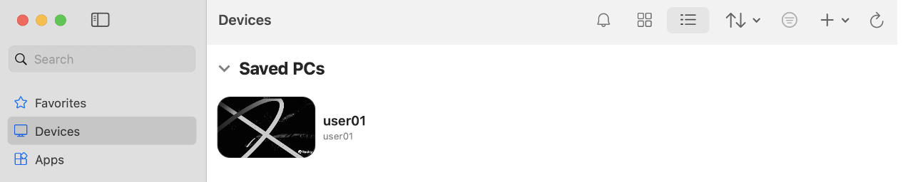

Show certificate 화면에서 continue 보튼을 클릭합니다.  
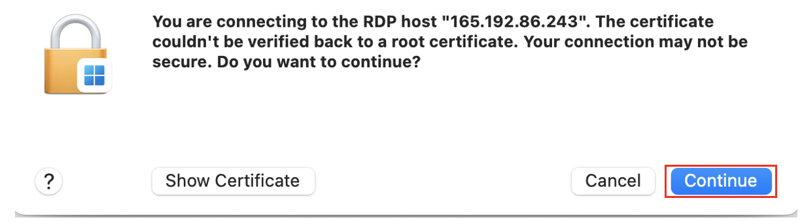  

VM 로그인 정보를 입력하여 로그인하면 다음과 같이 desktop 화면을 확인합니다.  
 

VM의 desktop 화면에서 왼쪽 상단에 현재활동 메뉴를 선택하고, 오른쪽 하단에서 terminal을 선택합니다.    
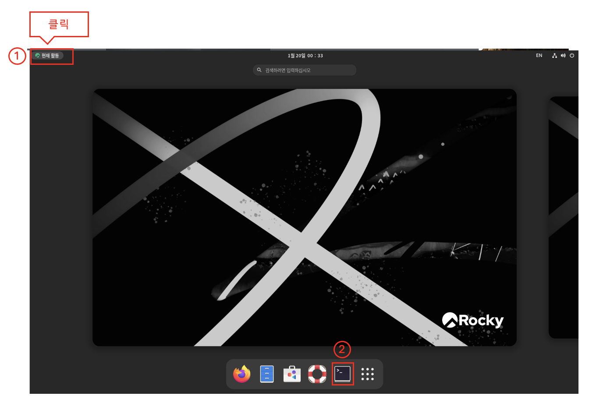 