# Visual Studio Code 설치 및 설정.
소프트웨어통합개발환경(IDE) 중 가장 인기있는 제품 중 하나인 Visual Studio Code를 설치 한 후 앞서 생성한 가상환경을 사용하도록 설정한다.

### 3-1. Visual Studio Code 설치.
#### Step1
실습 서버에 연결한 뒤 Firefox 브라우저를 실행해서 Visual Studio Code의 다운로드 사이트에 접속한다. (https://code.visualstudio.com/download)
Rocky Linux는 Redhat 계열이므로 .rpm을 클릭해서 다운로드 받는다.

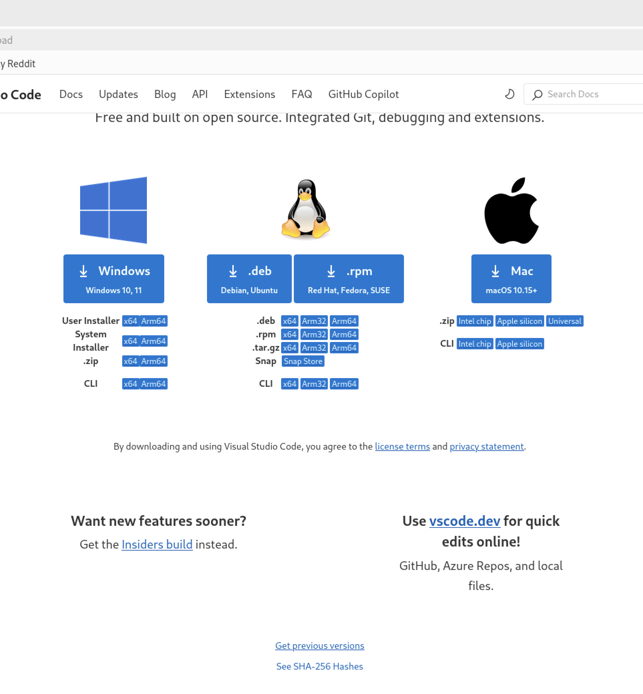

파일 관리자 앱에서 다운받은 이미지를 클릭해서 설치를 진행한다.

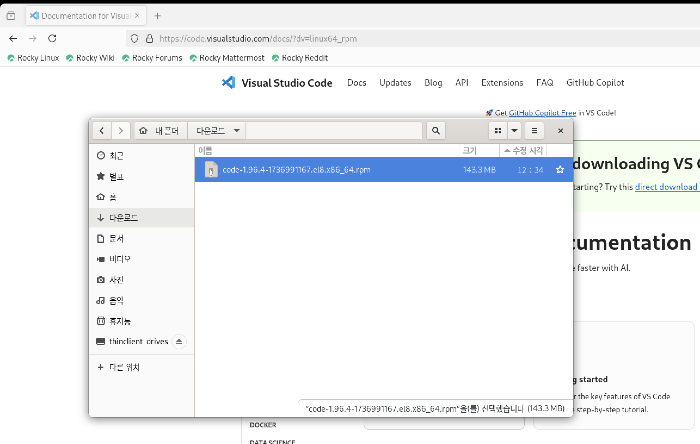

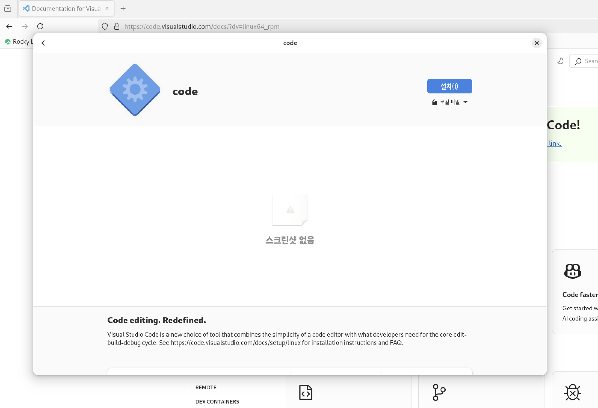

아래와 같은 password 입력 창에서는 user01이 아니라 <span style="color: red">**root 패스워드** </span>를 입력해야 한다.

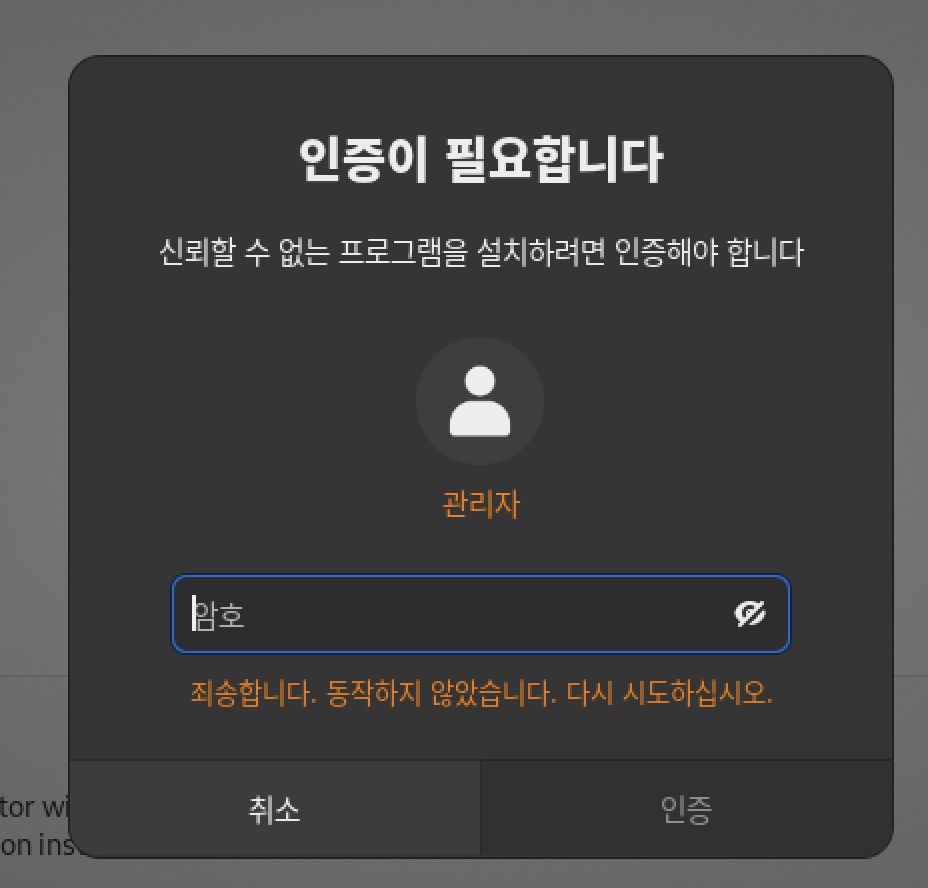

설치가 완료된 화면에서 "열기" 버튼을 클릭해서 vscode를 실행할 수 있다.

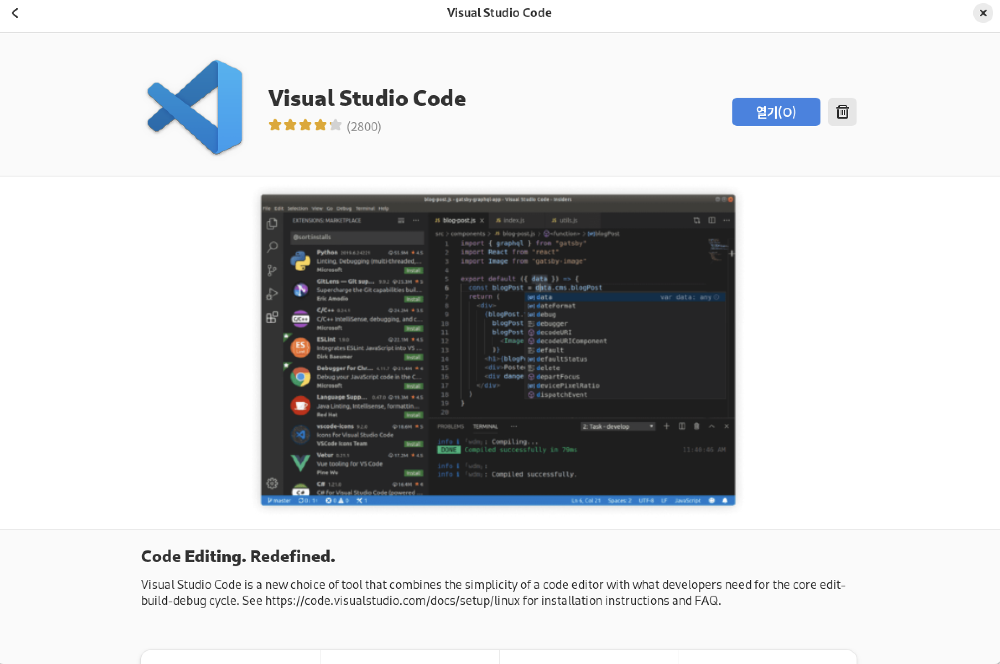

또는 설치된 application 목록에서 vscode 아이콘을 클릭해서 실행할 수 있다.

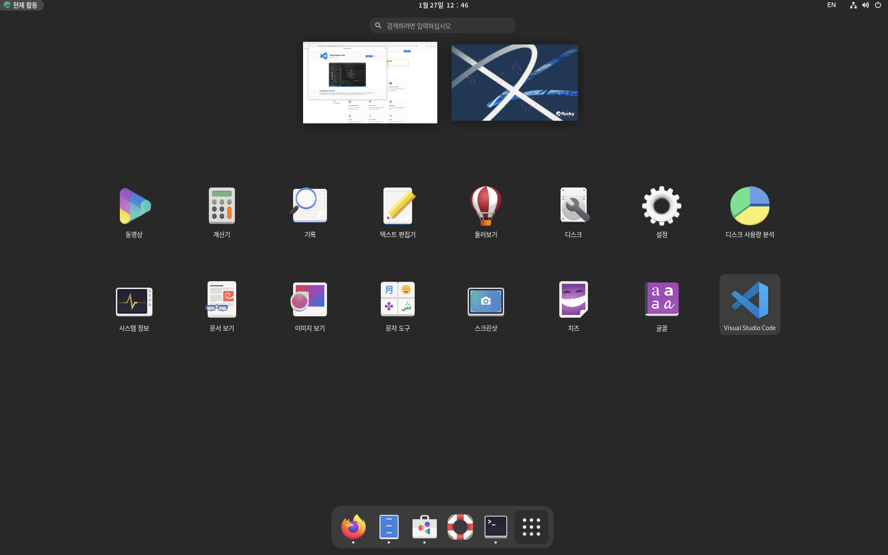

vscode를 실행한 후 Extention 설치 메뉴로 이동해서 python 및 Jupyter Extention을 설치해 준다.

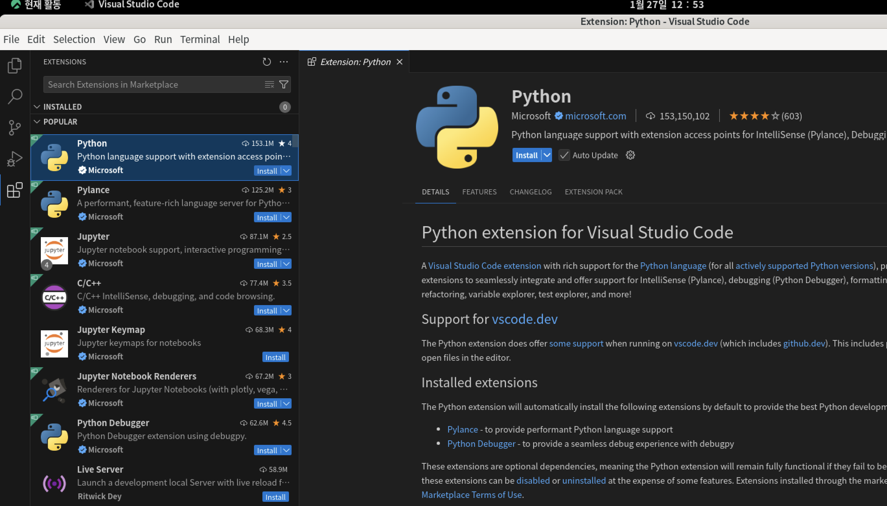


### 3-2 Visual Studio에 가상환경 설정.
#### Step1 - Git 설치 
터미널 창에서 다음 명령으로 git을 설치한다.
```
[user01@virtualserver02 ~]$ sudo dnf install git
[user01@virtualserver02 ~]$ 
[user01@virtualserver02 ~]$ git --version
git version 2.43.5
[user01@virtualserver02 ~]$ 
```
#### Step2 - Clone source code
터미널 창을 열고 user01 사용자 홈 디렉토리 아래에 src 디렉토리를 만들고 이 곳으로 이동한다. git clone 명령어로 소스코드 (https://github.com/junYoungSeo1359/gust-ibm-ai-hackathon)를 Clone한 뒤에 잘 받아졌는지 확인한다.
```
[user01@virtualserver02 ~]$ 
[user01@virtualserver02 ~]$ mkdir src
[user01@virtualserver02 ~]$ 
[user01@virtualserver02 ~]$ cd src
[user01@virtualserver02 src]$ git clone https://github.com/junYoungSeo1359/gust-ibm-ai-hackathon
'gust-ibm-ai-hackathon'에 복제합니다...
remote: Enumerating objects: 457, done.
remote: Counting objects: 100% (457/457), done.
remote: Compressing objects: 100% (429/429), done.
remote: Total 457 (delta 21), reused 448 (delta 16), pack-reused 0 (from 0)
오브젝트를 받는 중: 100% (457/457), 35.87 MiB | 6.73 MiB/s, 완료.
델타를 알아내는 중: 100% (21/21), 완료.
[user01@virtualserver02 src]$ 
[user01@virtualserver02 src]$ ls -ltr
합계 4
drwxr-xr-x. 8 user01 user01 4096  1월 27 13:10 gust-ibm-ai-hackathon
[user01@virtualserver02 src]$ 
```
#### Step3 - vscode에 가상 환경 셋팅.
vscode의 File->Open Foder... 메뉴를 클릭한 뒤 위에서 다운로드 받은 소스 코드의 위치를 찾아서 오픈한다.

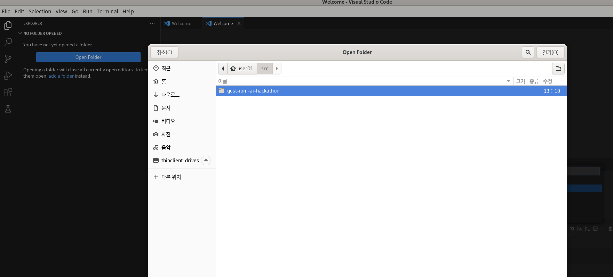


다음 질문에는 Yes, I trust the authors를 선택한다.

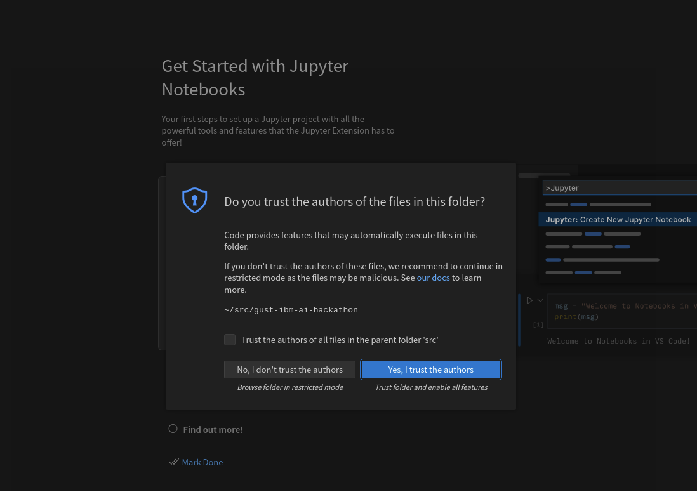

View->Command Palette...를 열어서 Select Interpreter를 입력해서 선택한다. (단축키는 Ctrl+Shift+P 또는 Cmd+Shift+P)
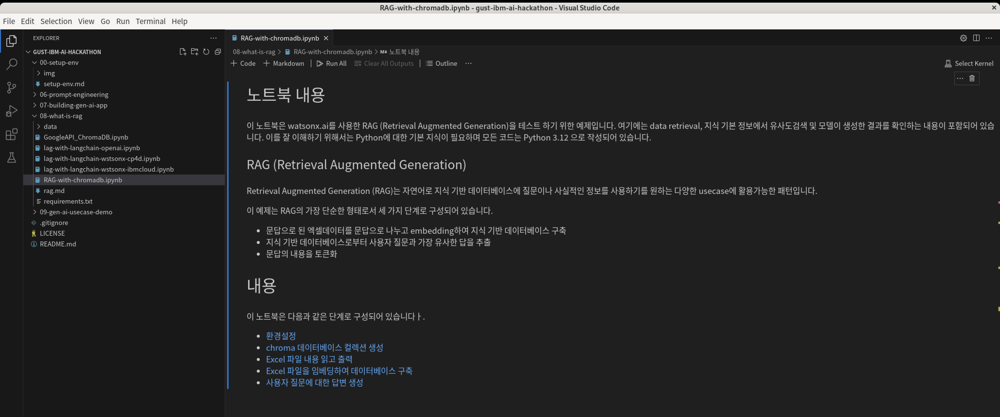

Enter interpreter path...-> Find... 를 차례로 선택한다.
왼쪽 탭에서 홈을 선택한 뒤 myenvs => 08-rag => bin => python을 선택한다.
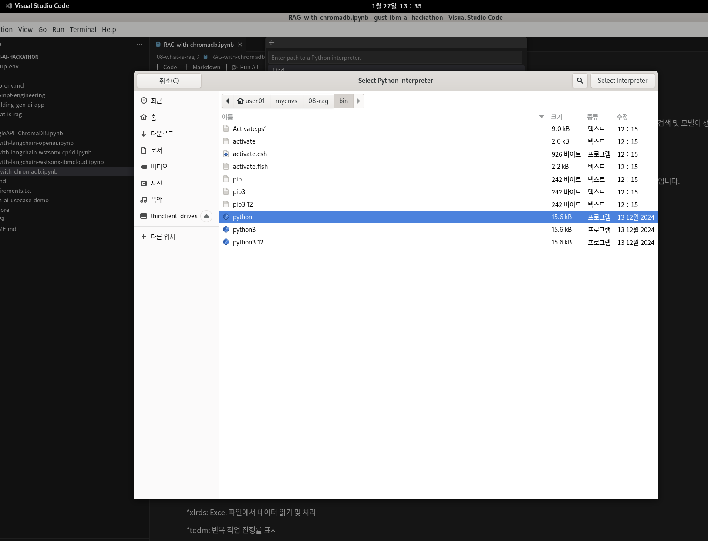


vscode 왼쪽 탭의 파일 목록 보기에서 08-what-is-rag -> RAG-with-chromadb.ipynb를 더블 클릭해서 연다. 그리고 우측 상단이 "Select Kernel" 메뉴를 클릭한 후에 "Python Environments..."를 선택한 후 08-rag (Python 3.12.5)가 보이는 지 확인후 이를 선택한다.

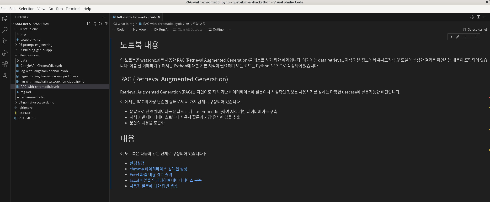

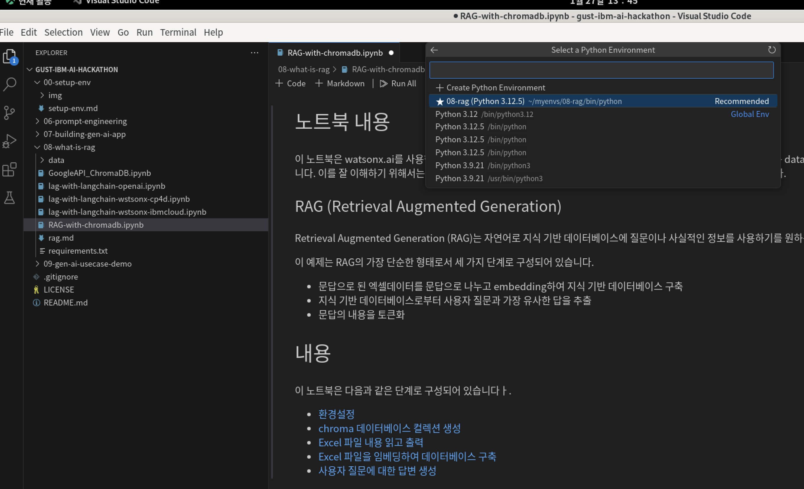


이전 단게에서 만든 4개의 가상 환경 모두에 대해 위와 같은 작업을 수행하여 해당 환경이 Select Kernel에서 나타날 수 있도록 반복한댜.
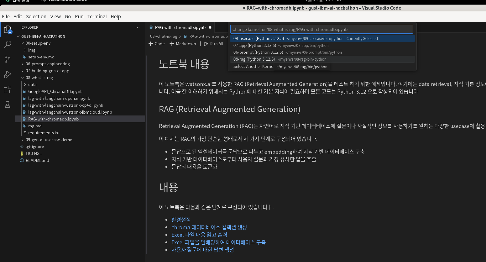

<span style="color: red">[**참고**] Select Interprinter 메뉴에서 python 선택을 완료했는데 Select Kernel 메뉴에서 해당 환경이 보이지 않을 경우 VS Code를 종료하고 재실행 한다 .</span>


<span style="color: red">[**참고**] Select Interprinter 메뉴에서 Find를 클릭해서 UI를 사용하는 대신 사각 창에 아래와 같이 full path를 입력해도 된다 .</span>
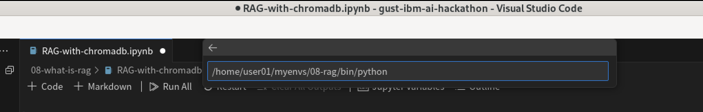


