#  개발 환경 설정:

이 섹션에서는 향후 실습에 사용할 개발 환경을 설정합니다. 여기에는 다음과 같은 내용이 포함 됩니다.
이 환경은 향후 python을 사용하는 모든 실습에서 동일하게 사용됩니다. 개별 실습내에 별도의 실행환경 설정 내용이 포함되어 있고 그 내용이 중복되는 경우 이 섹션의 내용이 우선 합니다.

- Python 실행 환경 만들기
- Visual Studio 설치 및 설정.

## 1. Python 실행 환경 만들기

Python 실행 환경은 python을 설치하고 내장 모듈인 venv를 사용해서 만든다.

### 1-1. Python 설치하기
이 교육 과정의 소스코드는 Python 3.10.11를 기준으로 작성되어 있기 때문에 기존에 다른 버전의 python이 설치되어 있다면 이를 먼저 삭제해야 한다. 

#### Step1
Python 패키지는 
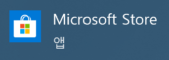
 또는 [Python3.10 다운로드](https://www.python.org/downloads/release/python-31011)에서 본인의 OS에 맞는 **3.10.11** 버전을 다운 받아서 설치한다. 
</br>

#### Step2
설치가 완료되면 다음 명령으로 Python 동작 여부를 확인한다.

##### Windows 사용자의 경우 명령어 검색창에서 cmd를 입력하면 나타나는 "명령 프롬프트"를 열어서 다음 명령을 입력한다.
```
C:\Users\swth1>python -V
Python 3.10.11

C:\Users\swth1>
```
##### Mac/Linux 사용자의 경우 Terminal 창을 열어서 다음 명령을 입력한다.
```
jihun.kim@JihunKimMacBook-Pro ~ % python3 -V
Python 3.10.11
jihun.kim@JihunKimMacBook-Pro ~ % 
jihun.kim@JihunKimMacBook-Pro ~ % 
```

> <span style="color: red">[**WARNING**] Windows 사용자의 경우 python 설치 후 python 명령을 찾지 못하는 경우가 발생할 수 있다 .<span>
> * 이 때는 [내컴퓨터]-[속성]-[고급 시스템 설정]-[환경변수]-[사용자 변수]를 열어서 Path 변수의 제일 위쪽에 Python3.10이 설치된 Path를 추가한다.
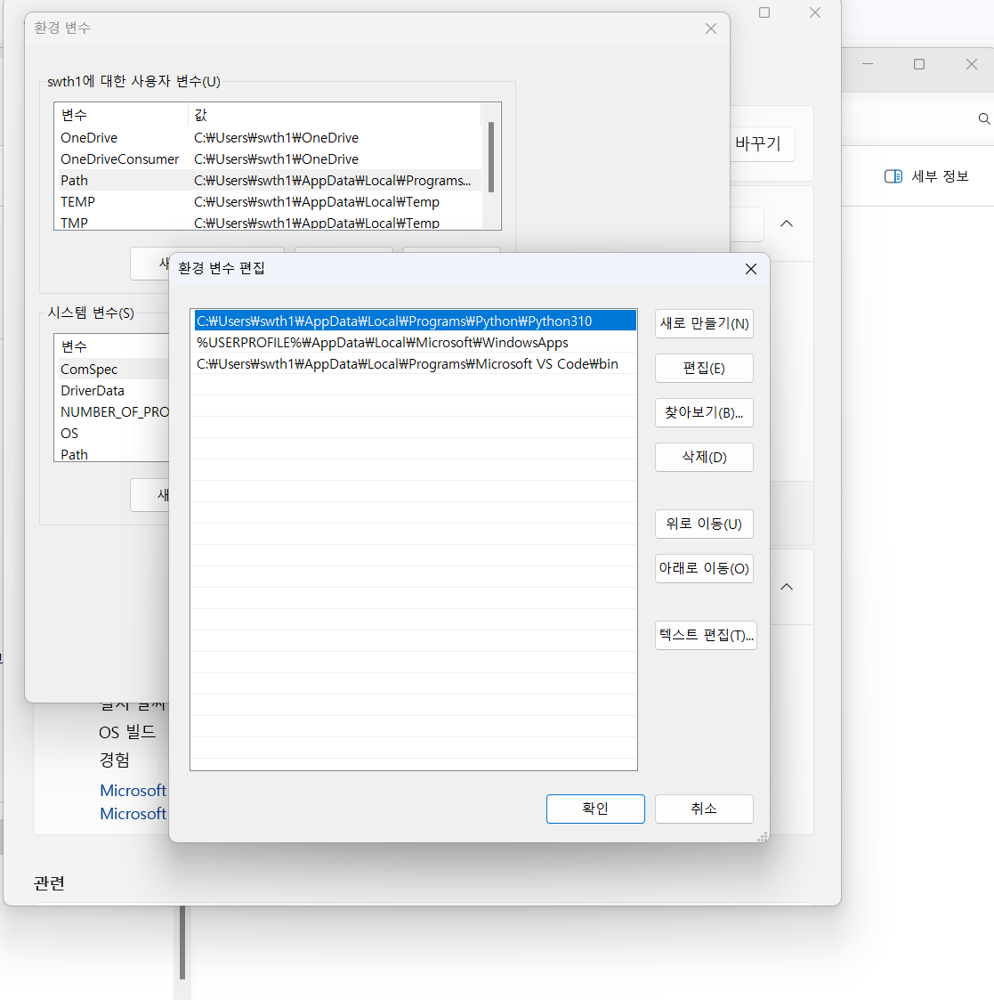


> <span style="color: red">[**WARNING**] Windows 사용자의 경우 다음과 같은 추가 작업을 수행한다.</span>
> * PowerShell을 admin으로 권한으로 실행하고 다음 명령어를 실행합니다.<br/>
```
Set-ExecutionPolicy Unrestricted
A를 입력하고 엔터
```
<br/>


#### Step3
설치된 python의 venv 모듈을 사용하여 가상 환경을 생성한다. 생성해야 할 가상 환경은 07-app, 08-rag, 09-usecase 총 3 개이다. 

##### Windows 사용자의 경우 명령어 "명령 프롬프트" 창에서 다음과 같이 입력한다.
명령이 성공적으로 수행되면 명령을 수행한 위치에 3개의 디랙토리가 생성되어 있다.
```
C:\Users\swth1>python -m venv 07-app

C:\Users\swth1>python -m venv 08-rag

C:\Users\swth1>python -m venv 09-usecase

C:\Users\swth1>
C:\Users\swth1>dir 0*
 C 드라이브의 볼륨에는 이름이 없습니다.
 볼륨 일련 번호: 90BF-6FFB

 C:\Users\swth1 디렉터리

2024-08-22  오후 05:39    <DIR>          07-app
2024-08-22  오후 05:39    <DIR>          08-rag
2024-08-22  오후 05:40    <DIR>          09-usecase
               0개 파일                   0 바이트
               3개 디렉터리  801,465,438,208 바이트 남음

C:\Users\swth1>
```
#### Mac/Linux 사용자의 경우 Terminal 창에서 다음 명령을 입력한다.
명령이 성공적으로 수행되면 명령을 수행한 위치에 3개의 디랙토리가 생성되어 있다.
```
jihun.kim@JihunKimMacBook-Pro ~ % python3 -m venv 07-app
jihun.kim@JihunKimMacBook-Pro ~ % 
jihun.kim@JihunKimMacBook-Pro ~ % python3 -m venv 08-rag
jihun.kim@JihunKimMacBook-Pro ~ % 
jihun.kim@JihunKimMacBook-Pro ~ % python3 -m venv 09-usecase
jihun.kim@JihunKimMacBook-Pro ~ % 
jihun.kim@JihunKimMacBook-Pro ~ % 
jihun.kim@JihunKimMacBook-Pro ~ % ls -ltr
.....
.....
drwxr-xr-x    6 jihun.kim  staff     192  8 22 17:48 07-app
drwxr-xr-x    6 jihun.kim  staff     192  8 22 17:48 08-rag
drwxr-xr-x    6 jihun.kim  staff     192  8 22 17:48 09-usecase
```


#### Step4
생성된 각 가상 환경을 activation 시키고 설치된 python version을 확인한다.

##### Windows 사용자의 경우 명령어 "명령 프롬프트" 창에서 다음과 같이 입력한다.
환경이 성공적으로 activation 되면 프롬프트에 (환경이름) 이라는 prefix가 붙는다. 3개의 환경 모두 점검한다.
```
C:\Users\swth1>07-app\Scripts\activate

(07-app) C:\Users\swth1>python -V
Python 3.10.11

(07-app) C:\Users\swth1>
(07-app) C:\Users\swth1>deactivate
C:\Users\swth1>

```
#### Mac/Linux 사용자의 경우 Terminal 창에서 다음 명령을 입력한다.
환경이 성공적으로 activation 되면 프롬프트에 (환경이름) 이라는 prefix가 붙는다. 3개의 환경 모두 점검한다.
```
jihun.kim@JihunKimMacBook-Pro ~ % source ./07-app/bin/activate
(07-app) jihun.kim@JihunKimMacBook-Pro ~ % 
(07-app) jihun.kim@JihunKimMacBook-Pro ~ % 
(07-app) jihun.kim@JihunKimMacBook-Pro ~ % python -V
Python 3.10.11
(07-app) jihun.kim@JihunKimMacBook-Pro ~ % 
(07-app) jihun.kim@JihunKimMacBook-Pro ~ % deactivate
jihun.kim@JihunKimMacBook-Pro ~ % 
```

## 2. Git 설치하기

### 2-1. Git 설치
#### Step1 : 다음 위치에서 본인의 OS에 맞는 git 프로그램을 다운받아서 설치한다.
[git 다운로드](https://git-scm.com/book/ko/v2/%EC%8B%9C%EC%9E%91%ED%95%98%EA%B8%B0-Git-%EC%84%A4%EC%B9%98)<br/>

설치 후에는 다음 명령으로 정상 설치 여부를 확인한다. Windows/Mac/Linux 사용자 모두 동일한 명령을 사용한다.

```
C:\Users\swth1>git --version
git version 2.39.2.windows.1

C:\Users\swth1>
```

```
jihun.kim@JihunKimMacBook-Pro ~ % git --version
git version 2.39.3 (Apple Git-146)
```

### 2-2. 소스 코드 다운로드

#### Step1 : git clone 명령으로 강사가 지정하는 URL로부터 소스 코드를 다운로드 받는다.
아래는 예제이며 강사가 지정하는 URL을 사용하도록 한다. Windows/Mac/Linux 사용자 모두 동일한 명령을 사용한다.

```
C:\Users\swth1>git clone https://github.ibm.com/telkr-genai/GUST-IBM-AI-Hackathon.git
Cloning into 'p-tect-genai-enablement'...
remote: Enumerating objects: 770, done.
remote: Counting objects: 100% (139/139), done.
remote: Compressing objects: 100% (78/78), done.
remote: Total 770 (delta 67), reused 115 (delta 55), pack-reused 631Receiving objects:  99% (763/770), 41.98 MiB | 7.72 Receiving objects: 100% (770/770), 43.91 MiB | 6.71 MiB/s, done.

Resolving deltas: 100% (173/173), done.

C:\Users\swth1>

```

```
jihun.kim@JihunKimMacBook-Pro ~ % git clone https://github.ibm.com/telkr-genai/GUST-IBM-AI-Hackathon.git
Cloning into 'p-tect-genai-enablement'...
remote: Enumerating objects: 770, done.
remote: Counting objects: 100% (139/139), done.
remote: Compressing objects: 100% (78/78), done.
remote: Total 770 (delta 67), reused 115 (delta 55), pack-reused 631
Receiving objects: 100% (770/770), 43.91 MiB | 1.99 MiB/s, done.
Resolving deltas: 100% (173/173), done.
jihun.kim@JihunKimMacBook-Pro ~ % 
```


## 3. Visual Studio Code 설치 및 설정.
소프트웨어통합개발환경(IDE) 중 가장 인기있는 제품 중 하나인 Visual Studio Code를 설치 한 후 앞서 생성한 가상환경을 사용하도록 설정한다.

### 3-1. Visual Studio Code 설치.
#### Step1
[Visual Studio Code 설치 파일](https://code.visualstudio.com/download)에서 자신의 OS에 맞는 설치 파일을 내려 받은 후 실행하고 안내에 따라 설치를 진행한다.
기본 설치가 완료된 후에 Extensions 메뉴로 이동하여 다음과 같은 확장 패키지를 설치한다.
- Python, Jupyter

해당 패키지 설치 시에 의존성 있는 다른 패키지들도 추가로 설치된다.
<br/>
Visual Studio Code가 설치 완료된 모습.
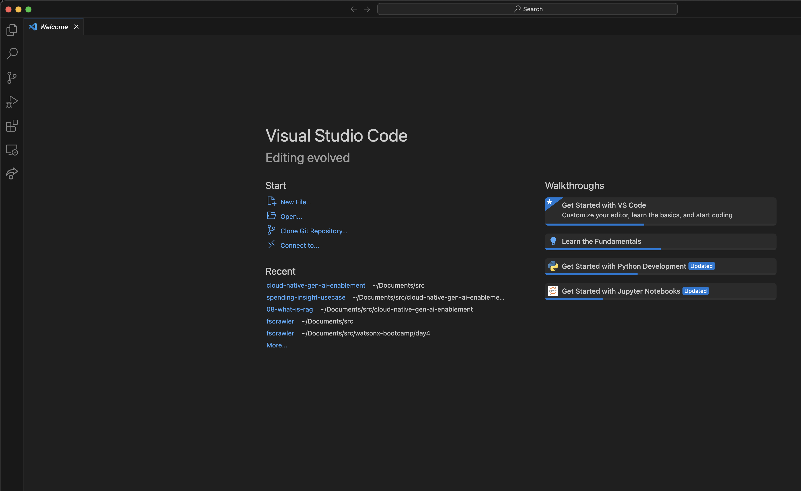
<br/>

Visual Studio 에서 확장팩 설치하기
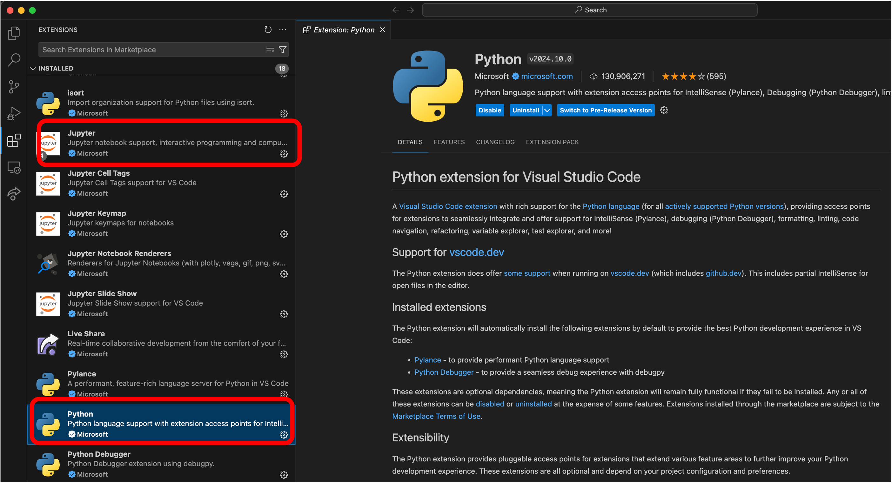
<br/>


### 3-2 Visual Studio에 가상환경 설정.
#### Step1
File -> Open Folder 메뉴를 사용하여 git clone으로 다운 받은 소스 코드의 최상위 폴더를 찾아서 연다.
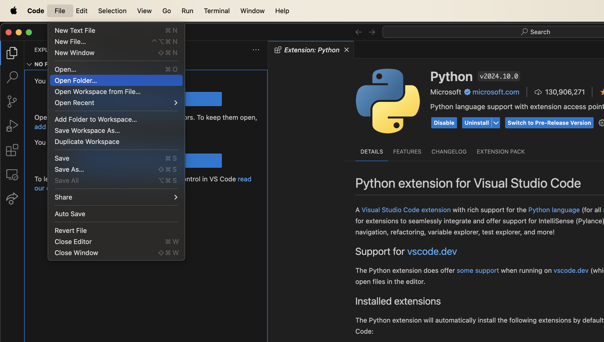
<br/>
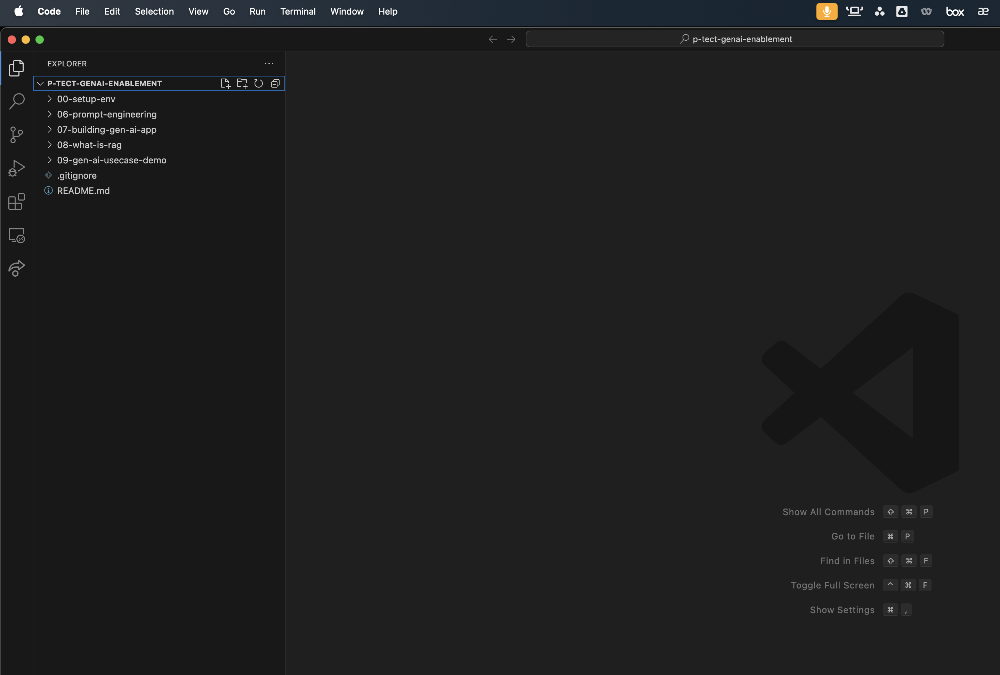
<br/>

#### Step2

View->Command Palette...를 열어서 Select Interpreter를 입력해서 선택한다. (단축키는 Ctrl+Shift+P 또는 Cmd+Shift+P)
Enter interpreter path...-> Browser your file system to find a Python interpreter 를 차례로 선택한다.

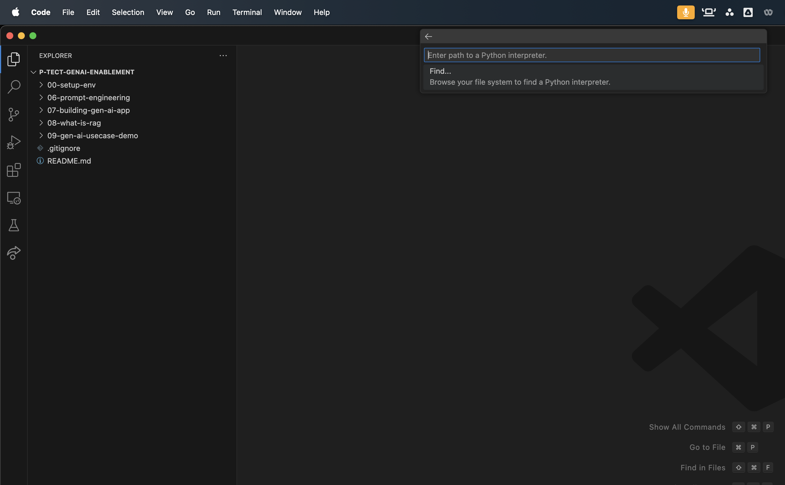
<br/>

이전 단계에서 생성한 3개의 환경 중에서 원하는 환경의 폴더를 찾아서 그 아래에 있는 python을 찾아서 선택한다.
```
윈도우즈의 경우 [환경폴더]\Scripts\python
```
이며
```
Mac/Linux의 경우 [환경폴더]/bin/python
```
이다.

또는 텍스트 박스에 full path를 입력해도 된다.
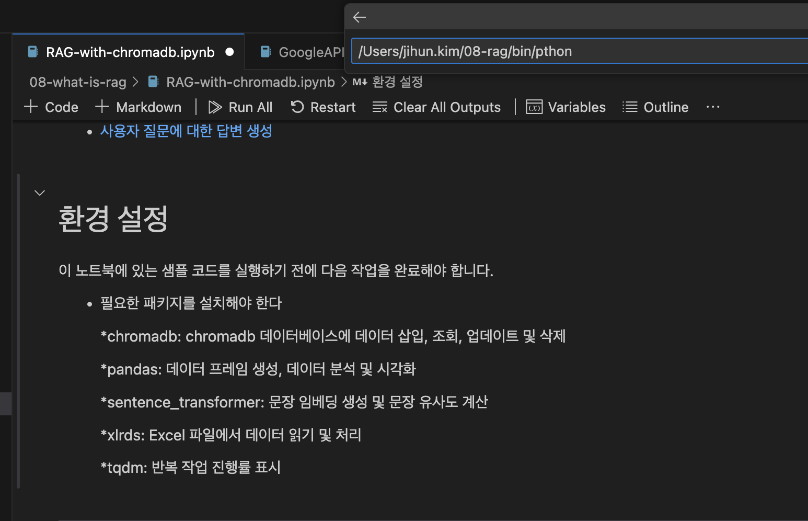


#### Step3
왼쪽 패널에 보이는 소스 코드 목록에서 08-what-is-rag/RAG-with-chromadb.ipynb 파일을 더블 클릭해서 연 후 우측 상단에 보이는 Select Kernel을 선택한다.

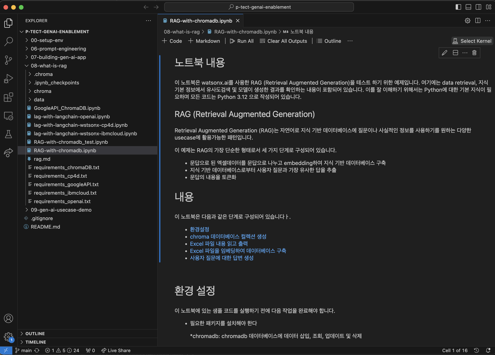
<br/>

Python Environments....(혹은 Select Another Kernel... 선택 후에) 선택하고 보이는 목록 중에 최근에 추가된 [환경이름]을 선택한다.
우측 상단에 선택된 환경 이름이 나타나는 지 확인 한다.

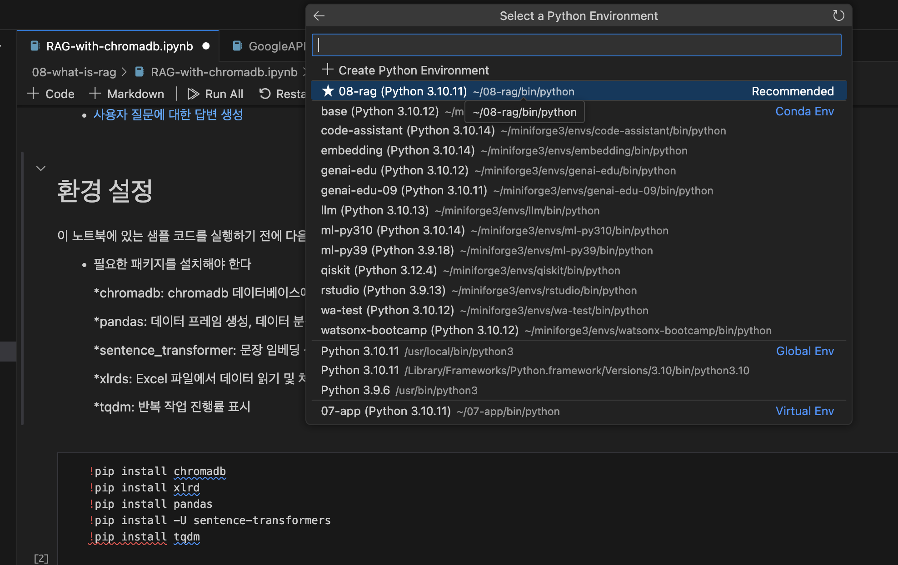
<br/>
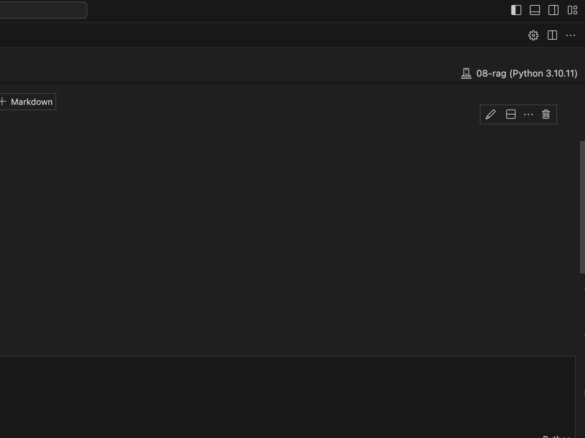


> <span style="color: red">[**WARNING**] Windows 사용자의 경우 실습 수행 중에 Python package 설치나 코드 실행 과정에서 Error가 발생할 수 있다 그럴 경우 아래와 같은 두가 지 조치를 수행한다. .<span>
> * pip list 명령을 실행하여 pyzmq 패키지 버전이 25.1.2가 아닌 경우 uninstall 하고 이 버전을 다시 설치한다.
```
pip install pyzmq==25.1.2
python -m pip install --upgrade pip
```
> * [libomp140.x86_64.dll](img/libomp140.x86_64.dll) 파일을 다운로드 받아서 C:\Windows\System32 아래에 복사한다.

