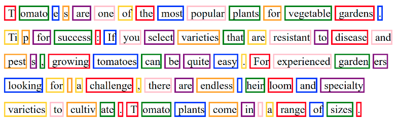
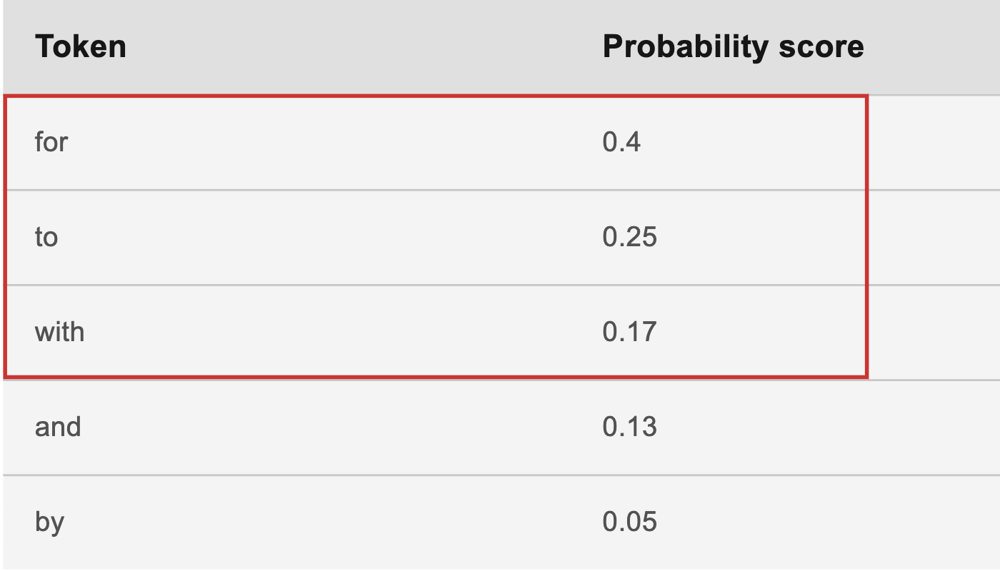
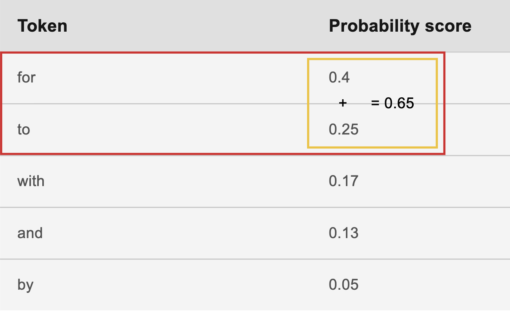
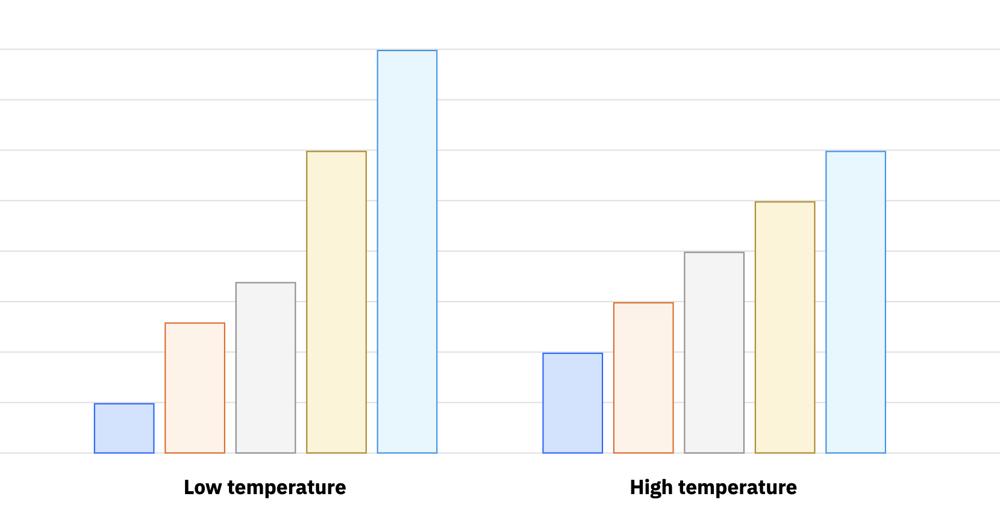
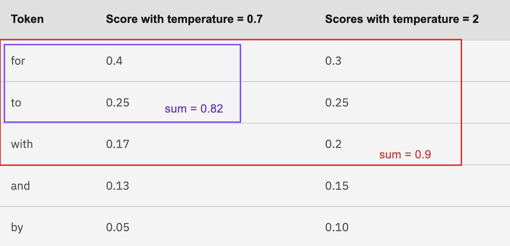

# What is Prompt Engineering?

“What is Prompt Engineering?” 이냐고 LLM-based AI 에게 물어 보았습니다.

프롬프트 엔지니어링은 원하는 출력을 생성하기 위해 GPT-3.5와 같은 언어 모델에 제공되는 프롬프트 또는 지침을 설계하고 개선하는 프로세스를 말합니다. 여기에는 원하는 응답이나 동작을 유도하기 위해 모델에 제공되는 입력 텍스트를 신중하게 작성하는 작업이 포함됩니다.

프롬프트 엔지니어링은 명시적인 지침을 지정하거나 컨텍스트를 추가하거나 특정 서식 지정 기술을 사용하여 모델 생성을 안내함으로써 언어 모델의 출력을 미세 조정하는 데 사용할 수 있습니다. 프롬프트를 조정함으로써 개발자와 사용자는 출력을 보다 정확하고 일관성 있게 조정하거나 특정 목표에 부합하도록 영향을 줄 수 있습니다.

효과적인 프롬프트 엔지니어링을 위해서는 기본 언어 모델과 그 기능에 대한 이해가 필요합니다. 여기에는 다양한 프롬프트를 실험하고, 반복하고, 모델의 반응을 분석하여 원하는 결과를 얻는 과정이 포함됩니다. 프롬프트 엔지니어링은 GPT-3.5와 같은 대규모 언어 모델을 사용할 때 특히 중요한데, 그 출력은 때때로 예측할 수 없거나 원하는 출력을 생성하기 위해 추가 컨텍스트가 필요할 수 있기 때문입니다.

전반적으로 프롬프트 엔지니어링은 언어 모델 작업에서 사용자의 의도나 요구 사항에 부합하는 정확하고 의미 있는 응답을 생성하기 위한 중요한 측면입니다.

Why is it important?
- 대부분의Generative AI의 경우질문에 "대답" 하는것이 아니라 단순히 가능성이 가장 높은 텍스트를 추가하는 것입니다.
- 단순한 질문만 으로는 최상의 결과를 얻을 수 없습니다.

# Tokens
## Tokens and tokenization
토큰은 모델에 대해 의미론적 의미를 갖는 문자의 모음입니다. 토큰화는 프롬프트의 단어를 토큰으로 변환하는 프로세스입니다.

## Converting words to tokens and back again
프롬프트 텍스트는 기초 모델에 의해 프롬프트가 처리되기 전에 토큰으로 변환됩니다.

단어와 토큰 간의 상관관계는 복잡합니다:

 - 하나의 단어가 여러 개의 토큰으로 나뉘는 경우도 있습니다.
 - 문맥(예: 단어가 나타나는 위치 또는 주변 단어)에 따라 같은 단어가 다른 수의 토큰으로 나뉠 수 있습니다.
 - 공백, 개행 문자, 구두점이 토큰에 포함되기도 하고 포함되지 않기도 합니다.
 - 단어가 토큰으로 나뉘는 방식은 언어마다 다릅니다.
 - 단어가 토큰으로 나뉘는 방식은 모델마다 다릅니다.
 - 대략적인 예로, 단어가 10개인 문장은 15~20개의 토큰으로 구성될 수 있습니다.

 ## Example
 

 ## Token limits
 모든 모델에는 입력 프롬프트의 토큰 수와 모델에서 생성된 출력의 토큰 수에 대한 상한선이 있습니다. 이 제한을 컨텍스트 context window length, context window, context length, maximum sequence length 라고도 합니다. 프롬프트 랩에서는 프롬프트 제출에 사용된 토큰 수와 그 결과 생성된 출력이 정보 메시지로 표시됩니다.

Table 1. IBM foundation models in watsonx.ai

| Model name                                 | IBM indemnification | Billing class | Maximum tokens Context (input + output) | Supported tasks                                                                                             | More information                       |
| :----------------------------------------- | :------------------ | :------------ | :-------------------------------------- | :---------------------------------------------------------------------------------------------------------- | :------------------------------------- |
|                                            |                     |               |                                         |                                                                                                             |                                        |
| granite-13b-chat-v2                        | Yes                 | Class 1       | 8192                                    | • classification• extraction• generation• question answering• summarization                                 | • Model card• Website• Research paper  |
| granite-13b-instruct-v2                    | Yes                 | Class 1       | 8192                                    | • classification• extraction• generation• question answering• summarization                                 | • Model card• Website• Research paper Note: This foundation model can be tuned.|
| granite-7b-lab                             | Yes                 | Class 1       | 8192                                    | • classification• extraction• generation• question answering• retrieval-augmented generation• summarization | • Model card• Research paper (LAB)     |
| granite-8b-japanese                        | Yes                 | Class 1       | 8192                                    | • classification• extraction• generation• question answering• summarization                                 | • Model card• Website• Research paper  |
| granite-20b-multilingual                   | Yes                 | Class 1       | 8192                                    | • classification• extraction• generation• question answering• summarization                                 | • Model card• Website• Research paper  |
| granite-3b-code-instruct                   | Yes                 | Class 1       | 2048                                    | • code• classification• extraction• generation• question answering• summarization                           | • Model card• Website• Research paper  |
| granite-8b-code-instruct                   | Yes                 | Class 1       | 4096                                    | • code• classification• extraction• generation• question answering• summarization                           | • Model card• Website• Research paper  |
| granite-20b-code-instruct                  | Yes                 | Class 1       | 8192                                    | • code• classification• extraction• generation• question answering• summarization                           | • Model card• Research paper           |
| granite-34b-code-instruct                  | Yes                 | Class 1       | 8192                                    | • code• classification• extraction• generation• question answering• summarization                           | • Model card• Research paper           |

### Google I/O 2024: An I/O for a new generation (2,000,000 token)
https://blog.google/intl/en-africa/products/explore-get-answers/google-io-2024-an-io-for-a-new-generation/
1M token의 예:
영어: 750,000 words, 2,500 ~ 3,000 pages 

### GPT-4o (128,000 token)
https://platform.openai.com/docs/models/gpt-4o
128k token의 예:
영어 : 96,000 words, 320~384 pages

# Prompt

Zero-shot prompting  - 추가 정보 없이 요청을 모델에 전달하기만 하면 됩니다. 요청에 따라 일부 모델(큰 모델)은 다른 모델보다 더 잘 응답합니다.

One-shot or few-shot prompting - 클라이언트는 간단한 입력을 제공하여 모델이 사용자의 의도에 맞게 최적의 답변을 제공하는 방법을 학습할 수 있습니다.

## Foundation model parameters: decoding and stopping criteria

### Decoding
- Greedy decoding:
디코딩 프로세스의 각 단계에서 가장 높은 확률을 가진 토큰을 선택합니다.

Greedy decoding은 모델의 사전 학습 데이터와 프롬프트 텍스트에서 가장 일반적인 언어와 거의 일치하는 출력을 생성하며, 이는 덜 창의적이거나 사실 기반 사용 사례에 적합합니다. Greedy decoding의 약점은 생성된 출력에서 반복적인 루프를 일으킬 수 있다는 것입니다.

- Sampleing decoding:
토큰을 선택하는 방식에 더 많은 가변성을 제공합니다.

Sampleing decoding을 사용하면 모델이 토큰을 샘플링하여 토큰의 하위 집합을 선택한 다음 이 하위 집합에서 무작위로 하나의 토큰을 선택하여 출력 텍스트에 추가합니다. Sampleing decoding은 프로세스에 가변성과 무작위성을 추가하므로 창의적인 사용 사례에서 바람직할 수 있습니다. 그러나 가변성이 커지면 부정확하거나 무의미한 출력이 발생할 위험이 커집니다.

## More options for sampling decoding

Sampling decoding을 선택하면 기본 모델이 샘플링할 토큰을 선택하는 방법을 조정하는 데 사용할 수 있는 추가
매개변수를 사용할 수 있습니다. 다음 매개변수는 함께 작동하여 샘플링되는 토큰에 영향을 줍니다.
• Temperature sampling 은 샘플링될 토큰에 대한 확률 분포를 평탄화하거나 더 선명하게 합니다.
• Top-k smapling 은 지정된 토큰 수에 도달할 때까지 확률이 가장 높은 토큰을 표본추출합니다.
• Top-p sampling은 점수의 합계가 지정된 임계값에 도달할 때까지 확률 점수가 가장 높은 토큰을 샘플링합니다.
(Top-p sampling을 핵 표본추출이라고도 합니다.)

## Example of adjusting sampling decoding settings

이 예제에서는 기초 모델이 이미 개를 데려간 출력 텍스트를 생성했으며 이제 모델이 다음 토큰을 선택하고 있습니다.

최적의 선택을 찾기 위해 모델은 가능한 토큰에 대한 이산 확률 분포를 계산합니다. 이러한 유형의 분포를 사용하면 각 토큰에 0에서 1 사이의 소수점 확률 점수가 할당되며, 점수가 합산되면 1이 됩니다.

실제 시나리오에서는 수백 개의 가능한 토큰이 있을 수 있습니다. 이 예에서는 일반적인 문장의 맥락에서 5개의 토큰만 선택하도록 했습니다:

I took my dog...

- for a walk.
- to the vet.
- with me.
- and my cat on vacation.
- by the collar.

다음 표에는 토큰과 가상의 확률 점수가 순서대로 나열되어 있습니다.

| Token | Probability score |
| :---- | :---------------- |
| for   | 0.4               |
| to    | 0.25              |
| with  | 0.17              |
| and   | 0.13              |
| by    | 0.05              |

### Top K example

상위 K는 샘플링할 토큰 수를 지정합니다. 예를 들어 Top K를 3으로 설정하면 목록에서 처음 세 개의 토큰(for, to, with)만 샘플링됩니다.

참고: Greedy decoding 설정은 Top K = 1에 해당합니다.

### Top P example

상위 P는 토큰이 도달해야 하는 누적 확률 점수 임계값을 지정합니다.

예를 들어 Top P를 0.6으로 설정하면 처음 두 토큰인 for와 to의 확률(0.4와 0.25)이 합쳐져 0.65가 되므로 처음 두 토큰만 샘플링됩니다. (이 예에서 보듯이 합계가 임계값을 초과해도 괜찮습니다.)

Top P 매개변수 값을 기본값인 1이 아닌 다른 값으로 설정하지 않으면 Top P는 사용되지 않습니다. Top P와 Top K를 함께 사용하면 확률 점수가 매우 낮은 토큰을 필터링하는 데 유용할 수 있습니다. 두 매개변수를 모두 지정하면 상위 K가 먼저 적용됩니다.

예를 들어 상위 K를 5로 설정하고 상위 P를 0.8로 설정할 수 있습니다. Top K 설정은 5개의 토큰을 모두 샘플링하고, Top P는 샘플링된 토큰의 확률이 확률 점수 임계값인 0.8(0.4 + 0.25 + 0.17 = 0.82)에 도달하기 때문에 샘플 토큰을 for, to 및 with로 제한합니다.

두 설정을 모두 지정한 경우, 상위 K로 설정된 컷오프 미만의 토큰은 상위 P가 계산될 때 확률이 0인 것으로 간주됩니다. 예를 들어, Top K를 2로 설정하고 Top P를 0.8로 설정하면 for와 to만 샘플링됩니다. 토큰 with는 샘플링되지 않으므로 with, and, by의 확률 점수가 0으로 재설정됩니다.

### Temperature example
Temperature setting은 토큰을 샘플링할 때 사용되는 확률 분포의 모양에 영향을 줍니다.

Low temperature는 토큰 간의 확률 차이를 증폭시킵니다. 가능성이 높은 용어는 가능성이 낮은 용어에 비해 훨씬 더 높은 점수를 받습니다. 따라서 모델의 학습 데이터 또는 프롬프트 입력에 있는 용어와 유사한 용어가 샘플링될 가능성이 높습니다. 보다 신뢰할 수 있는 결과를 원한다면 낮은 온도 값을 사용해야 합니다.

High temperature는 토큰 확률이 서로 더 가까워집니다. 결과적으로 특이한 용어가 샘플링될 확률이 높아집니다. 창의적인 결과물을 원할 때와 같이 무작위성과 가변성 또는 결과물을 높이고자 할 때는 더 높은 온도 값을 사용 해야 합니다. 무작위성은 부정확하거나 무의미한 결과를 초래할 수도 있다는 점을 기억해야 합니다.

예를 들어, 2와 같이 High temperature 값을 적용하면 아래 표에 표시된 것처럼 이 예시에서 토큰의 확률 점수가 서로 더 가까워질 수 있습니다.
| Token | Score with temperature = 2|
| :---- | :---------------- |
| for   | 0.3               |
| to    | 0.25              |
| with  | 0.2              |
| and   | 0.15             |
| by    | 0.10              |

Top P를 0.8로 설정하면 온도는 다음과 같이 샘플 토큰에 영향을 미칩니다:

- High temperature 점수(0.3 + 0.25 + 0.2 + 0.15 = 90)가 총 90이므로 상위 4개 토큰(for, to, with 및 and)이 샘플링됩니다.
- Low temperature 점수(0.4 + 0.25 + 0.17 = 82)가 총 82이므로 상위 3개 토큰(for, to, with)만 샘플링됩니다.

High temperature 값을 사용하면 상위 P가 설정한 임계값에 도달하는 데 더 많은 토큰이 필요하며, 샘플링되는 추가 토큰의 점수가 가장 낮으므로 토큰이 더 특이한 선택이 됩니다.

| 기준| Top-K| Top-P|
| :----| :---- | :---- |
|후보단어 선택 방식 | 확률 순위 기반 |누적 확률 기반 |
|다양성 |낮음 |높음|
|예측 |가능성 높음 |낮음|
|계산량 |낮음 |높음|

### Random seed

샘플링 디코딩을 통해 동일한 프롬프트를 모델에 여러 번 전송하면 모델은 일반적으로 매번 다른 텍스트를 생성합니다. 이러한 가변성은 디코딩 프로세스에 내장된 의도적인 의사 무작위성의 결과입니다.

Random seed는 모델이 토큰 선택을 무작위화하는 데 사용하는 난수 생성기를 시작하는 데 사용되는 숫자를 말합니다. 실험에서 이러한 의도적인 무작위성을 변수로 제거하려면 숫자를 선택하고 실험을 실행할 때마다 동일한 숫자를 지정하면 됩니다.

- Supported values: Integer in the range 1 to 4,294,967,295
- Default: Itself randomly generated
- Use: To produce repeatable results, set the same random seed value every time.

### Repetition penalty

선택한 프롬프트, 모델 및 매개변수에 대해 생성된 출력에 반복되는 텍스트가 지속적으로 포함되어 있다면 반복 페널티를 추가해 볼 수 있습니다. 페널티를 설정하면 최근에 사용된 토큰의 확률 점수를 낮추어 모델이 토큰을 반복할 가능성을 줄입니다. 값이 높을수록 더 다양하고 다양한 결과를 얻을 수 있습니다.

- Supported values: Floating-point number in the range 1.0 (no penalty) to 2.0 (maximum penalty)
- Default: 1.0
- Use: The higher the penalty, the less likely it is that the result will include repeated text.

### Stopping criteria

텍스트 생성은 모델이 출력이 완료된 것으로 간주하거나, 중지 시퀀스가 생성되거나, 최대 토큰 제한에 도달하거나, 모델 생성 시간 제한에 도달하면 중지됩니다.

생성 요청의 시간 제한에 도달하면 모델 생성이 중지됩니다. 기본 시간 제한은 10분, 라이트 요금제의 경우 5분입니다. API를 사용하여 추론 요청을 제출할 때 더 짧은 시간 제한을 지정할 수 있습니다.

정지 시퀀스 지정, 최소 토큰 및 최대 토큰 설정 등의 방법으로 모델에서 생성되는 출력의 길이에 영향을 줄 수 있습니다.

### Stop sequences

정지 시퀀스는 하나 이상의 문자로 구성된 문자열입니다. 중지 시퀀스를 지정하면 생성된 출력에 지정한 중지 시퀀스 중 하나가 나타난 후 모델이 자동으로 출력 생성을 중지합니다.

예를 들어, 한 문장만 나온 후에 모델이 출력 생성을 중지하도록 하는 한 가지 방법은 마침표를 중지 시퀀스로 지정하는 것입니다. 이렇게 하면 모델이 첫 번째 문장을 생성하고 마침표로 끝낸 후 출력 생성이 중지됩니다.

효과적인 중지 시퀀스를 선택하는 것은 사용 사례와 예상되는 생성된 출력의 특성에 따라 달라집니다.

- upported values: 0 to 6 strings, each no longer than 40 tokens

- Default: No stop sequence

- Use: Stop sequences are ignored until after the number of tokens that are specified in the Min tokens parameter are generated.
If your prompt includes examples of input-and-output pairs, ensure the sample output in the examples ends with one of the stop sequences.
