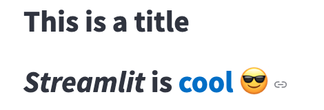
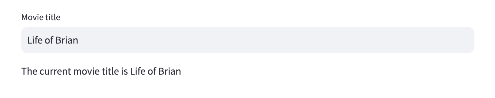
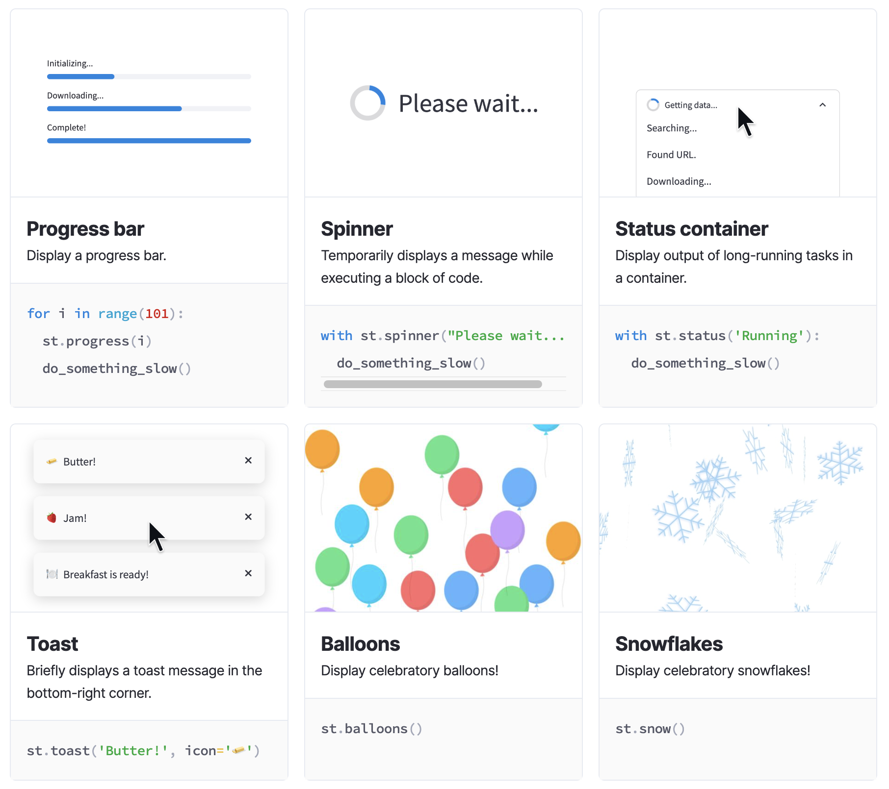

# Streamlit 튜토리얼  
Streamlit은 데이터 Scientlist 와 AI/ML 엔지니어가 단 몇 줄의 코드만으로 동적 데이터 앱을 제공할 수 있는 오픈 소스 Python 프레임워크입니다.  
몇 분 만에 아래와 같은 AI/ML UI 앱을 만들고 배포할 수 있습니다.  


**streamlit 사전준비**
파이썬 가상환경이 설치되어 있는지 확인하고   

```bash
# for macbook
source .venv/bin/activate
```

```bash
# for windows
.venv/Scripts/activate
```

streamlit을 사용하기 전에 streamlit 패키지를 설치합니다.
```bash
pip install streamlit python-dotenv
```

## Streamlit element 알아보기
streamlit 에서 사용하는 elements들을 빠르게 알아봅니다.

- [Text elements](#text-elements)
- [Heading and body text](#headings-and-body-text)
- [Formatted text](#formatted-text)
- [Input widgets](#input-widgets)
- [Buttons](#buttons)
- [Numeric input](#numeric-input)
- [DATE and TIME](#date-and-time)  
- [TEXT](#text)
- [Display progress and status](#display-progress-and-status)
  
### Headings and body text

순수 텍스트는 st.text로, 마크다운은 st.markdown으로 입력합니다.

또한 여러 인수와 여러 데이터 유형을 허용하는 st.write라는 "스위스 아미 나이프" 명령도 제공합니다. 그리고 위에서 설명한 대로 st.write 대신 매직 명령을 사용할 수도 있습니다.


#### st.title
제목 서식으로 텍스트를 표시합니다.
```python
import streamlit as st

st.title('This is a title')
st.title('_Streamlit_ is :blue[cool] :sunglasses:')
```



#### st.header
헤더 서식으로 텍스트를 표시합니다.  

```python
import streamlit as st

st.header('This is a header with a divider', divider='rainbow')
st.header('_Streamlit_ is :blue[cool] :sunglasses:')
```
#### st.subheader

하위 헤더 서식으로 텍스트를 표시합니다.
```python

import streamlit as st

st.subheader('This is a subheader with a divider', divider='rainbow')
st.subheader('_Streamlit_ is :blue[cool] :sunglasses:')
```


#### st.markdown
마크다운으로 서식이 지정된 문자열을 표시합니다.  

```python
import streamlit as st

st.markdown("*Streamlit* is **really** ***cool***.")
st.markdown('''
    :red[Streamlit] :orange[can] :green[write] :blue[text] :violet[in]
    :gray[pretty] :rainbow[colors] and :blue-background[highlight] text.''')
st.markdown("Here's a bouquet &mdash;\
            :tulip::cherry_blossom::rose::hibiscus::sunflower::blossom:")

multi = '''If you end a line with two spaces,
a soft return is used for the next line.

Two (or more) newline characters in a row will result in a hard return.
'''

st.markdown(multi)
```


```bash
import streamlit as st

md = st.text_area('Type in your markdown string (without outer quotes)',
                  "Happy Streamlit-ing! :balloon:")

st.code(f"""
import streamlit as st

st.markdown('''{md}''')
""")

st.markdown(md)
```


### Formatted text


```python
st.caption("This is written small caption")
st.code("a=1234")
with st.echo():
	st.write("This is code will be printed")
  st.text("Hello world")
	st.latex("\int a x^2 \,dx")
	st.divider()
```

#### st.text
고정 너비 및 미리 서식이 지정된 텍스트를 작성합니다.  

```python
import streamlit as st

st.text('This is some text.')
st.text("고정 너비 및 미리 서식이 지정된 텍스트를 작성합니다.")
```


#### caption
작은 글꼴로 텍스트를 표시합니다.

캡션, 각주, 각주, 사이드노트 및 기타 설명 텍스트에 이 글꼴을 사용해야 합니다.
```python
import streamlit as st

st.caption('This is a string that explains something above.')
st.caption('A caption with _italics_ :blue[colors] and emojis :sunglasses:')
```


#### st.code
구문 강조 표시(선택 사항)를 사용하여 코드 블록을 표시합니다.
```python
import streamlit as st

code = '''def hello():
    print("Hello, Streamlit!")'''
st.code(code, language='python')
```


#### st.echo
블록에 사용하여 앱에 코드를 출력하고 실행합니다.

```python
import streamlit as st

def get_user_name():
    return 'John'

# ------------------------------------------------
# Want people to see this part of the code...

def get_punctuation():
    return '!!!'

greeting = "Hi there, "
user_name = get_user_name()
punctuation = get_punctuation()

st.write(greeting, user_name, punctuation)

# ...up to here
# ------------------------------------------------

foo = 'bar'
st.write('Done!')
```

위의 파일은 "Hi there, John"이라는 단어와 "완료!"라는 단어가 포함된 Streamlit 앱을 생성합니다.

이제 st.echo()를 사용하여 코드의 중간 부분을 앱에 표시해 보겠습니다:

```python
import streamlit as st

def get_user_name():
    return 'John'

with st.echo():
    # Everything inside this block will be both printed to the screen
    # and executed.

    def get_punctuation():
        return '!!!'

    greeting = "Hi there, "
    value = get_user_name()
    punctuation = get_punctuation()

    st.write(greeting, value, punctuation)

# And now we're back to _not_ printing to the screen
foo = 'bar'
st.write('Done!')
```

## input widgets
위젯을 사용하면 버튼, 슬라이더, 텍스트 입력 등을 통해 앱에 직접 인터랙티브한 기능을 추가할 수 있습니다.  

**Button elements**


**Select elements**


**Numeric Input Eelements**


**Date and time input elements**


**Text input elements**


**Other input elements**


### Buttons

#### st.button
버튼 위젯을 표시합니다.
```python
import streamlit as st

st.button("Reset", type="primary")
if st.button("Say hello"):
    st.write("Why hello there")
else:
    st.write("Goodbye")
```


#### st.link_button
링크 버튼을 표시합니다.

클릭하면 지정된 URL로 연결되는 새 탭이 열립니다. 앱 내에서 지시된 경우 사용자를 위한 새 세션이 생성됩니다.


```python
import streamlit as st

st.link_button("Go to gallery", "https://streamlit.io/gallery")
```


#### st.checkbox

```python
import streamlit as st

agree = st.checkbox("I agree")

print("agree:", agree)

if agree:
    st.write("Great!")
```

#### st.multiselect

```python
import streamlit as st

options = st.multiselect(
    "What are your favorite colors",
    ["Green", "Yellow", "Red", "Blue"],
    ["Yellow", "Red"])

st.write("You selected:", options)
```


#### st.radio
```python
import streamlit as st

genre = st.radio(
    "What's your favorite movie genre",
    [":rainbow[Comedy]", "***Drama***", "Documentary :movie_camera:"],
    captions = ["Laugh out loud.", "Get the popcorn.", "Never stop learning."])

if genre == ":rainbow[Comedy]":
    st.write("You selected comedy.")
else:
    st.write("You didn't select comedy.")
```


```python
import streamlit as st

genre = st.radio(
    "What's your favorite movie genre",
    [":rainbow[Comedy]", "***Drama***", "Documentary :movie_camera:"],
    index=None,
)

st.write("You selected:", genre)
```
라디오 버튼을 비활성화할 수도 있고, 가로 매개변수를 사용하여 라디오 버튼의 방향을 가로로 설정할 수도 있습니다:


#### st.toggle

```python
import streamlit as st

on = st.toggle("Activate feature")

if on:
    st.write("Feature activated!")
```


#### st.selectbox

```python
import streamlit as st

option = st.selectbox(
    "How would you like to be contacted?",
    ("Email", "Home phone", "Mobile phone"))

st.write("You selected:", option)
```


초기 값을 빈 선택 상자로 하고자 하는 경우  인덱스 값으로 None을 사용합니다:

```python
import streamlit as st

option = st.selectbox(
   "How would you like to be contacted?",
   ("Email", "Home phone", "Mobile phone"),
   index=None,
   placeholder="Select contact method...",
)

st.write("You selected:", option)
```


### Numeric input
#### st.number_input

```python
import streamlit as st

number = st.number_input("Insert a number")
st.write("The current number is ", number)
```


```python
import streamlit as st

number = st.number_input("Insert a number", value=None, placeholder="Type a number...")
st.write("The current number is ", number)
```


#### st.slider
```python
import streamlit as st

age = st.slider("How old are you?", 0, 130, 25)
st.write("I'm ", age, "years old")
```

다음은 범위 슬라이더의 예입니다:  

```python
import streamlit as st

values = st.slider(
    "Select a range of values",
    0.0, 100.0, (25.0, 75.0))
st.write("Values:", values)
```

시간 슬라이더입니다:

```python
import streamlit as st
from datetime import datetime

start_time = st.slider(
    "When do you start?",
    value=datetime(2020, 1, 1, 9, 30),
    format="MM/DD/YY - hh:mm")
st.write("Start time:", start_time)
```
datetime 슬라이더  

```python
import streamlit as st
from datetime import datetime

start_time = st.slider(
    "When do you start?",
    value=datetime(2020, 1, 1, 9, 30),
    format="MM/DD/YY - hh:mm")
st.write("Start time:", start_time)
```


### DATE and TIME
#### st.date_input

```python
import datetime
import streamlit as st

d = st.date_input("When's your birthday", datetime.date(2019, 7, 6))
st.write("Your birthday is:", d)
```


```python
import datetime
import streamlit as st

today = datetime.datetime.now()
next_year = today.year + 1
jan_1 = datetime.date(next_year, 1, 1)
dec_31 = datetime.date(next_year, 12, 31)

d = st.date_input(
    "Select your vacation for next year",
    (jan_1, datetime.date(next_year, 1, 7)),
    jan_1,
    dec_31,
    format="MM.DD.YYYY",
)
d
```


```python
import datetime
import streamlit as st

d = st.date_input("When's your birthday", value=None)
st.write("Your birthday is:", d)
```


#### st.time_input
시간 입력 위젯

```python
import datetime
import streamlit as st

t = st.time_input("Set an alarm for", datetime.time(8, 45))
st.write("Alarm is set for", t)
```


빈 시간 입력을 초기화하려면 값으로 None을 사용합니다:
```python
import datetime
import streamlit as st

t = st.time_input("Set an alarm for", value=None)
st.write("Alarm is set for", t)
```


### TEXT
#### st.text_input
한 줄 텍스트 입력 위젯

```python
import streamlit as st

title = st.text_input("Movie title", "Life of Brian")
st.write("The current movie title is", title)
```



텍스트 입력 위젯은 label_visibility 매개변수를 사용하여 레이블을 숨기는 방법을 사용자 정의할 수 있습니다. "숨김"인 경우 레이블은 표시되지 않지만 위젯 위에 레이블을 위한 빈 공간이 남습니다(레이블=""). "접힌"인 경우 레이블과 공백이 모두 제거됩니다. 기본값은 "표시"입니다. 텍스트 입력 위젯은 disabled 매개변수를 사용하여 비활성화할 수도 있으며, placeholder 매개변수를 사용하여 텍스트 입력란이 비어 있는 경우 선택적 플레이스홀더 텍스트를 표시할 수 있습니다:

```python
import streamlit as st

# Store the initial value of widgets in session state
if "visibility" not in st.session_state:
    st.session_state.visibility = "visible"
    st.session_state.disabled = False

col1, col2 = st.columns(2)

with col1:
    st.checkbox("Disable text input widget", key="disabled")
    st.radio(
        "Set text input label visibility 👉",
        key="visibility",
        options=["visible", "hidden", "collapsed"],
    )
    st.text_input(
        "Placeholder for the other text input widget",
        "This is a placeholder",
        key="placeholder",
    )

with col2:
    text_input = st.text_input(
        "Enter some text 👇",
        label_visibility=st.session_state.visibility,
        disabled=st.session_state.disabled,
        placeholder=st.session_state.placeholder,
    )

    if text_input:
        st.write("You entered: ", text_input)
```


#### st.chat_input
채팅 입력 위젯

```python
import streamlit as st

prompt = st.chat_input("Say something")
if prompt:
    st.write(f"User has sent the following prompt: {prompt}")

```


#### st.file_uploader
파일 업로더 위젯을 표시합니다.

기본적으로 업로드된 파일은 200MB로 제한됩니다. 서버 최대 업로드 크기 구성 옵션을 사용하여 이를 구성할 수 있습니다. 구성 옵션을 설정하는 방법에 대한 자세한 내용은 https://docs.streamlit.io/develop/api-reference/configuration/config.toml 을 참조하세요.

single file 업로드
```python
import streamlit as st
import pandas as pd
from io import StringIO

uploaded_file = st.file_uploader("Choose a file")
if uploaded_file is not None:
    # To read file as bytes:
    bytes_data = uploaded_file.getvalue()
    st.write(bytes_data)

    # To convert to a string based IO:
    stringio = StringIO(uploaded_file.getvalue().decode("utf-8"))
    st.write(stringio)

    # To read file as string:
    string_data = stringio.read()
    st.write(string_data)

    # Can be used wherever a "file-like" object is accepted:
    dataframe = pd.read_csv(uploaded_file)
    st.write(dataframe)
```

Multi file 업로드
```python
import streamlit as st

uploaded_files = st.file_uploader("Choose a CSV file", accept_multiple_files=True)
for uploaded_file in uploaded_files:
    bytes_data = uploaded_file.read()
    st.write("filename:", uploaded_file.name)
    st.write(bytes_data)
```


### Display progress and status

스트림릿은 앱에 애니메이션을 추가할 수 있는 몇 가지 방법을 제공합니다. 이러한 애니메이션에는 진행률 표시줄, 상태 메시지(예: 경고), 축하 풍선 등이 포함됩니다.

**Animated status elements**


**간단한 호출 메시지**


