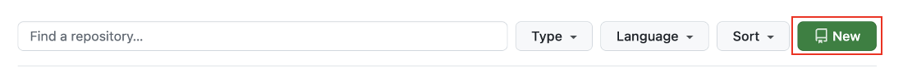
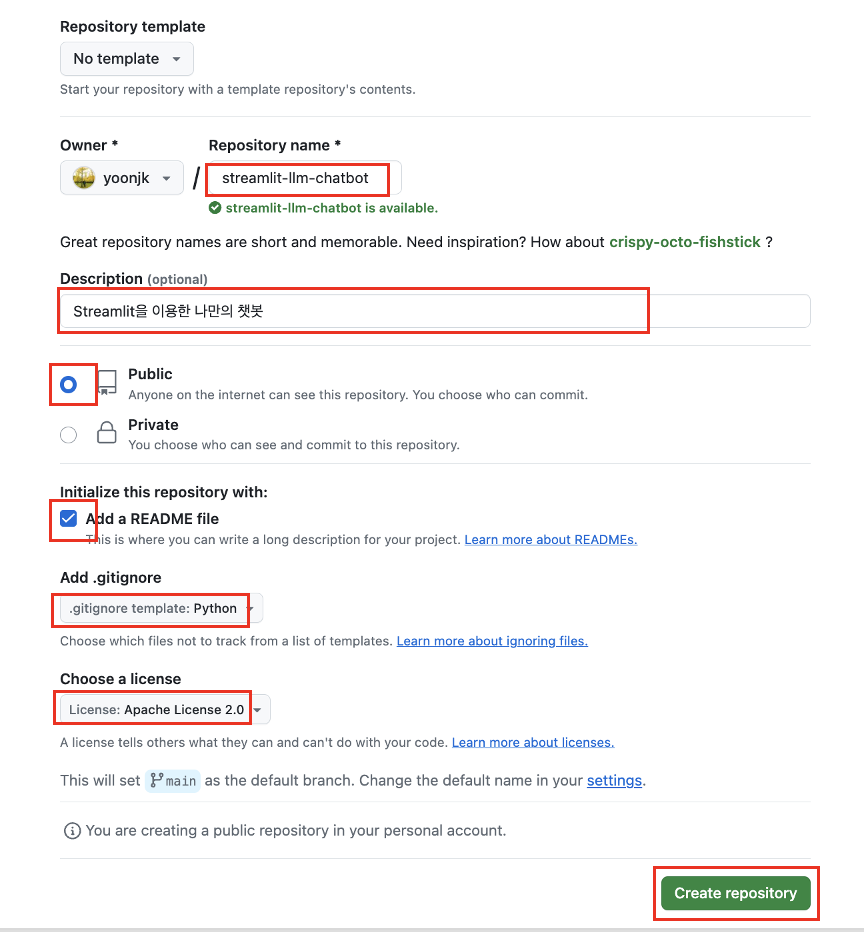
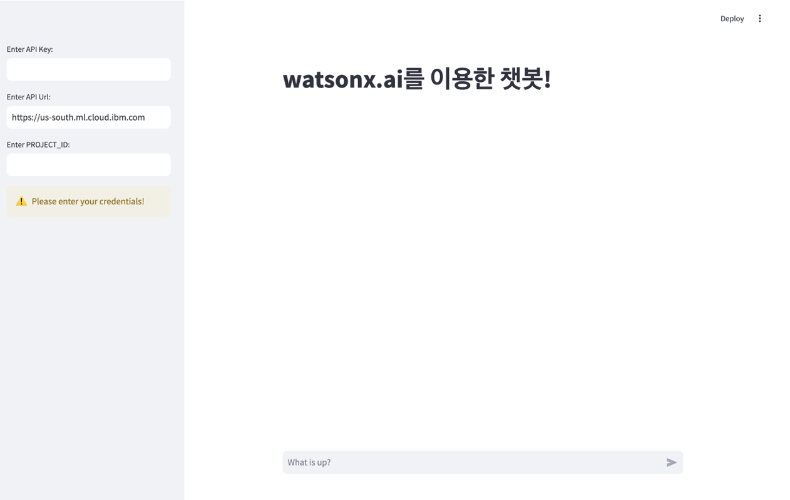
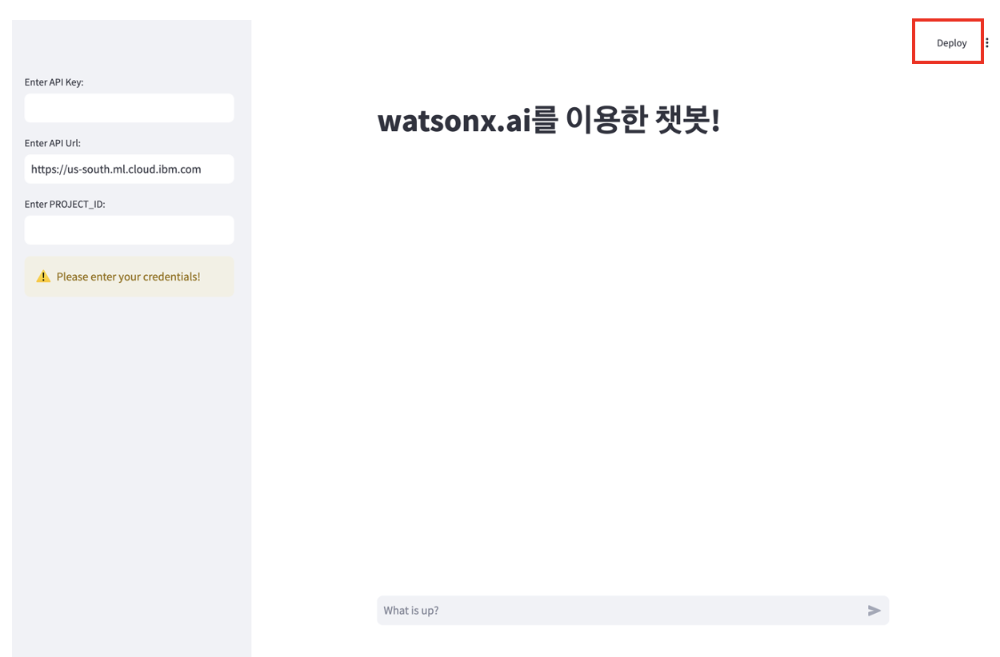
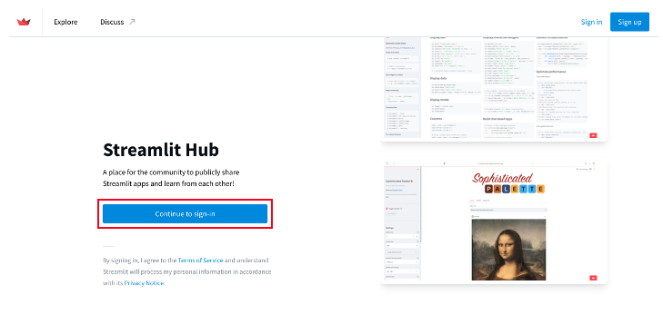
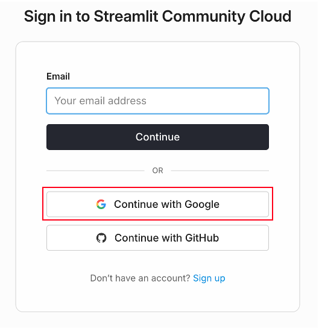
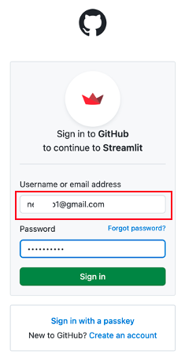
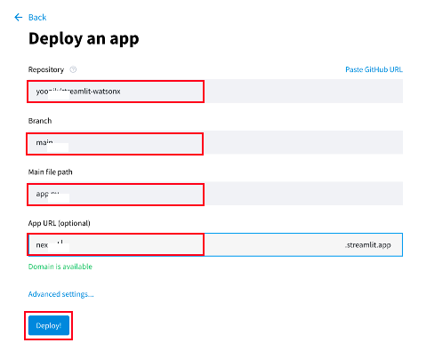
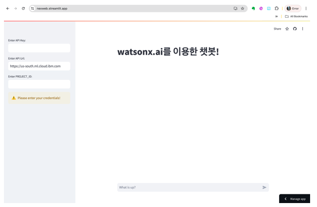

# 과제 - streamlit을 이용한 AI Chatbot 만들기
프롬프트 엔지니어링을 실습을 했던 것을 기반으로 LLM 애플리케이션을 만들어서 streamlit community 환경에 배포합니다.

## streamlit 과 watsonx.ai와 연계하여 챗봇 만들기 

Streamlit은 데이터 Scientlist 와 AI/ML 엔지니어가 단 몇 줄의 코드만으로 동적 데이터 앱을 제공할 수 있는 오픈 소스 Python 프레임워크입니다.

이전에 notebook에서 prompt engineering을 실습했던 것을 frontend 앱과 연계하여 챗봇을 만드는 것을 실습합니다.

강사가 제공하는 streamlit 기반 chatbot 소스를 받습니다.

### github repository 생성 
자신의 github new repository를 생성합니다.


repository생성을 위한 정보를 입력하고 create repository를 선택합니다.


### 사전 패키지 설치
```python
# git clone 위에서 생성한 git repository
# cd 위에서 생성한 git repository
python3 -m venv .venv
source .venv/bin/activate
pip install "ibm-watson-machine-learning>=1.0.342"
pip install streamlit
pip freeze > requirements.txt

git add .
git commit -am "Add requirements.txt"
git push

```

### streamlit 배포 
1. 제공받은 watsonx 챗봇 소스를 모두 수정했으면 자신의 github 소스에 반영하고 streamlit 애플리케이션을 실행합니다.

```python
streamlit run app.py
```

<p align="center" style="text-align: center;">

</p> 

2. streamlit을 배포하기 위해 오른쪽 상단에 deploy 버튼을 클릭합니다.  

<p align="center" style="text-align: center;">

</p> 

3. streamlit을 어디에 배포할 것인지 선택하는 화면이며, Streamlit Community Cloud 의 deploy를 선택해서 배포합니다.  

<p align="center" style="text-align: center;">

</p> 

4. streamlit에 가입되어 있으면 Continue to sign-in을 선택하고, 가입이 필요하면 오른쪽 상단의 Sign-up 버튼을 클릭하여 가입합니다.

<p align="center" style="text-align: center;">

</p> 


5. sign-in 하기 위해 Continue with Google provider를 선택합니다. 

<p align="center" style="text-align: center;">

</p> 

6. 자신의 google 계정을 선택합니다.

<p align="center" style="text-align: center;">

</p> 

7. Deployy an app 화면에서 자신의 streamlit github repository 와 branch, main file, App URL 정보를 입력하고 Deploy 버튼을 클릭합니다.

<p align="center" style="text-align: center;">

</p> 

8. 자신의 streamlit app이 배포된 것을 확인합니다.
   
<p align="center" style="text-align: center;">

</p> 	 


