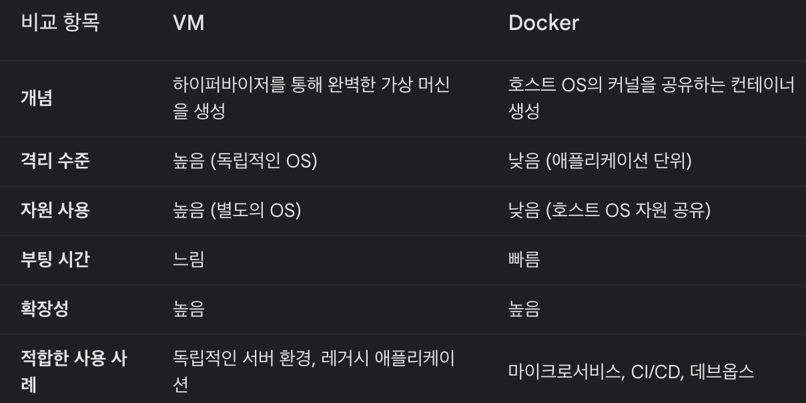
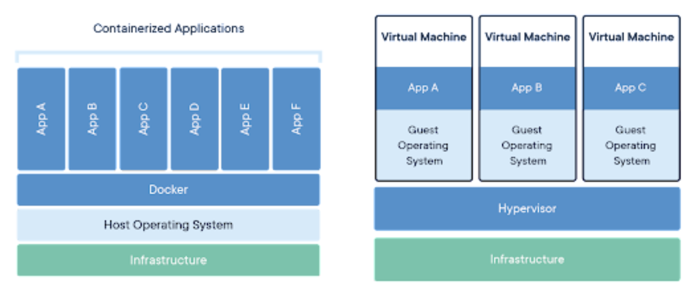

#### 기본 개념
Virtual Machine (VM): 가상 머신은 물리적인 컴퓨터(호스트) 위에 소프트웨어를 사용해 하나 이상의 가상 컴퓨터(게스트)를 생성하는 기술입니다. 각 VM은 운영체제(OS)와 애플리케이션을 포함하여 독립적으로 실행됩니다.

Docker: Docker는 컨테이너라는 가벼운 격리 환경에서 애플리케이션을 실행합니다. 컨테이너는 호스트 운영체제의 커널을 공유하고, 필요에 따라 애플리케이션과 그 의존성만 포함합니다.

#### 구조
VM 구조:

하드웨어: 물리적인 서버나 컴퓨터.
하이퍼바이저: VM을 생성하고 관리하는 소프트웨어 (예: VMware, Hyper-V).
게스트 운영체제: 각 VM에 설치된 독립적인 운영체제 (예: Windows, Linux).
애플리케이션: 게스트 OS 위에서 실행되는 프로그램들.
Docker 구조:

하드웨어: 물리적인 서버나 컴퓨터.
호스트 운영체제: Docker가 설치된 운영체제.
Docker 엔진: 컨테이너를 관리하는 소프트웨어.
컨테이너: 애플리케이션과 그 의존성을 포함하는 가벼운 격리 환경. 호스트 OS의 커널을 공유.
#### 성능과 효율성
VM: 각 VM은 독립적인 운영체제를 실행하므로 리소스 사용이 크고, 부팅 시간이 길 수 있습니다. 이로 인해 시스템 성능이 저하될 수 있습니다.

Docker: 컨테이너는 호스트 OS의 커널을 공유하므로, VM보다 훨씬 가볍고 빠르게 실행됩니다. 운영체제를 따로 포함하지 않기 때문에 리소스 사용이 적고, 더 많은 컨테이너를 동일한 하드웨어에서 실행할 수 있습니다.

#### 이식성
VM: VM은 전체 운영체제를 포함하므로, 이식성이 상대적으로 낮습니다. VM 이미지는 크기가 크고, 호환성 문제도 발생할 수 있습니다.

Docker: Docker 컨테이너는 애플리케이션과 그 의존성만 포함하여 매우 이식성이 높습니다. "한 번 빌드, 어디서나 실행"할 수 있습니다.

#### 사용 사례
VM: 다양한 운영체제를 동시에 실행해야 할 때 유용합니다. 예를 들어, Windows와 Linux 애플리케이션을 동일한 물리 서버에서 동시에 실행해야 할 때 VM을 사용할 수 있습니다.

Docker: 애플리케이션을 빠르게 배포하고, 격리된 환경에서 개발, 테스트, 배포를 진행해야 할 때 주로 사용됩니다. 컨테이너화된 애플리케이션은 어디서나 동일하게 동작하기 때문에 마이크로서비스 아키텍처에 적합합니다.

#### 예시로 비교
VM: 물리적인 컴퓨터 하나를 여러 개의 작은 컴퓨터로 나누어 각각 다른 운영체제를 설치하고 사용하는 것과 비슷합니다. 이 각각의 작은 컴퓨터는 서로 완전히 독립적입니다.

Docker: 하나의 운영체제를 공유하면서 여러 애플리케이션이 서로 격리된 환경에서 동시에 실행되는 것과 같습니다. 운영체제를 여러 번 설치할 필요가 없기 때문에 더 빠르고 가볍습니다.

이렇게 VM과 Docker는 목적과 사용 환경에 따라 다르게 선택할 수 있는 기술입니다. VM은 완전한 운영체제 격리가 필요할 때, Docker는 경량화된 애플리케이션 배포가 필요할 때 주로 사용됩니다.

