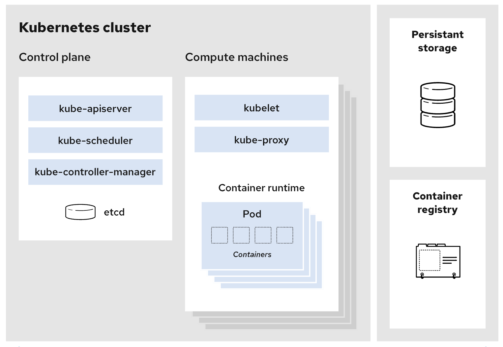

#### kubernetes
Kubernetes는 컨테이너화된 애플리케이션을 자동으로 배포, 확장, 관리하는 오픈 소스 플랫폼입니다. Kubernetes는 클라우드 네이티브 애플리케이션의 배포와 관리를 쉽게 해주며, 복잡한 컨테이너 환경에서 안정적인 운영을 지원합니다. Kubernetes의 주요 특징과 아키텍처를 설명하겠습니다.

#### Kubernetes의 주요 특징

**자동화된 배포와 롤아웃**:

Kubernetes는 애플리케이션의 배포와 업데이트를 자동화합니다. 새 버전의 애플리케이션을 배포하거나 롤백할 때, 서비스 중단 없이 수행할 수 있습니다.
서비스 디스커버리와 로드 밸런싱:

클러스터 내의 서비스를 자동으로 찾고 로드 밸런싱을 제공합니다. 애플리케이션이 컨테이너에 의해 여러 인스턴스에서 실행될 때, 요청을 적절히 분산시킬 수 있습니다.

**자동 스케일링:**

애플리케이션의 부하에 따라 자동으로 컨테이너의 수를 조정합니다. CPU 사용량이나 메모리 사용량에 따라 수평적으로 스케일링이 가능합니다.

**자체 복구:**

컨테이너가 실패하거나 장애가 발생하면, Kubernetes는 자동으로 새로운 인스턴스를 시작하거나 문제를 해결하여 서비스를 지속적으로 제공할 수 있도록 합니다.

**비밀 관리와 구성 관리:**

애플리케이션의 비밀 정보(예: API 키, 암호)를 안전하게 저장하고 관리합니다. 또한, 환경에 맞는 구성 정보를 관리할 수 있습니다.

**스토리지 오케스트레이션:**

다양한 저장소 시스템을 동적으로 관리할 수 있습니다. 예를 들어, 로컬 디스크, 네트워크 스토리지, 클라우드 스토리지 등을 지원합니다.

#### Kubernetes의 아키텍처
Kubernetes 아키텍처는 여러 주요 구성 요소로 나뉘며, 이들 구성 요소가 협력하여 클러스터를 관리합니다.

#### 클러스터

Kubernetes 클러스터는 여러 노드로 구성되며, 각 노드는 컨테이너화된 애플리케이션이 실행되는 물리적 또는 가상 서버입니다.

**마스터 노드 (Control Plane):**

클러스터의 상태를 관리하고 조정하는 역할을 합니다. 주요 컴포넌트는 다음과 같습니다:  
- **API 서버 (kube-apiserver):** 클러스터의 REST API를 통해 모든 요청을 처리합니다. 클러스터의 상태를 관리하고, 다른 컴포넌트와 상호작용합니다.

- **컨트롤러 매니저 (kube-controller-manager):** 클러스터의 상태를 모니터링하고 필요한 조정을 수행합니다. 예를 들어, 노드의 상태를 감시하고 새로운 포드를 생성하거나 삭제합니다.
  
- **스케줄러 (kube-scheduler):** 새로운 포드를 적절한 노드에 배치하는 역할을 합니다. 포드의 자원 요구 사항과 노드의 자원 상태를 고려하여 배치합니다.

- **etcd:** 클러스터의 상태 정보를 저장하는 분산 키-값 저장소입니다. 클러스터의 모든 설정과 상태 데이터가 저장됩니다.

**워커 노드:**

실제 애플리케이션이 실행되는 서버입니다. 워커 노드는 다음과 같은 주요 컴포넌트를 포함합니다:
- **Kubelet:** 노드에서 실행되며, 각 포드와 컨테이너의 상태를 관리합니다. API 서버와 상호작용하여 포드를 생성, 삭제 및 모니터링합니다.
  
- **컨테이너 런타임:** 실제로 컨테이너를 실행하는 소프트웨어입니다. Docker, containerd, CRI-O 등이 사용됩니다.

- **Kube-Proxy:** 네트워크 프록시로, 서비스의 네트워크 요청을 적절한 포드로 라우팅합니다. 클러스터 내부의 서비스 디스커버리와 로드 밸런싱을 지원합니다.
  
#### 애플리케이션:

- **포드 (Pod):** Kubernetes의 기본 실행 단위로, 하나 이상의 컨테이너를 포함합니다. 포드는 컨테이너의 그룹을 관리하고 네트워크와 스토리지를 공유합니다.
  
- **서비스 (Service):** 포드를 외부와 연결해주는 추상화된 네트워크 엔드포인트입니다. 로드 밸런싱과 서비스 디스커버리를 제공합니다.
  
- **디플로이먼트 (Deployment):** 포드를 선언적으로 관리하고 업데이트할 수 있게 해주는 리소스입니다. 롤링 업데이트와 롤백을 지원합니다.
추가 구성 요소:

- **네임스페이스 (Namespace):** 클러스터 내의 리소스를 논리적으로 구분하여 다중 사용자와 다중 애플리케이션이 격리된 환경에서 작업할 수 있도록 합니다.

- **ConfigMap과 Secret:** 애플리케이션의 설정 정보와 민감한 데이터를 관리합니다.

이와 같이 Kubernetes는 복잡한 컨테이너 환경을 관리하기 위한 강력한 기능을 제공하며, 이를 통해 대규모 애플리케이션의 배포와 운영을 효율적으로 수행할 수 있습니다.
