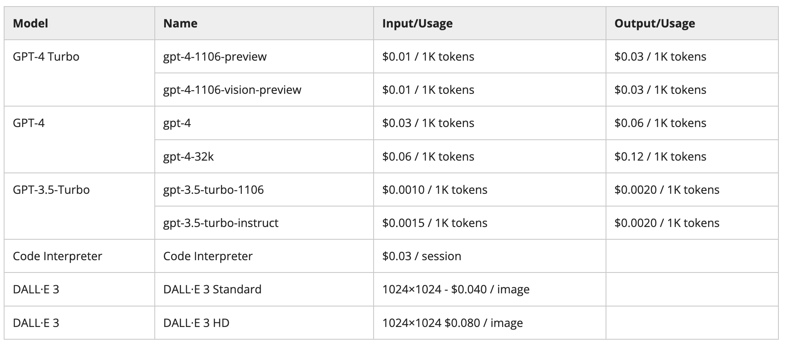

# 소프트웨어 개발에서의 생성형 AI 소개

예상 소요 시간: 20분

## 모듈 소개

이 모듈에서는 AI가 소프트웨어 개발에 어떤 영향을 미치는지 알아봅니다. 다양한 도구와 알고리즘을 사용하여 소프트웨어 개발 라이프사이클에 AI를 활용하는 방법을 이해하고 AI 및 ChatGPT를 위한 개발 환경을 설정합니다. 

## 동영상: Introduction to Generative AI in Software Development(6:40)

### 내용

생성적 AI는 소프트웨어 개발에서 큰 잠재력을 가진 빠르게 발전하는 분야입니다. 주요 내용은 다음과 같습니다:

- **정의 및 응용**: 생성적 AI는 인공지능 기술을 사용하여 기존 데이터와 유사한 새로운 코드, 콘텐츠(이미지, 텍스트, 음악 등)를 생성합니다.
- **자동화**: 반복 작업을 간소화하고 수동 작업을 줄이며 생산성을 증가시킵니다.
- **코드 최적화**: 대규모 코드베이스를 분석하여 성능을 향상하거나 메모리 사용량을 줄입니다.
- **버그 감지 및 문제 해결**: 머신 러닝 알고리즘을 사용하여 일반적인 버그와 취약점을 식별합니다.
- **사용자 경험 개선**: 자연어 처리(NLP) 알고리즘을 통해 사용자 피드백을 분석하고 귀중한 통찰력을 제공합니다.
- **창의성 증대**: GANs 같은 생성 모델을 사용하여 새로운 디자인 및 현실적인 테스트 데이터를 생성합니다.
- **코드 리팩토링**: 코드 구조 재조정, 변수 이름 변경, 중복 코드 제거 등으로 코드 품질 및 유지 관리를 향상시킵니다.
- **스마트 문서화 시스템**: 코드 주석 및 관련 리소스를 자동으로 분석하여 설명 문서를 생성합니다.
- **효율성 향상**: 데이터 생성 및 설계 탐색과 같은 자동화 작업을 통해 개발 효율성을 향상시킵니다.
- **창의적 협업**: 인간의 전문 지식과 기계 생성 아이디어의 결합으로 새로운 창의적 결과물을 도출합니다.
- **새로운 응용 분야**: 전통적인 소프트웨어 개발과 관련되지 않은 새로운 가능성을 열어줍니다.
- **자연어 처리 강화**: 인간 언어의 이해 및 처리 능력을 향상시킵니다.
- **로우 코드/노 코드 플랫폼**: 최소한의 코딩 지식으로 애플리케이션을 구축할 수 있게 합니다.
- **설명 가능한 AI**: AI 모델의 의사 결정 프로세스에 대한 투명성을 제공합니다.
- **지능형 비서**: 소프트웨어 개발 전반에 걸쳐 개발자를 지원하는 지능형 비서의 잠재력이 큽니다.
- **윤리적 AI 개발**: 공정하고 편견 없는 AI 시스템 개발 및 개인정보 존중을 보장합니다.

생성적 AI는 소프트웨어 개발의 여러 측면에서 혁신을 가져올 가능성을 가지고 있으며, 미래에는 더욱 발전할 것으로 예상됩니다.

## 동영상: 소프트웨어 개발 라이프사이클에서 생성형 AI 활용하기(6:40)

### 내용

생성적 AI를 활용한 소프트웨어 개발 생명 주기(SDLC)의 역할과 적용 방식을 설명합니다. 주요 내용은 다음과 같습니다:

- **요구 사항 수집 및 분석**: 자연어 처리(NLP)와 머신러닝(ML)을 활용해 사용자 요구 사항을 자동으로 분석하고, 대규모 데이터 세트에서 패턴이나 트렌드를 식별합니다. 요구 사항 검증도 자동화하여 품질을 향상시킵니다.
- **디자인 및 아키텍처**: AI는 최적의 소프트웨어 아키텍처를 추천하고, 과거 데이터나 모범 사례를 기반으로 설계 문서를 생성합니다. 디자인 패턴을 분석하여 시스템 성능과 확장성을 최적화합니다.
- **코드 생성 및 검토**: 반복적인 코드 작업을 자동화하고, 코드 리뷰 과정에서 잠재적인 버그나 취약점을 식별합니다. AI는 기존 코드 베이스를 분석해 코드 스니펫을 예측하고 생성합니다.
- **테스트 및 품질 보증**: AI는 테스트 케이스 생성 및 실행을 자동화하여 수동 테스트의 노력을 줄입니다. 코드 변경을 분석해 시스템에 영향을 미칠 수 있는 영역을 자동으로 식별하고, 회귀 테스트를 타겟팅합니다.
- **배포**: AI는 배포 프로세스를 자동화하고 일관된 무오류 배포를 보장합니다. 배포된 소프트웨어의 성능을 모니터링하고 이상 징후를 경고합니다.
- **유지 보수**: AI는 로그 파일과 사용자 피드백을 분석해 패턴을 식별하고 잠재적인 문제를 예측합니다. 코드 최적화 추천과 버그 보고를 제안합니다.
- **DevOps 및 지속적 통합**: AI는 DevOps 프로세스에 통합되어 자동화된 의사 결정을 지원합니다. 소프트웨어 릴리스를 최적화하고 성능 및 신뢰성을 보장합니다. 

AI는 SDLC의 모든 단계에서 효율성과 품질을 향상시키는 데 기여합니다.

## 소프트웨어 개발을 위한 생성형 AI의 도구들

### ChatGPT
ChatGPT는 실감 나는 텍스트 생성을 위해 OpenAI에서 만든 도구입니다. 자연스러운 대화, 질문 설명, 창의적인 글쓰기 지원에 뛰어납니다. 고객 지원 봇, 콘텐츠 생성, 작가의 브레인스토밍 등에 널리 사용됩니다.

### Gemini
Gemini는 Google에서 개발한 최첨단 챗봇 및 콘텐츠 생성 도구입니다. 소프트웨어 개발, 프로그래밍 질문, 콘텐츠 작성, 연구 및 학습을 지원하기 위해 LaMDA라는 트랜스포머 기반 모델을 활용합니다.

### Claude
Claude는 Anthropic AI에서 개발한 대규모 언어 모델(LLM)이며, 텍스트 생성, 번역, 질의응답, 코드 작성 등 다양한 작업 수행이 가능합니다.

### GitHub Copilot
GitHub Copilot은 인기 있는 코드 편집기와의 통합 및 협업 기능을 통해 코딩을 혁신합니다. 코드 스니펫, 설명, 문맥에 맞는 지침을 제공합니다. 여러 프로그래밍 언어를 지원하고 코딩 모범 사례를 준수하도록 돕습니다.

### Watsonx.ai
Watsonx.ai는 다양한 기능과 사용 사례를 제공하는 고급 AI 기술입니다. 대량의 텍스트 데이터를 효율적으로 처리하여 시간과 자원을 절약합니다. 언어 번역 기능으로 글로벌 커뮤니케이션과 협업을 가능하게 하고, 감정 분석 기능으로 고객 의견과 선호도를 파악할 수 있습니다.

깃허브의 코파일럿과 함께 가장 인기 있는 코드 생성 툴로는 구글 Gemini, 아마존 코드위스퍼러, 마이크로소프트 365 코파일럿(GPT 기반), 리플리트(Replit), 디비 AI(Divi AI), 탭나인(Tabnine), 리팩트닷에이아이(Refact.ai), 코디움(Codeium) 등이 있습니다. 대부분은 무료이거나 AI 지원 구독 서비스 일부로 제공됩니다.

## 동영상: GitHub CoPilot을 활용한 코드 생성(4:10)

### 내용
AI는 코드 작성 방식을 혁신하고 있으며, 그 대표적인 예로 GitHub Copilot이 있습니다. Copilot은 다양한 프로그래밍 언어와 저장소에서 학습한 방대한 코드를 바탕으로 가상 코딩 파트너 역할을 하며, 귀중한 제안을 제공하여 코딩 과정을 신속하게 진행할 수 있게 합니다.

이 데모 영상에서는 GitHub Copilot의 기능을 시연하며, 코딩 패턴을 인식하고 개발 및 디버깅 시간을 크게 단축하는 능력을 보여줍니다. Copilot은 월 $10의 비용이 들지만, 30일 무료 체험을 제공하며, GitHub 계정과 결제 정보를 등록해야 합니다. 체험 기간 종료 전에 취소해야 요금이 부과되지 않습니다.

시작하려면 코드 에디터에 확장을 설치하고 GitHub 계정으로 로그인해야 합니다. 이 데모에서는 VS Code를 사용하며, 확장 프로그램 탭에서 Copilot을 검색해 설치하고 인증 과정을 거칩니다. Copilot 프롬프트를 통해 함수와 코드를 생성하고, 필요에 따라 제안을 수락하거나 거부할 수 있습니다.

예를 들어, 배열의 최소값과 최대값을 찾는 함수를 작성하거나, 날씨 API를 호출하는 코드를 작성할 때 프롬프트에 입력하면 자동으로 코드가 생성됩니다. Copilot은 코드 작성 방식을 설명하는 기능도 제공하며, 주석을 통해 기대하는 코드를 입력하면 필요한 시간대를 제안합니다.

또한, Copilot은 HTML 템플릿을 생성하고 부트스트랩을 추가하는 등 프론트엔드 작업을 도와줍니다. 디버깅 기능도 탁월하여 코드의 버그를 찾아 수정 제안을 제공하며, 수정 전후의 코드를 비교할 수 있습니다. Copilot은 코딩 속도와 코드 품질을 향상시키고 소프트웨어 개발 과정을 지원합니다.

------------------

## 생성형 AI에서 토큰이란?

## 생성형 AI API에서의 토큰이란? :
토큰은 ChatGPT API의 중요한 조각입니다. 토큰은 단어의 조각 또는 세그먼트입니다. 프롬프트를 처리하기 전에 API는 입력을 개별 토큰으로 분해합니다.

이 토큰은 단어의 시작 또는 끝과 정확히 일치하지 않을 수 있으며, 공백이나 하위 단어를 포함할 수 있습니다.

**토큰 한계**: 일반적으로 요청은 모델에 따라 프롬프트와 완료 사이에 최대 4097개의 토큰을 사용할 수 있습니다. 예를 들어, 프롬프트가 4000개의 토큰으로 구성되어 있으면 완료는 최대 97개의 토큰을 포함할 수 있습니다. 이 한계는 현재 기술적 제약이지만, 프롬프트를 축약하거나 텍스트를 더 작은 조각으로 나누는 등 이를 극복할 창의적인 방법이 종종 있습니다.

**토큰 가격**: API는 다양한 가격대의 여러 모델 유형을 제공합니다. 각 모델은 다양한 기능을 가지고 있으며, 이러한 다양한 모델에 대한 요청은 다른 가격을 가집니다. 토큰 가격에 대한 자세한 정보는 제품 API 페이지에서 확인할 수 있습니다.

**토큰 탐색**: API는 코퍼스 데이터의 문맥에 따라 단어를 처리합니다. 프롬프트를 받아 입력을 토큰 목록으로 변환하고, 프롬프트를 처리한 다음 예측된 토큰을 단어로 다시 변환하여 응답을 제공합니다. 동일한 단어처럼 보일 수 있는 것이 텍스트 내 구조에 따라 다른 토큰으로 생성될 수 있습니다. 예를 들어, "red"라는 단어의 문맥에 따른 토큰 값을 생성하는 방법을 고려해 보세요.

### 토큰 도구

- OpenAI의 interactive tokenizer tool
- BPE tokenizer Tiktoken
- Python용 transformers 패키지 또는 Node.js용 gpt-3-encoder 패키지
- hugginface의 여러가지 tool

### 토큰 계산 방법?
토큰을 계산하려면 다음 단계를 따르세요:

- API 엔드포인트 식별: 호출할 생성형 AI 엔드포인트를 결정합니다.
- 각 엔드포인트는 API가 제공하는 특정 기능이나 리소스를 나타냅니다.
- API 문서 검토: API 제공자가 제공한 API 문서에 액세스합니다. 문서에는 요청 및 응답의 구조, 필요한 헤더, 매개변수 또는 인증 방법이 포함됩니다.
- API가 토큰 기반 인증이 필요한지 확인: 토큰 기반 인증은 요청 헤더에 액세스 토큰을 포함하여 API 호출을 승인하는 것을 포함합니다. 토큰은 일반적으로 API 제공자와 애플리케이션을 등록하고 인증 프로세스를 따름으로써 얻습니다.
- 액세스 토큰 획득: 토큰 기반 인증이 필요한 경우, API 제공자가 지정한 인증 프로세스를 따름으로써 액세스 토큰을 획득합니다. 이 작업에는 애플리케이션 등록, 자격 증명 제공 및 토큰 수신이 포함될 수 있습니다.
- 각 API의 토큰 계산: 액세스 토큰을 얻으면, API 호출마다 하나의 토큰으로 계산합니다. 요청 헤더에 액세스 토큰을 포함한 각 API 엔드포인트 요청은 단일 토큰으로 계산됩니다.
- 토큰 사용량 추적: 사용한 토큰 수를 추적하여 API 제공자가 설정한 사용 한도 또는 할당량 내에서 유지합니다. 일부 API는 특정 기간 내에 사용할 수 있는 토큰 수를 제한할 수 있습니다.

### OpenAI의 토큰 수 계산 지침
OpenAI의 공식 문서에 따르면 토큰 수의 추정치는 다음과 같습니다:

- 1 토큰 ~= 영어에서 4 문자
- 1 토큰 ~= ¾ 단어
- 100 토큰 ~= 75 단어
- 1-2 문장 ~= 30 토큰
- 1 문단 ~= 100 토큰
- 1,500 단어 ~= 2048 토큰

### 예시: API 호출을 위한 토큰 계산
예를 들어, 사용자의 정보를 검색하기 위해 GET 요청이 필요한 OpenAI 엔드포인트가 있다고 가정해 봅시다. 엔드포인트의 세부 사항은 다음과 같습니다:

- 요청 방법: GET
- 엔드포인트 URL: https://api.example.com/users/{userId}
- 경로 매개변수: userId (값: "123")
- 쿼리 매개변수: includeAddress (값: true)

#### 이 요청의 토큰 계산:

- 요청 방법 'GET'은 일반적으로 1 토큰이 필요합니다.
- 엔드포인트 URL은 추가 토큰을 소모하지 않습니다.
- 경로 매개변수 'userId'의 값 '123'은 추가 토큰을 소모하지 않습니다.
- 쿼리 매개변수 'includeAddress'의 값 'true'는 2개의 토큰을 소모합니다 (매개변수 이름 1개, 매개변수 값 1개).
- 1단계에서 4단계까지의 토큰을 합산하면 이 API 요청의 총 토큰 수는 3개가 됩니다.

> **참고**: 토큰 계산 방법은 특정 API 구현 또는 API 제공자에 따라 다를 수 있습니다. 토큰 사용 및 관련 비용 또는 제한 사항에 대한 정확한 정보는 API 문서를 참조하세요.

## AI 비용 추정
예: 입력 프롬프트와 출력을 사용한 샘플 비용 계산 공식.

입력 프롬프트: 프롬프트: "운동의 이점에 대한 간략한 개요를 제공할 수 있습니까?"

- 단계 1: 프롬프트의 단어 수를 결정합니다.
  - 이 경우 프롬프트는 9개의 단어로 구성되어 있습니다.
- 단계 2: 토큰 수를 기준으로 프롬프트의 비용을 계산합니다. 1000 토큰당 비용이 $0.03이라고 가정합니다 (가격은 생성형 AI별로 다름).
  - 프롬프트에 9개의 단어가 있고 평균 변환율이 1000 토큰당 750 단어이므로 프롬프트 비용 = (9 / 750) * (0.03) = $0.00036
- 단계 3: AI 모델이 약 500개의 단어로 출력을 생성하면 동일한 공식을 사용하여 출력 생성 비용을 계산합니다. 출력 비용 = (500 / 750) * (0.06) = $0.04
- 단계 4: 총 비용을 계산합니다. 총 추정 가격 = 프롬프트 비용 + 출력 비용 = $0.00036 + $0.04 = $0.04036

따라서 주어진 프롬프트를 사용하여 약 500개의 단어로 출력을 생성하는 추정 가격은 $0.04036입니다.

마찬가지로, 애플리케이션이 하루에 1000번 API를 호출한다고 가정하면 비용은 다음과 같습니다:

- 하루 비용 = $40.36
- 월 비용 = $1,210.80

> **참고**: 실제 비용은 콘텐츠 생성에 사용된 정확한 토큰 수와 사용된 모델 유형에 따라 달라질 수 있습니다.

## 모델의 현재 가격
> **주의 : 제공된 가격표는 작성 시점의 정보입니다. 가장 최신의 정확한 가격 정보는 공식 홈페이지 문서를 참조하시기 바랍니다.**

고려 사항: 각기 다른 기능과 가격 포인트를 가진 여러 모델.

가격은 1,000 토큰당입니다. 이 모델에서 토큰은 단어의 조각이므로 1,000 토큰은 약 750 단어입니다. [이 문단은 35 토큰입니다].

### 모델별 가격표:

