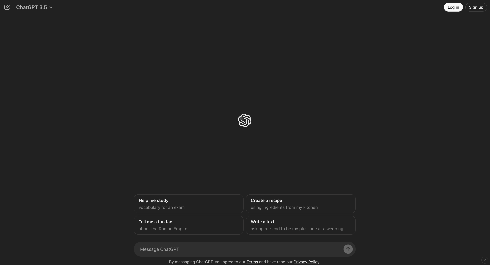
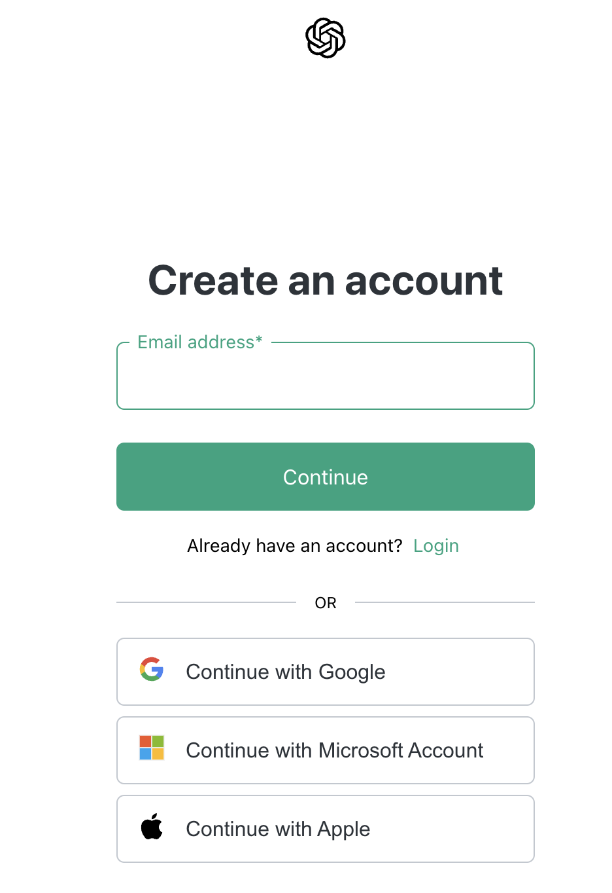
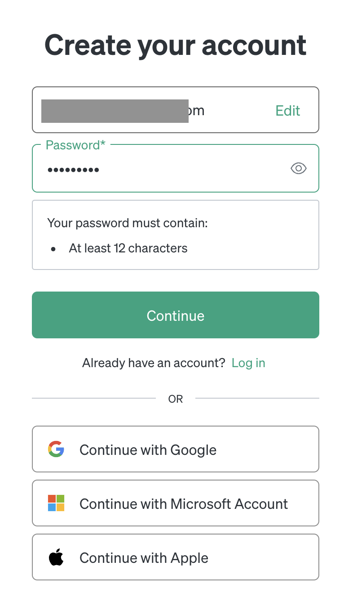
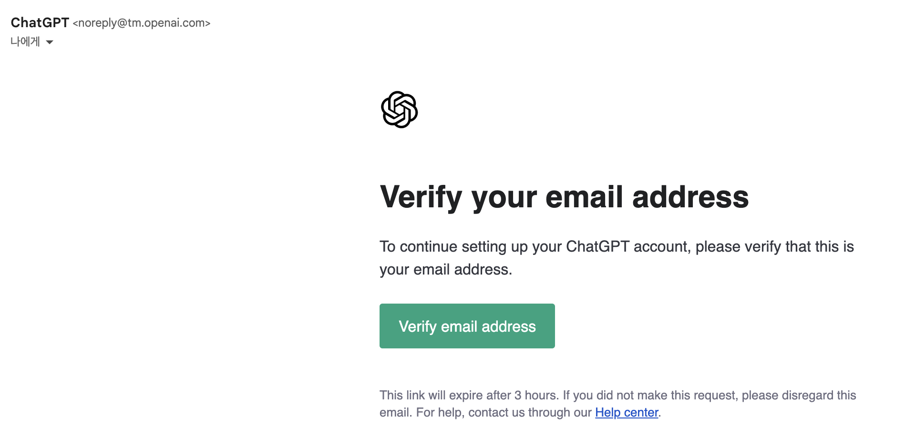
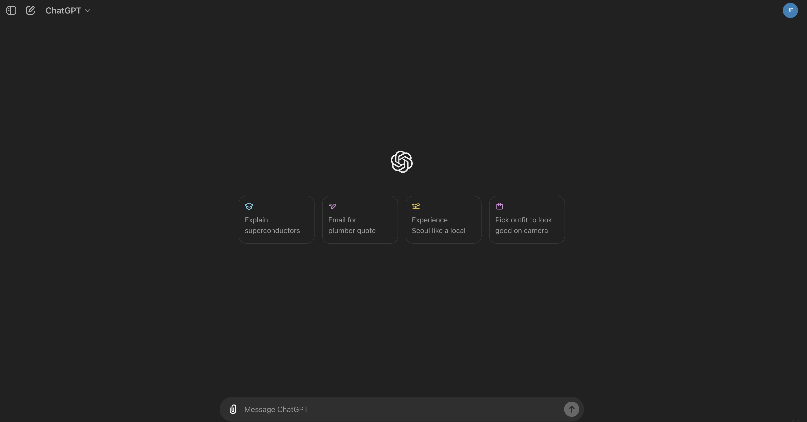

# 생성형 AI 환경 준비

예상 소요 시간: 10분

## ChatGPT 사용 준비

본 과정에서는 소프트웨어 개발에 활용할 생성형 AI로 ChatGPT를 사용합니다.
Google Gemini, Claude 등 원하는 모델을 같이 사용하면서 결과를 비교해보면 좋은 경험이 될 것입니다.

가입하지 않더라도 일부 기능(이전버전의 모델)을 사용할 수 있습니다.

가입을 하게 되면 대화를 저장하여 나중에 다시 내용을 확인해 볼 수 있습니다.
최신 버전의 모델을 사용할 수 있습니다.(무료계정은 사용량 제한이 있음)

Step 1: 웹 브라우저를 열고 [https://chatgpt.com/](https://chatgpt.com/) 웹사이트로 이동합니다:

Step 2: 오른쪽 상단의 Sign up 클릭

Step 3: 이메일 등록 또는 아래의 Google 계정, Microsoft 계정, Apple 계정으로 선택하기 중 선택해서 진행(다음 과정은 이메일 등록으로 진행함)

Step 4: 이메일 및 비밀번호 입력하고 Continue 클릭

Step 5: 이메일 확인

Step 6: 이메일에서 Verify email address 클릭

Step 7: chatgpt.com 사이트에 로그인

