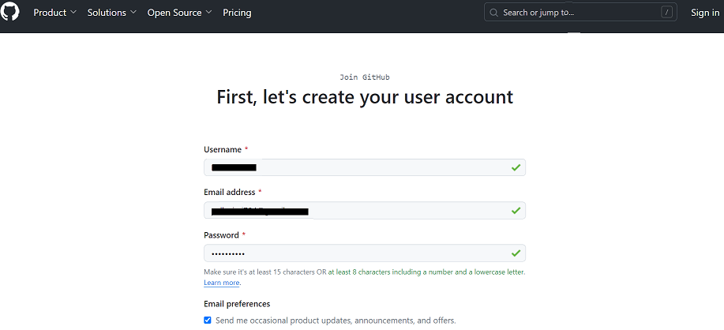
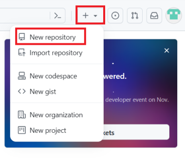

#  GitHub 계정 및 Repo 생성

예상 소요 시간: 10분

이 실습에서는 GitHub 계정을 만들고 새 리포지토리를 생성하여 GitHub를 시작하게 됩니다. 그런 다음 GitHub 웹 인터페이스를 사용하여 리포지토리에 파일을 추가합니다.

## 목적
이 실습을 완료하면 다음을 수행할 수 있습니다:

1. GitHub 설명하기
2. GitHub 계정 만들기
3. 프로젝트/리포지토리 추가하기
4. 파일 생성 및 편집
5. 파일 업로드 및 커밋
6. Personal Access Token 생성

## 1. GitHub 개요

GitHub 사용법을 배우기 전에 먼저 Git에 대해 살펴봅시다. Git은 소프트웨어 개발을 위한 오픈 소스 명령줄 기반 버전 관리 시스템입니다. Git은 명령줄 도구이며 버전 관리를 위해 Git을 사용할 수 있는 서버를 호스팅하고 유지 관리해야 합니다.

GitHub는 Git을 사용하는 리포지토리 호스팅 서비스입니다. GitHub는 그래픽 사용자 인터페이스(GUI)와 git 명령줄 인터페이스(CLI)를 갖춘 웹 기반 호스팅 서비스를 제공합니다. 또한 모든 프로젝트에 대한 액세스 제어와 위키 및 기본 작업 관리 도구와 같은 여러 협업 기능을 제공합니다. GitHub는 소스 코드를 위한 클라우드 스토리지를 제공하고, 모든 인기 프로그래밍 언어를 지원하며, 반복 프로세스를 간소화합니다. GitHub에는 개인 개발자 및 오픈 소스 프로젝트 호스팅을 위한 무료 플랜이 포함되어 있습니다.

## 2. GitHub 계정 만들기

GitHub에서 계정을 만들려면 다음 단계를 완료하세요:

1. [GitHub 가입](https://github.com/join) 페이지로 이동하여 계정을 만듭니다. **참고**: 이미 GitHub 계정이 있는 경우 지금 로그인하세요.
2. 아래와 같이 계정 생성에 필요한 세부 정보를 입력합니다:

3. 계정을 인증한 다음 **Submit**을 클릭합니다.

4. 완료되면 **Create account**를 클릭합니다.

5. GitHub에서 인증 이메일을 받게 됩니다. 동봉된 링크를 클릭하여 이메일을 인증하거나 제공된 인증 코드를 입력하세요. **참고**: 인증 이메일을 받지 못한 경우 **Resend the code**를 클릭하세요.

6. 제공된 인증 코드를 입력하면 다음과 같은 화면이 표시됩니다. 이는 계정에 로그인했으며 사용할 준비가 되었음을 나타냅니다.

## 3. 프로젝트/리포지토리 추가

새 리포지토리를 추가하려면 다음 단계를 완료하세요:

1. GitHub 홈페이지의 오른쪽 상단에서 "+" 아이콘을 클릭하고 **New repository**를 선택합니다.

2. 리포지토리 이름을 입력하고 **Initialize this repository with:** 옵션 아래에서 **Add a README file** 확인란을 선택합니다.

3. **Create repository** 를 클릭합니다.

4. 리포지토리가 생성되고 홈 페이지가 표시됩니다.

다음으로 리포지토리 편집을 시작합니다.

## 4. 파일 만들기 및 편집

### 4.1 파일 편집

일반적으로 파일을 편집하기 전에 파일을 생성하지만, 이 경우에는 `README.md` 파일이 이미 생성되어 있습니다. 해당 파일을 편집하려면 다음 단계를 완료합니다:

1. 리포지토리 루트 폴더에 파일이 하나만 있습니다: README.md` 파일 하나만 있습니다. 오른쪽의 연필 아이콘을 클릭하여 파일을 편집합니다.

2. 파일에 "It's a markdown file in this repository" 라는 텍스트를 추가하고 오른쪽 상단으로 이동하여 변경 사항 커밋을 클릭합니다.

3. 설명을 추가하고 **Commit changes**을 클릭합니다.

4. 파일에 추가한 텍스트가 저장되었는지 확인합니다.

### 4.2 새 파일 만들기

1. 리포지토리 이름을 클릭하면 메인 브랜치로 돌아가는데, 이 리포지토리와 비슷한 `testrepo`라는 리포지토리가 있습니다.

2. **Add file** 를 클릭하고 **Create new file** 를 선택하여 리포지토리에 새 파일을 생성합니다.

3. 파일 이름과 확장자를 입력합니다(예: `firstpython.py`). 다음 이미지에 표시된 코드 줄을 파일에 추가합니다:

4. 페이지 오른쪽 상단으로 스크롤하여 변경사항 커밋을 클릭합니다. 선택적으로 업데이트에 대한 설명(예: "새 파일 추가")을 추가할 수 있습니다. **Commit changes**을 클릭하여 새 파일을 만듭니다.

5. 이제 파일이 리포지토리에 추가되고 리포지토리 목록에 파일이 추가되거나 마지막으로 수정된 시점이 표시됩니다.

## 5. 파일 업로드 및 커밋

로컬 파일을 업로드하고 리포지토리에 커밋하려면 다음 단계를 완료하세요:

1. 리포지토리 페이지에서 **Add file** 을 클릭한 다음 **Upload files** 를 선택하여 파일을 업로드합니다.

2. **choose your files** 을 클릭하고 컴퓨터에서 파일을 선택합니다. 리포지토리에 모든 파일(예: .txt, .ipynb 또는 .png 파일)을 업로드할 수 있습니다.

3. 파일 업로드가 완료되면 **Commit changes**을 클릭합니다.

4. 파일이 리포지토리에 업로드됩니다.

## 6. GitHub personal access token 생성

개인 액세스 토큰은 일반 OAuth 액세스 토큰처럼 작동합니다. HTTPS를 통한 Git에서 비밀번호 대신 사용할 수 있습니다.

### 사전 요구 사항

이 실습에는 Github.com 계정이 필요합니다. 또한 Github에서 이메일 주소가 인증되지 않은 경우 이메일 주소를 인증하세요.

### personal access token 생성

먼저 비밀번호로 사용할 개인 액세스 토큰을 만들어 보겠습니다.

1. [GitHub.com](https://github.com/)을 엽니다. 페이지의 오른쪽 상단에서 프로필 사진을 클릭한 다음 설정을 클릭합니다.

2. 왼쪽 사이드바에서 **Developer settings** 을 클릭합니다.

3. **Personal access tokens** 과 **Generate new token** 을 클릭합니다.

4. 토큰에 설명이 포함된 이름을 지정합니다. 토큰에 만료일을 지정하려면 `Expiration` 드롭다운 메뉴를 선택한 다음 기본값을 클릭하거나 캘린더 선택기를 사용합니다. 이 토큰에 부여할 범위 또는 권한을 선택합니다. 토큰을 사용하여 명령줄에서 리포지토리에 액세스하려면 리포지토리를 선택합니다.

5. **개인 토큰을 안전한 곳에 복사합니다.** 이 페이지를 나가면 이 토큰을 다시 볼 수 없습니다. 어떤 이유로든 토큰을 분실한 경우 다음 단계를 따라 새 토큰을 다시 생성할 수 있습니다.

## 요약

축하합니다! 이 실습에서는 새 리포지토리 만들기, 새 파일 추가하기, 파일 편집하기, 파일 업로드하기, 변경 사항 커밋하기 방법을 배웠습니다. 학습한 프로세스에 익숙해지도록 리포지토리를 계속 업데이트하는 것이 좋습니다.

