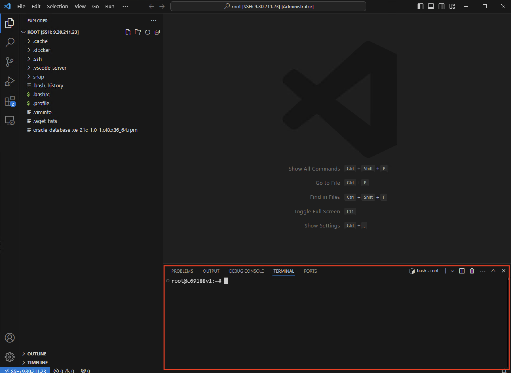

#  개발 환경 설정: Visual Studio Code(Optional)

예상 소요 시간: 15분

이 실습에서는 Visual Studio Code, Intellicode, Code Spell Checker를 설치하는 방법을 배웁니다.

### 학습 목표

이 실습을 완료한 후에는 다음 작업을 수행할 수 있습니다:

- Visual Studio Code(VS Code) 설치하기
- Visual Studio Code에 IntelliCode 설치
- Visual Studio Code의 Code Spell Checker 설치

### Task 1: Visual Studio Code 설치

Step 1: 웹 브라우저를 열고 공식 Visual Studio Code 웹사이트로 이동합니다: [비주얼 코드 스튜디오 설치](https://code.visualstudio.com/ "비주얼 코드 스튜디오 설치")로 이동합니다. **[설치 대상 PC의 운영 체제용 다운로드\]** 버튼을 클릭하여 설치 프로그램을 다운로드합니다.

  
  
Step 2: 다운로드가 완료되면 다운로드 폴더에서 Visual Studio 코드 아이콘을 찾거나 바탕화면에 표시될 수 있습니다. 설치 프로그램 실행 파일을 클릭하여 설치 프로세스를 시작합니다. 
  
  

_참고: Mac용 Visual Studio 코드 설치는 이 링크를 확인하세요: 비주얼 코드 [Mac용 설치](https://code.visualstudio.com/docs/setup/mac "Mac용 설치")에서 확인하세요._

Step 3: 인스톨러가 시작되면 Visual Studio Code 이용 약관에 동의하라는 메시지가 표시됩니다. **I accept the agreement** 옵션을 선택하고 **Next** 버튼을 클릭하여 계속 진행합니다.

  
  
Step 4: VS Code 를 시스템 경로에 추가하는 등 설치 환경설정을 선택합니다. 
  
  
  

Step 5: 설치 설정을 시작하라는 메시지가 표시되면 **Install** 버튼을 선택합니다.

  
  

Step 6: 설치를 클릭하면 장치에 Visual Studio Code 설치가 완료되는 데 약 1분 정도 소요됩니다. Visual Studio Code 설치 설정이 완료되면 아래 스크린샷과 유사한 창이 나타납니다. **Finish** 를 클릭합니다.

  
  
이제 Visual Studio Code 설치가 성공적으로 완료되었습니다.    
  
Step 7: 컴퓨터에서 Visual Studio Code 애플리케이션을 찾을 수 있습니다. 애플리케이션 메뉴에서 찾거나 설치 중에 만든 바로 가기를 사용하여 찾을 수도 있습니다.    
  
  

### Task 2: IntelliCode 설치

IntelliCode는 개발 환경에 지능형 코드 완성 및 제안 기능을 제공하는 Visual Studio Code의 확장 프로그램입니다.

Step 1: Visual Studio Code 애플리케이션을 찾습니다:

Windows OS 경우: 시작 메뉴에서 Visual Studio Code를 찾거나 작업 표시줄에서 검색합니다.  
macOS: 애플리케이션 폴더를 확인합니다. Spotlight 검색을 사용하여 찾을 수도 있습니다(Cmd + 스페이스 키를 누른 다음 "Visual Studio Code"를 입력하세요).

Visual Studio Code 아이콘을 두 번 클릭합니다.

Step 2: 창 옆의 활동 표시줄에서 확장 프로그램 아이콘을 클릭하여 확장 프로그램 보기로 이동합니다. 또는 Ctrl+Shift+X(Windows/Linux) 또는 Cmd+Shift+X(Mac)를 누를 수도 있습니다. 상단 메뉴 View  -> Extensions 로 이동할 수도 있습니다.

  
  

Step 3: 사용 가능한 확장 프로그램 목록에서 **IntelliCode** 확장 프로그램을 검색합니다. 이를 선택한 다음 **IntelliCode** 확장 프로그램 옆에 있는 **Install** 버튼을 클릭하여 설치 프로세스를 시작합니다.

  
  

Step 4: 설치가 완료되면 아래 스크린샷과 같은 창이 표시됩니다.

변경 사항을 적용하려면 Visual Studio Code를 다시 시작합니다.

### Task 3: Code Spell Checker 설치

코드 맞춤법 검사기는 개발자가 코드 내에서 맞춤법 오류를 식별하고 수정하는 데 도움을 주기 위해 설계된 Visual Studio Code의 확장 기능입니다.

Step 1: 확장 프로그램 보기의 검색 창에서 **Code Spell Checker**를 검색합니다. 검색 결과에서 **Code Spell Checker** 확장 프로그램을 찾아 선택합니다.

  
  

Step 2: 설치를 시작하려면 코드 맞춤법 검사기 확장 프로그램 옆에 있는 **Install** 버튼을 클릭합니다.

  
  

Step 3: **Trust Workspace and Install** 를 선택합니다.

  
  

Step 4: 설치가 완료되면 아래 스크린샷과 같은 창이 표시됩니다. 변경 사항을 적용하려면 Visual Studio Code를 다시 시작합니다.

  
  
### Task 4: 원격 개발 환경 설치

Remote Explorer는 개발자가 원격 서버에 연결하여 개발을 하기 위해 설계된 Visual Studio Code의 확장 기능입니다.

Step 1: 확장 프로그램 보기의 검색 창에서 **remote explorer**를 검색합니다. 검색 결과에서 **Remote Explorer** 확장 프로그램을 찾아 선택합니다.

Step 2: 설치를 시작하려면 **Install** 버튼을 클릭합니다.

Step 3: 검색 결과에서 **Remote - SSH** 확장 프로그램을 선택하고 **Install** 버튼을 클릭합니다.

Step 4: 설치가 완료되면 아래 스크린샷의 붉은색 박스와 같은 아이콘이 생성되고, 해당 아이콘을 클릭합니다.

Step 5: 아래 스크린샷의 붉은색 박스를 클릭합니다.

Step 6: 상단의 입력창에 강사가 알려준 본인이 사용할 원격 서버 정보를 입력하고 엔터키를 입력합니다.

> window pc에서 오류 발생시 다음 명령어를 사용 `ssh -o MACs=hmac-sha2-256 user@x.xx.xx.xx`

Step 7: config 저장할 파일을 선택하고 엔터합니다.

Step 8: 입력한 정보가 목록에 보이면 화살표를 클릭합니다.

Step 9: remote windows extension을 설치해야 한다는 메세지가 오른쪽 하단에 뜨면 설치를 합니다.
설치후 vscode가 재시작 되면서 상단 창에 원격 서버 OS를 선택하는 창이 나타납니다.

Step 10: Fingerprint를 continue 선택하고

Step 11: 암호를 입력

Step 12: 왼쪽 아이콘 클릭 후 Open Folder 클릭

Step 13: 폴더를 선택하고 OK 버튼 클릭

Step 14: 체크박스 선택후 왼쪽 버튼 클릭

Step 15: 상단 메뉴의 View > Terminal 선택

Step 16: 오른쪽 하단에 terminal 창이 열린것 확인

축하합니다! Visual Studio Code 개발 환경 설정에 대한 실습을 성공적으로 완료했습니다.

## 요약

이 실습에서는 코딩을 위해 Visual Studio Code를 설정하고, 지능적인 코드 완성을 위해 IntelliCode를 추가하고, 오류 없는 프로그래밍을 위해 코드 맞춤법 검사를 통합했습니다.