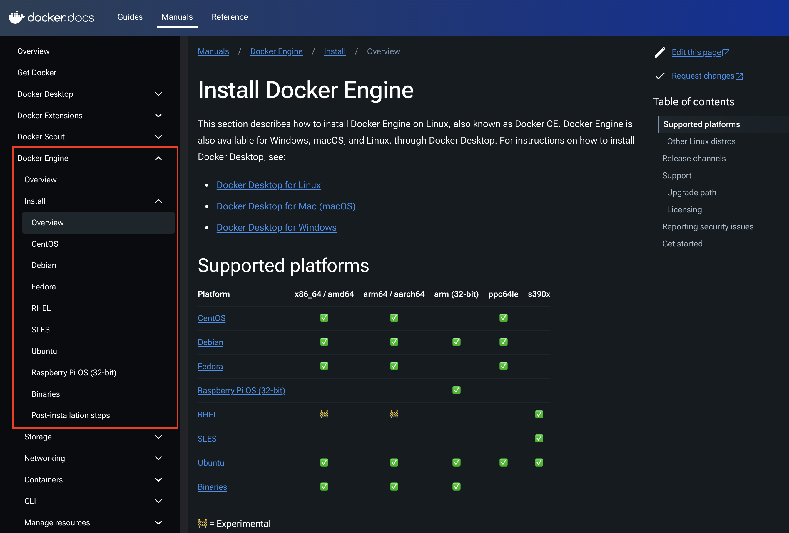

#  개발 환경 설정: docker 설치(Optional)

예상 소요 시간: 15분

이 실습에서는 docker를 설치하는 방법을 배웁니다.


### 학습 목표

이 실습을 완료한 후에는 다음 작업을 수행할 수 있습니다:

- linux에 docker 설치하기

### Task 1: docker engine 설치

Step 1: 웹 브라우저를 열고 공식 docker 웹사이트로 이동합니다: [docker engine 설치](https://docs.docker.com/engine/install/ "docker engine")로 이동합니다. 좌측 메뉴에서 해당하는 OS를 선택합니다.(Ubuntu로 진행)


  
Step 2: conflict package 제거
```
for pkg in docker.io docker-doc docker-compose docker-compose-v2 podman-docker containerd runc; do sudo apt-get remove $pkg; done
```

Step 3: setup apt repository
```
# Add Docker's official GPG key:
sudo apt-get update
sudo apt-get install ca-certificates curl
sudo install -m 0755 -d /etc/apt/keyrings
sudo curl -fsSL https://download.docker.com/linux/ubuntu/gpg -o /etc/apt/keyrings/docker.asc
sudo chmod a+r /etc/apt/keyrings/docker.asc

# Add the repository to Apt sources:
echo \
  "deb [arch=$(dpkg --print-architecture) signed-by=/etc/apt/keyrings/docker.asc] https://download.docker.com/linux/ubuntu \
  $(. /etc/os-release && echo "$VERSION_CODENAME") stable" | \
  sudo tee /etc/apt/sources.list.d/docker.list > /dev/null
sudo apt-get update
```

Step 4: install the Docker packages

install the latest version
```
sudo apt-get install docker-ce docker-ce-cli containerd.io docker-buildx-plugin docker-compose-plugin
```

Step 5: Verify that the Docker Engine installation 

running the hello-world image.
```
sudo docker run hello-world
```

### Task 2: docker engine 설치(CentOS)

Step 1: 웹 브라우저를 열고 공식 docker 웹사이트로 이동합니다: [docker engine 설치](https://docs.docker.com/engine/install/ "docker engine")로 이동합니다. 좌측 메뉴에서 해당하는 OS를 선택합니다.(CentOS 진행)


Step 2: Uninstall old versions
```
sudo yum remove docker \
                  docker-client \
                  docker-client-latest \
                  docker-common \
                  docker-latest \
                  docker-latest-logrotate \
                  docker-logrotate \
                  docker-engine
```

Step 3: Setup the repository

```
sudo yum install -y yum-utils
sudo yum-config-manager --add-repo https://download.docker.com/linux/centos/docker-ce.repo
sudo yum update
```

Step 4: install docker engine
```
sudo yum install docker-ce docker-ce-cli containerd.io docker-buildx-plugin docker-compose-plugin
```

Step 5: Start Docker.
```
sudo systemctl start docker
```

Step 6: Verify that the Docker Engine installation

```
sudo docker run hello-world
```


축하합니다! Docker engine 설치를 성공적으로 완료했습니다.


