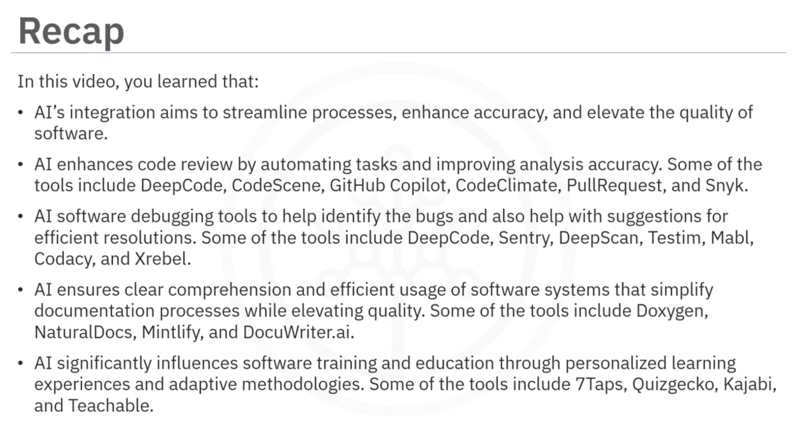

# 생성형 AI를 사용한 아키텍처 및 디자인 다이어그램 생성
예상 시간: 15분

## 목표
이 읽기를 완료한 후, 다음을 할 수 있습니다:

- 아키텍처 및 디자인 다이어그램을 생성하는 데 사용되는 생성형 AI 도구를 설명합니다.
- AI 도구를 사용하여 아키텍처 및 디자인 다이어그램을 만드는 방법을 설명합니다.

## 생성형 AI 도구를 사용한 아키텍처 및 디자인 다이어그램
소프트웨어 아키텍처 다이어그램은 복잡한 소프트웨어 시스템의 구조와 디자인을 시각적으로 나타내는 데 도움이 됩니다. 전통적으로 이러한 다이어그램을 만드는 데는 상당한 수작업과 전문 지식이 필요했습니다. 그러나 AI 도구와 알고리즘의 등장으로 소프트웨어 아키텍처 다이어그램을 생성하는 것이 더 효율적이고 자동화되었습니다.

다음은 소프트웨어 아키텍처 다이어그램 생성을 쉽게 할 수 있게 하는 몇 가지 AI 기반 도구와 기술입니다.

**자연어 처리(NLP) 기반 다이어그램 생성**: 자연어 처리 기능을 갖춘 AI 기반 도구는 소프트웨어 시스템의 텍스트 설명을 분석하고 해당 아키텍처 다이어그램을 자동으로 생성할 수 있습니다. 예를 들어, "시스템은 웹 서버, 애플리케이션 서버 및 데이터베이스 서버로 구성됩니다"와 같은 텍스트 설명을 입력하면 AI 도구가 이러한 구성 요소 간의 상호 연결을 나타내는 다이어그램을 생성할 수 있습니다.

**코드 분석을 통한 다이어그램 생성**: AI 알고리즘은 코드베이스를 분석하여 주요 모듈, 구성 요소 및 이들의 관계를 식별하고 소프트웨어 아키텍처의 시각적 표현을 생성할 수 있습니다. 이 접근 방식은 시간을 절약하고 시스템 구조를 정확하게 포착하는 데 도움이 됩니다.

**이미지 인식을 통한 역공학**: 이미지 인식에 훈련된 AI 알고리즘은 기존의 시각적 표현에서 소프트웨어 아키텍처 다이어그램을 생성하는 데 도움을 줍니다. 예를 들어, 레거시 시스템에 포괄적인 문서가 없는 경우 AI 도구가 스크린샷이나 다른 시각적 아티팩트를 분석하여 패턴을 식별하고 기본 구조를 반영하는 아키텍처 다이어그램을 생성할 수 있습니다.

**패턴 식별을 위한 기계 학습**: 기계 학습 기술은 기존 소프트웨어 아키텍처 다이어그램의 대규모 데이터를 분석하여 반복되는 패턴이나 디자인 원칙을 식별합니다. 이러한 데이터 세트로 AI 모델을 학습시킴으로써 일반적인 아키텍처 패턴을 인식하고 이러한 지식을 바탕으로 새로운 다이어그램을 생성할 수 있습니다. 이 기술은 다이어그램 생성 과정을 가속화하고 다양한 프로젝트 간의 일관성을 유지하는 데 도움이 됩니다.

**협업 AI 다이어그램 생성**: AI 도구는 여러 이해 관계자가 자신의 통찰력과 지식을 기여할 수 있도록 협업 다이어그램 생성을 촉진합니다. 이러한 도구는 여러 팀원의 입력을 통합하고 이를 종합적으로 분석하여 다양한 관점을 반영한 포괄적인 소프트웨어 아키텍처 다이어그램을 생성합니다. 이러한 협업 접근 방식은 팀원 간의 더 나은 커뮤니케이션과 정렬을 촉진합니다.

## 아키텍처 및 디자인 다이어그램 생성: 사용 사례

**자동화된 다이어그램 생성:**
AI 도구는 프롬프트를 사용하고 기본 코드베이스를 분석하여 소프트웨어 아키텍처 다이어그램을 자동으로 생성할 수 있습니다. 이러한 도구는 기계 학습 알고리즘을 사용하여 코드의 다양한 구성 요소, 모듈 및 종속성 간의 관계를 이해합니다. 이러한 도구는 코드 패턴, 명명 규칙 및 코드 구조를 분석하여 소프트웨어 시스템의 개요를 제공하는 고수준 아키텍처 다이어그램을 생성합니다.

예시: ChartAI, ChatUML, Eraser

이러한 AI 도구는 고급 자연어 처리(NLP) 기술을 사용하여 프롬프트에서 순서도와 다이어그램을 생성합니다. 이 도구들은 개발자가 소프트웨어 아키텍처를 시각화하고 이러한 프롬프트를 시각적 순서도로 변환하여 잠재적인 디자인 선택을 식별하는 데 도움을 줍니다.

**종속성 분석:**
다양한 구성 요소 간의 종속성을 이해하는 것은 확장 가능하고 유지 관리 가능한 소프트웨어 시스템을 설계하는 데 중요합니다. AI 도구는 코드베이스를 분석하여 종속성을 식별하고 자세한 종속성 그래프나 다이어그램을 생성할 수 있습니다. 이러한 다이어그램은 개발자가 소프트웨어 아키텍처 내의 다양한 모듈과 구성 요소 간의 상호 작용을 시각화하는 데 도움을 줍니다.

예시: JArchitect는 Java 애플리케이션을 위해 특별히 설계된 AI 도구입니다. 이 도구는 정적 코드 분석을 수행하여 Java 프로젝트의 클래스, 패키지 및 라이브러리 간의 종속성을 식별합니다. 이러한 종속성을 대화형 그래프 형식으로 시각화하여 JArchitect는 개발자가 전체 아키텍처에 대한 변경 사항의 영향을 이해하고 리팩토링 또는 시스템 진화 중에 정보에 입각한 결정을 내릴 수 있게 합니다.

**패턴 인식:**
소프트웨어 아키텍처는 종종 문제를 해결하고 시스템 품질을 향상시키기 위해 디자인 패턴을 통합합니다. 이러한 패턴을 수동으로 식별하는 것은 시간 소모적이고 오류가 발생하기 쉽습니다. 그러나 AI 도구는 기계 학습 알고리즘을 활용하여 코드베이스에서 디자인 패턴을 자동으로 인식하고 추출할 수 있습니다.

예시: ArchR는 소프트웨어 시스템에서 아키텍처 패턴을 식별하기 위해 패턴 인식 기술을 사용하는 AI 도구입니다. 코드베이스를 분석하여 ArchR는 계층화된 아키텍처, 클라이언트-서버 아키텍처 또는 MVC(Model-View-Controller) 패턴과 같은 일반적인 패턴을 감지할 수 있습니다. 그런 다음 이러한 패턴을 강조하는 시각적 다이어그램을 생성하여 개발자가 시스템의 전체 구조를 이해하기 쉽게 만듭니다.

## 동영상: 생성형 AI를 활용한 프로토타입 생성

- teleport.ai
- visily.ai

### 내용
Teleport HQ는 협업을 통해 웹사이트를 빠르게 생성할 수 있는 제품입니다. 다양한 제품을 제공하며, 여기에는 웹사이트 빌더, 정적 웹사이트 템플릿, 로우 코드 개발 등이 포함됩니다. 이 데모 영상에서는 AI 웹사이트 빌더를 소개합니다.

Teleport HQ의 AI 웹사이트 디자인 생성기는 챗GPT에 입력된 한 줄의 프롬프트로부터 반응형 레이아웃을 갖춘 웹사이트를 자동으로 생성합니다. 생성된 섹션은 Teleport HQ의 비주얼 에디터에서 편집하거나 코드로 내보내 프로젝트에 사용할 수 있습니다.

Teleport HQ는 제한된 용도로 무료로 사용할 수 있으며, 무료 프로젝트에서는 무제한 협업자 초대, 무료 템플릿 사용, 코드 내보내기 기능을 제공합니다. AI 웹사이트 빌더를 사용하려면 작업 공간을 열고 'Generate with AI' 옵션을 선택한 후, 챗GPT 프롬프트에 설명을 입력합니다. 예를 들어, "개인 포트폴리오 웹사이트를 생성해주세요"와 같은 프롬프트를 입력하면 필요한 섹션이 자동으로 생성됩니다. 생성된 레이아웃은 모바일과 데스크톱에 맞게 수정할 수 있으며, 색상 및 CSS 요소도 편집 가능합니다. 생성된 사이트를 미리 보고 필요에 따라 수정한 후, 웹사이트를 게시하거나 AI 생성 코드를 내보낼 수 있습니다.

또 다른 솔루션으로 Visily 협업 도구가 소개됩니다. 이 도구는 팀 전체가 플로우차트, 와이어프레임, 프로토타입 등을 작업할 수 있게 합니다. Visily AI는 손으로 그린 스케치를 편집 가능한 와이어프레임으로 변환해줍니다. 보드에서 Sketch to Wireframe AI를 열고 스케치 사진을 업로드하면 모바일 또는 웹 출력 화면을 선택하고 레이아웃을 변경할 수 있습니다. 디자인은 PDF, PNG 등 여러 형식으로 내보낼 수 있습니다. 이를 통해 개발자와 디자이너는 효율적으로 작업하고 혁신적인 아이디어를 개발하며, 프로토타입을 생성하고 미리 볼 수 있습니다.

## 동영상: 생성형 AI를 활용한 다이어그램 생성

- chart AI https://chartai.io/
- chat UML https://chatuml.com/edit/new
- eraser https://www.eraser.io/ai
- chatgpt - mermaid syntax

### 내용
이 영상에서는 아키텍처와 디자인 차트를 자동으로 생성하는 AI 도구들을 살펴봅니다. 

1. **Chart AI**: AI 기반의 다이어그램 생성 애플리케이션으로, 시퀀스 다이어그램, 간트 차트, 사용자 여정, ER 다이어그램, 플로우차트, 마인드 맵 등 다양한 다이어그램을 쉽게 생성할 수 있습니다. AI 기술을 활용해 타임라인 최적화, 차트 조정, 종속성 식별 및 레이아웃 생성을 자동으로 수행합니다. 사용자는 프롬프트를 입력해 다이어그램을 생성하고, 3개의 초기 크레딧이 제공되며 추가 크레딧은 월간 구독 또는 일회성 구매로 구매할 수 있습니다.

2. **Chatl**: 복잡한 다이어그램 생성을 단순화하는 AI 지원 다이어그램 생성기입니다. 최신 AI 알고리즘을 사용하여 명확하고 정확하며 시각적으로 매력적인 다이어그램을 빠르고 쉽게 생성합니다. Chatl은 PlantUML과 Mermaid와 호환되는 다이어그램을 생성할 수 있습니다.

3. **Eraser**: 문서 및 다이어그램 플랫폼으로, 엔지니어링 팀을 위해 개발된 도구입니다. 최소한의 UI와 키보드 기반 흐름, 마크다운 및 코드로서의 다이어그램을 통해 신속하게 문서와 다이어그램을 생성할 수 있습니다. AI를 활용하여 다양한 아키텍처 다이어그램을 생성할 수 있으며, 생성된 다이어그램은 저장, 공유 및 편집이 가능합니다.

4. **ChatGPT**: Mermaid와 호환되는 텍스트 기반 다이어그램을 생성할 수 있으며, 생성된 출력을 Mermaid로 복사하여 사용할 수 있습니다.

# 비디오: 소프트웨어 개발 워크플로우에 생성형 AI 통합

### 내용
이 비디오는 소프트웨어 개발 워크플로우에서 생성적 AI의 통합을 탐구합니다. AI는 코드 검토, 디버깅, 문서화, 교육 및 훈련의 여러 단계를 혁신하여 프로세스를 간소화하고 정확성을 높이며 소프트웨어 품질을 평가하는 데 도움을 줍니다.

1. **AI와 소프트웨어 코드 검토**:
   - **기능**: AI는 코드 검토를 자동화하고 정확성을 높여 코드 스타일 위반, 버그, 보안 결함, 성능 문제를 식별합니다.
   - **기술**: 정적 분석, 패턴 인식, 버그 탐지.
   - **도구**: DeepCode, CodeScene, GitHub Copilot, Code Climate, Pull Request, Snyk.

2. **AI와 소프트웨어 디버깅**:
   - **기능**: AI는 버그를 식별하고 해결 방법을 제안하여 디버깅을 가속화합니다.
   - **기술**: 자동 로그 분석, 예측 디버깅, 자동 버그 수정.
   - **도구**: DeepCode, Sentry, DeepScan, Testim, Mabel, Kodesy, XRebel.

3. **AI와 소프트웨어 문서화**:
   - **기능**: AI는 코드 구조와 사용자 상호작용을 분석하여 API 문서화 및 사용자 매뉴얼을 자동으로 생성합니다.
   - **기술**: 자연어 처리(NLP), API 문서 자동 생성, 사용자 매뉴얼 작성.
   - **도구**: Doxygen, Natural Docs, Minfi, DocuWriter.

4. **AI와 교육 및 훈련**:
   - **기능**: AI는 개인 맞춤형 학습 경험과 적응형 방법론을 통해 교육과 훈련을 최적화합니다.
   - **기술**: 개인 맞춤형 학습, 적응형 훈련.
   - **도구**: Seven Taps, Quiz Gecko, Kajabi, Teachable.

AI의 통합은 소프트웨어 개발의 다양한 측면에서 효율성을 높이고 품질을 향상시킵니다.

## 요약
이번 과정에서 다음을 배웠습니다:

- 자연어 처리 기능을 갖춘 AI 도구는 소프트웨어 시스템의 텍스트 설명을 분석하고 해당 아키텍처 다이어그램을 자동으로 생성할 수 있습니다.
- AI 알고리즘은 코드베이스를 분석하여 주요 모듈, 구성 요소 및 이들의 관계를 식별하고 소프트웨어 아키텍처의 시각적 표현을 생성할 수 있습니다.
- 이미지 인식에 훈련된 AI 알고리즘은 기존 시각적 표현에서 소프트웨어 아키텍처 다이어그램을 생성할 수 있습니다.
- AI 기술은 기존 소프트웨어 아키텍처 다이어그램의 대규모 데이터를 분석하여 반복되는 패턴이나 디자인 원칙을 식별하는 데 도움을 줍니다.
- AI 도구는 여러 이해 관계자가 자신의 통찰력과 지식을 기여할 수 있도록 협업 다이어그램 생성을 촉진합니다.
- AI는 자동화된 다이어그램 생성, 종속성 분석 및 패턴 인식을 돕습니다.

