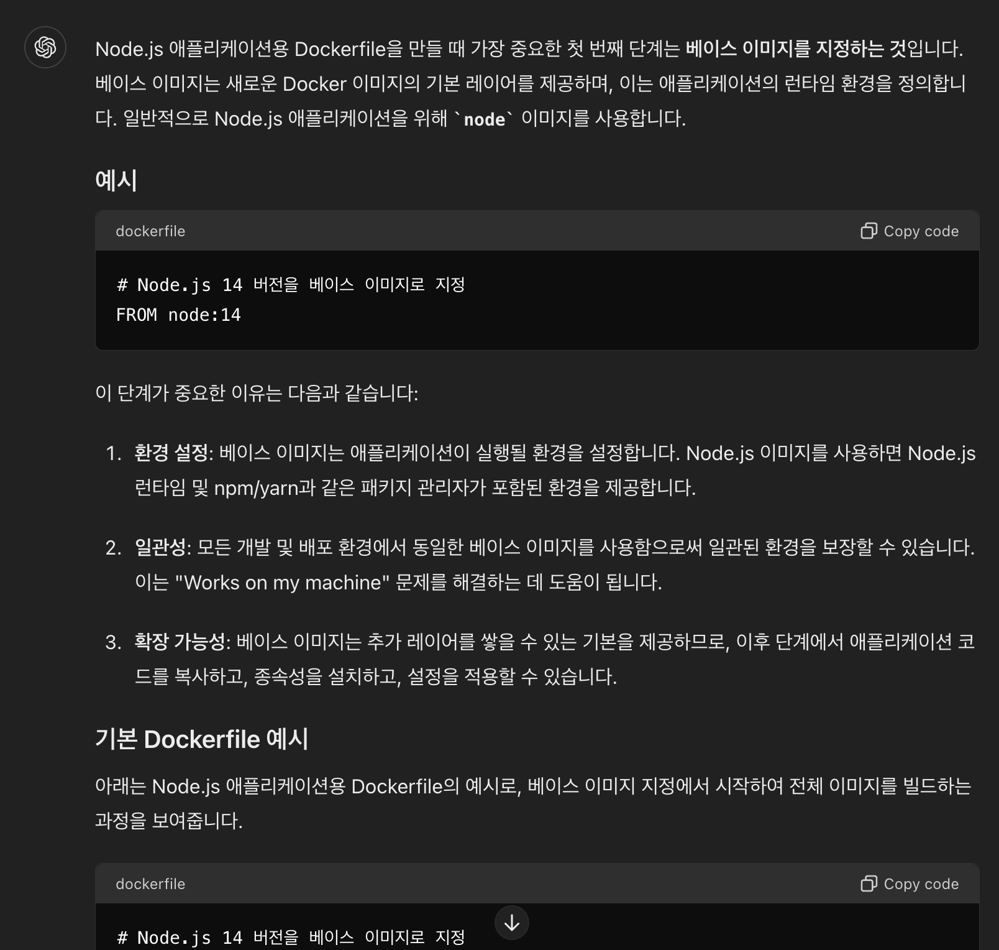

# Node app 배포를 위한 Dockerfile 작성하기

예상 소요 시간: 25분

## 소개
이 실습에서는 생성형 AI가 Node.js 애플리케이션을 위한 Dockerfile을 생성하는 데 어떻게 도움이 되는지 살펴봅니다. 목표는 Dockerfile에 필요한 코드를 생성하여 도커 환경에서 Node.js 애플리케이션 개발을 간소화하는 것입니다.

## 학습 목표
이 연습을 완료하면 다음을 수행할 수 있습니다:

- 생성형 AI를 활용하여 Dockerfile과 관련된 질문에 대한 적절한 응답을 생성합니다.
- node.js 애플리케이션을 위해 생성형 AI를 사용하여 Dockerfile 개발하기

> **주의: 생성형 AI는 빠르게 발전하는 분야 입니다. 실습 결과가 여기서 보이는 것과 다를 수 있습니다.**


## Dockerfile 이란 무엇이며 왜 사용하나요?    
Dockerfile은 애플리케이션 환경에 대한 레시피와 같습니다. 여기에는 Docker가 Docker 이미지를 빌드하는 데 사용하는 지침이 포함되어 있습니다. 이 이미지는 코드, 런타임, 라이브러리, 시스템 도구 등 소프트웨어를 실행하는 데 필요한 모든 것을 포함하는 경량의 독립 실행형 실행 패키지입니다.

Dockerfile은 애플리케이션을 패키징하고 배포하는 표준화되고 재현 가능한 방법을 제공하는 컨테이너화의 핵심 요소입니다. 이를 통해 개발자는 애플리케이션과 종속성을 캡슐화하여 다양한 환경에서 일관된 동작을 보장할 수 있습니다. Dockerfile은 개발 프로세스를 간소화하고 원활한 협업과 배포를 촉진합니다.


### Dockerfile 생성 시작

생성형 AI에 Dockerfile 작성에 대한 도움을 요청해 보겠습니다.

1. 프롬프트에 다음 질문을 입력합니다: 
```
Dockerfile이란 무엇인가요?
------
What is Dockerfile ?
```
이제 AI의 응답을 통해 Dockerfile에 대한 설명을 확인합니다.

생성된 샘플 응답은 아래와 유사합니다.


**답변 예시**    
Dockerfile is a text file used to define the configuration and steps required to build a Docker image. It contains a set of instructions that specify the base image, any additional dependencies, environment variables, and commands to run within the image. Dockerfile is written in a simple syntax and allows users to automate the process of creating Docker containers. It is a fundamental component of Docker and is widely used in containerization workflows.


2. 프롬프트에 다음 질문을 입력하세요: 
```
Dockerfile의 요구 사항은 무엇인가요?
------
What are the requirements for a Dockerfile?
```


그런 다음 AI의 답변을 읽고 Dockerfile 요구 사항에 대해 계속 질문하세요.

생성된 샘플 응답은 아래와 유사합니다.


**답변 예시**    
To create a Dockerfile, you need to have the following requirements:
Base Image: You need to specify a base image on which your Docker image will be built. The base image provides the initial set of files and dependencies for your application.

Instructions: Dockerfile consists of a series of instructions that define the steps to build your Docker image. These instructions include commands to install packages, copy files, set environment variables, and configure the container.

Environment Variables: You can define environment variables in your Dockerfile to provide configuration options for your application. These variables can be used to specify things like database connection strings, API keys, or other application-specific settings.

Exposed Ports: If your application listens on a specific port, you need to specify the port number using the EXPOSE instruction in your Dockerfile. This allows other containers or host systems to access your application.

Container Configuration: You can configure the behavior of your container by specifying the entry point and command in your Dockerfile. The entry point is the command that is executed when the container starts, and the command is any additional arguments or parameters passed to the entry point.

It is important to note that the requirements for a Dockerfile may vary depending on the specific needs of your application. However, the above requirements are common and provide a good starting point for creating Docker images.


3. 프롬프트에 다음 질문을 입력하세요: 
```
Node.js 애플리케이션용 Dockerfile을 만들 때 가장 중요한 첫 번째 단계는 무엇인가요?
------
What's the first crucial step when creating a Dockerfile for a Node.js application?
```
Node.js Docker파일의 기본 이미지를 선택한 후 첫 번째 단계를 이해하는 것이 중요합니다.

생성된 샘플 응답은 아래와 유사합니다.



**답변 예시**    
The first crucial step when creating a Dockerfile for a Node.js application is to specify the base image. You need to choose a base image that includes Node.js runtime and other necessary dependencies for your application. This base image will provide the initial environment for your application to run. A commonly used base image for Node.js applications is "node:latest" or a specific version like "node:14". By starting with a Node.js base image, you can avoid the need to manually install Node.js and its dependencies in your Dockerfile.


4. 프롬프트에 다음 질문을 입력하세요: 
```
기본 이미지 선택 후 컨테이너 내부의 작업 디렉터리를 /app로 설정합니다.
------
Following the base image selection, Set the working directory inside the container to /app
```

그런 다음 컨테이너 내부의 작업 디렉터리를 정의하는 다음 단계에 대해 알아보세요.

생성된 샘플 응답은 아래와 유사합니다.


**답변 예시**    

Following the base image selection, you can set the working directory inside the container to /app by using the WORKDIR instruction in your Dockerfile. The WORKDIR instruction sets the working directory for any subsequent instructions in the Dockerfile. By setting the working directory to /app, you can ensure that any files or commands executed in the Dockerfile are relative to that directory. This can make it easier to manage and organize your application files within the container. To set the working directory to /app, you can add the following line to your Dockerfile:
WORKDIR /app


5. 프롬프트에 다음 지침을 입력합니다: 
```
작업 디렉터리를 /app로 선택한 후 package.json 및 package-lock.json을 작업 디렉터리로 가져옵니다.
------
As selected working directory /app, bring the package.json and package-lock.json to the working directory
```
그 후에는 패키지 파일을 작업 디렉터리로 가져오는 프로세스를 이해할 수 있습니다.

생성된 샘플 응답은 아래와 유사합니다.    


**답변 예시**     

To bring the package.json and package-lock.json files to the working directory (/app), you can use the COPY instruction in your Dockerfile. The COPY instruction allows you to copy files or directories from the host system to the container. In this case, you can add the following lines to your Dockerfile:
COPY package.json .
COPY package-lock.json .
The first line copies the package.json file from the host system to the current working directory (which is set to /app). The second line copies the package-lock.json file to the same location. By copying these files to the working directory, you can ensure that they are available for subsequent steps in the Dockerfile, such as installing dependencies.


6. 프롬프트에 다음 질문을 입력합니다: 
```
이제 종속성을 어떻게 설치하나요? 그리고 나머지 애플리케이션 코드를 작업 디렉터리에 복사하나요?
------
Now, how do I install dependencies? And copy the remaining application code to the working directory?
```
그러면 종속성 설치 및 나머지 애플리케이션 코드 복사에 대한 안내를 받을 수 있습니다.

생성된 샘플 응답은 아래와 유사합니다.  


**답변 예시**    

To install dependencies and copy the remaining application code to the working directory (/app), you can use the following instructions in your Dockerfile:
- Install Dependencies: To install dependencies, you can use the RUN instruction followed by the appropriate package manager command. For example, if you are using npm as your package manager, you can add the following line to your Dockerfile:
RUN npm install
This command will install the dependencies listed in the package.json file.
- Copy Application Code: To copy the remaining application code to the working directory, you can use the COPY instruction. Assuming your application code is located in a directory called “src” on the host system, you can add the following line to your Dockerfile:
COPY src/ .
This command will copy all files and directories from the “src” directory to the current working directory (/app).

By using these instructions, you can install the dependencies and bring the application code into the container’s working directory, making them available for the subsequent steps in the Dockerfile.


7. 프롬프트에 다음 질문을 입력합니다: 
```
특정 포트에서 Node.js 앱에 액세스할 수 있어야 합니다. 이를 위해 어떤 Dockerfile 명령어를 포함하나요?
------
Node.js app needs to be accessible on a specific port. What Dockerfile instruction do you include for this purpose?
```

그런 다음 특정 포트를 노출하기 위해 포함할 지침을 배웁니다.

생성된 샘플 응답은 아래와 유사합니다.  


**답변 예시**    
To make the Node.js app accessible on port 3000, you can add the following line to your Dockerfile:
EXPOSE 3000
This instruction will inform Docker that your container will listen on port 3000 at runtime, allowing other containers or host systems to access your Node.js app through port 3000.


8. 프롬프트에 다음 질문을 입력합니다: 
```
CMD를 사용하여 Node.js 애플리케이션을 시작하는 명령을 지정하는 방법은 무엇인가요?
------
How to specify the command to start the Node.js application using CMD?
```
그런 다음 Node.js 애플리케이션을 시작하는 명령을 지정하는 마지막 단계를 이해하게됩니다.

생성된 샘플 응답은 아래와 유사합니다.  


**답변 예시**    
To specify the command to start the Node.js application using CMD, you can add the following line to your Dockerfile:
CMD [“node”, “app.js”]
Replace “app.js” with the main file of your Node.js application. This command will be executed when the container starts and will run your Node.js application using the “node” command. You can also include any additional arguments or parameters required by your application.


9. 프롬프트에 다음 지침을 입력합니다: 
```
모든 단계를 결합하여 Node.js 애플리케이션에 대한 완전한 Dockerfile 만들기
------
Combine all the steps to form a complete Dockerfile for a Node.js application
```
이제 모든 단계를 완료했으므로 생성된 Docker파일을 볼 수 있습니다.

생성된 샘플 응답은 아래와 유사합니다.  


**답변 예시**    
Sure! Here's a complete Dockerfile for a Node.js application:
```dockerfile
# Specify the base image
FROM node:14
# Set the working directory
WORKDIR /app
# Copy package.json and package-lock.json
COPY package.json .
COPY package-lock.json .
# Install dependencies
RUN npm install
# Copy application code
COPY src/ .
# Expose port 3000
EXPOSE 3000
# Specify the command to start the Node.js application
CMD ["node", "app.js"]
```
This Dockerfile starts with a Node.js base image, sets the working directory to /app, copies the package.json and package-lock.json files, installs dependencies, copies the application code, exposes port 3000, and specifies the command to start the Node.js application. You can replace “app.js” with the main file of your Node.js application.


## 요약
이 실습에서는 생성형 AI를 활용하여 Node.js 애플리케이션의 Dockerfile 생성을 간소화했습니다. 생성형 AI와 상호작용하며 Dockerfile 개발과 관련된 주요 질문과 단계를 해결했습니다. 생성된 Dockerfile은 컨테이너화된 환경에서 Node.js 애플리케이션을 배포하기 위한 기반이 됩니다. 이 경험은 Docker 기반 개발 워크플로우의 효율성을 향상시키는 데 있어 생성형 AI의 잠재력을 보여줍니다. 안내된 상호작용을 통해 여러분과 다른 사람들은 Dockerfile 생성 프로세스에 대한 귀중한 인사이트를 얻고, 실제 애플리케이션 배포에 더 쉽게 접근할 수 있습니다.

축하합니다!
생성형 AI를 활용하여 Node.js 애플리케이션을 위한 완전한 Dockerfile을 개발했습니다.
