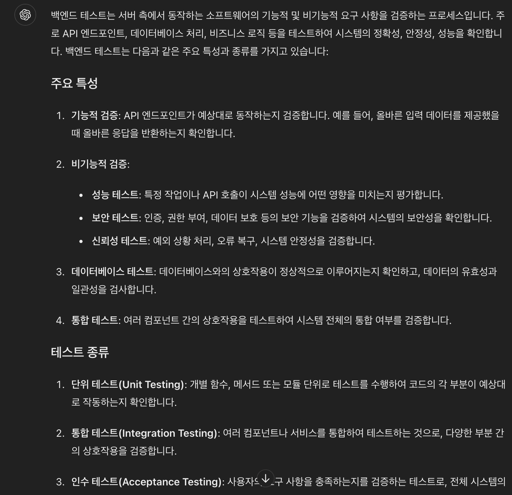

# 생성형 AI를 사용한 테스트 케이스 생성

예상 소요 시간: 30분

소프트웨어 개발자로서 코딩에 익숙할 것입니다. 코드는 작성될 때마다 여러 시나리오에서 기능을 테스트해야 합니다. 테스트 주도 개발(TDD)은 코드가 예상대로 작동하도록 보장하는 입증된 방법론 중 하나입니다. TDD는 원하는 코드에 대한 테스트 케이스를 먼저 작성한 후, 그 테스트 케이스를 통과하도록 코드를 작성하는 접근 방식입니다. TDD에 대해 더 알아보려면 이 링크를 방문하십시오. 과거에는 올바른 테스트 케이스를 작성하는 것이 어려웠고 전문성과 경험이 필요했습니다. 이제 특정 사용 사례에 대한 테스트 케이스를 생성하는 데 생성형 AI의 도움을 받을 수 있습니다.

생성형 AI에게 제공하는 프롬프트는 전문가와의 대화와 같으며, 연속적인 프롬프트는 이전 프롬프트와 받은 응답에 따라 다릅니다. 원하는 결과를 얻기 위해 필요할 때 문구를 변경하십시오. 아래 예시는 목표를 달성하기 위한 대화의 한 예시를 보여줍니다.

## 학습 목표
실습이 끝나면 다음을 할 수 있습니다:
- 특정 사용 사례에 대해 생성형 AI를 사용하여 테스트 케이스 생성
- TDD 원칙에 맞는 테스트 케이스 작성

## 사전 준비 사항
프로그래밍 언어를 사용하여 코딩할 수 있고 소프트웨어 설계 관점에서 사고할 수 있으면 좋습니다.

## 채팅 제목 및 프롬프트 설정
생성형 AI 세션이 열리면 새로운 대화가 시작됩니다. 적절한 제목을 지정하십시오. 이는 나중에 대화를 다시 방문하는 데 도움이 됩니다. 대화를 주제별로 구분하는 것이 좋은 습관입니다.

또한, 이 특정 실습에 적합한 프롬프트를 제공하십시오. 이제 JavaScript 코드에 대한 소프트웨어 문서를 작성하는 작업을 시작합시다.

> **주의: 생성형 AI는 빠르게 발전하는 분야 입니다. 실습 결과가 여기서 보이는 것과 다를 수 있습니다.**

## 테스트 케이스 생성 도구의 기능
소프트웨어의 "사용자 등록" 모듈이 제공되었으며, 등록을 검증하기 위한 테스트 케이스를 작성해야 합니다. 시간을 효율적으로 사용하기 위해 생성형 AI를 사용하여 문서를 작성하기로 결정했습니다.

먼저 생성형 AI 도구가 JavaScript에 필요한 소프트웨어 문서를 작성할 수 있는지 확인해야 합니다. 프롬프트 창에 다음을 입력하십시오:

```
사용자 등록 모듈이 있습니다. 특정 사용 사례에 대한 테스트 케이스를 작성하는 데 도움을 줄 수 있습니까?
------
I have a user registration module in my software. Can you help me create a test case for a specific use case?
```

생성형 AI 모델이 테스트 케이스를 생성할 수 있는 경우, 이미지에 표시된 것과 유사한 긍정적인 응답을 받을 것입니다. 응답의 신뢰도를 판단하여 도구를 계속 사용할지 지원 도구로 사용할지 결정하십시오. 반복적인 프롬프트를 사용하여 응답의 정확성을 보장할 수 있습니다.


## 사용 사례 제공
프롬프트 창에 다음을 입력하여 필요한 테스트 케이스의 사용 사례를 설명하십시오:

```
사용자 등록 정보 검증을 위한 테스트 케이스를 작성하는 데 도움을 주세요.
------
Help me create a test case for validation of the user registration information.
```

출력은 다음 이미지와 유사할 수 있습니다:


API 테스트를 위한 테스트 케이스가 필요한 경우, 보다 구체적으로 생성형 AI에게 원하는 응답을 제공해야 합니다.

## 정제된 테스트 케이스 생성 프롬프트
등록 정보를 검증하기 위해 테스트해야 하는 다양한 시나리오가 필요합니다. 프롬프트 창에 다음을 입력하십시오:

```
다양한 가능한 시나리오와 테스트할 입력 및 결과를 고려하여 등록 검증을 위한 테스트 케이스를 제공해 주세요.
------
Give me the test cases for registration validation, taking into consideration various possible scenarios and the required input and outcome to test for.
```

출력은 다음 이미지와 유사할 수 있습니다:

응답은 다를 수 있지만, 핵심적으로 유사한 응답을 받을 것입니다. 이 응답은 질문이 더 구체적이어서 더 포괄적입니다.


이제 하나의 테스트 케이스가 어떻게 생겼는지 보기 위해 코드 예시를 요청하십시오.

## 테스트 케이스의 위치 확인
여러 시나리오를 기반으로 한 등록 정보 검증을 위한 테스트 케이스를 확보했습니다. 소프트웨어 개발자로서, 테스트 케이스가 프런트엔드에 있어야 할지 백엔드에 있어야 할지 구분하는 것도 중요합니다. 이전 응답의 모든 테스트 케이스는 명백히 프런트엔드를 위한 것입니다. 생성형 AI의 도움을 받아 이를 확인하십시오. 프롬프트 창에 다음을 입력하십시오:

```
이 테스트 케이스들은 프런트엔드 테스트와 백엔드 테스트 중 어디에 더 적합한가요?
------
Will these test cases fit better in front-end testing or back-end testing?
```

출력은 다음 이미지와 유사할 수 있습니다:
    


## 프런트엔드 및 백엔드 테스트 케이스 구분
각 테스트 케이스가 프런트엔드에 속할지 백엔드에 속할지에 대한 권장 사항을 포함하여 테스트 케이스 목록을 다시 작성하십시오. 프롬프트 창에 다음을 입력하십시오:

```
제안된 각 테스트 케이스가 프런트엔드와 백엔드 중 어디에 속해야 하는지 권장해 주세요. 각 테스트 케이스에 대한 권장 사항을 포함하여 다시 나열해 주세요.
------
Recommend for each of the test cases suggested whether it should belong to the front end or the back end. Include the recommendation for each test case and list it again.
```

출력은 다음 이미지와 유사할 수 있습니다:


## 특정 백엔드 테스트 케이스
백엔드에서 수행해야 할 처리 유형을 확인하기 위해 생성형 AI를 사용할 수 있습니다. 다음 프롬프트를 입력하십시오:

```
백엔드 테스트에 대해 자세히 설명해 주세요.
------
Elaborate on the back-end testing.
```

출력은 다음과 유사할 것입니다. 백엔드 검증에 대해 더 구체적인 정보가 포함되어 있습니다.




## 요약
축하합니다! 프런트엔드와 백엔드 모두에서 사용할 수 있는 테스트 케이스를 생성했습니다. 생성된 결과에 만족한다면 사용할 수 있으며, 개선하고 싶다면 추가적인 질문을 할 수 있습니다. 개발 또는 테스트를 위한 코드 샘플이 필요하다면, 선호하는 언어를 지정하여 요청할 수 있습니다. 생성형 AI는 응답에 더 많은 사실과 현실성을 추가하기 위해 외부 소스에 의존합니다. 그러나 소프트웨어 개발자로서 결과의 정확성을 확인하는 것은 귀하의 책임입니다.


