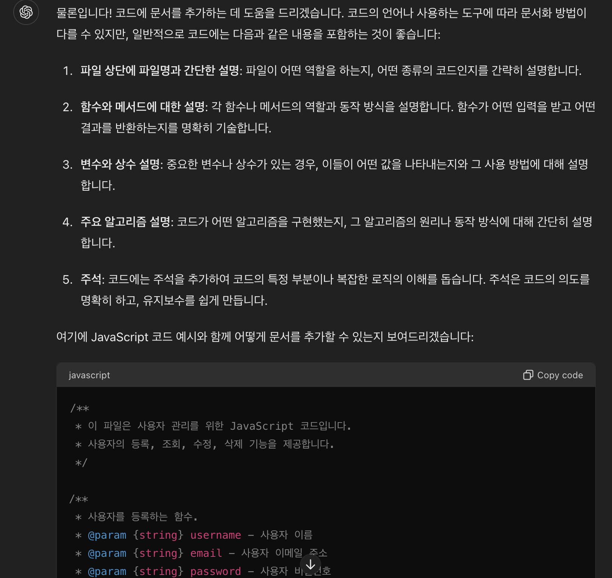
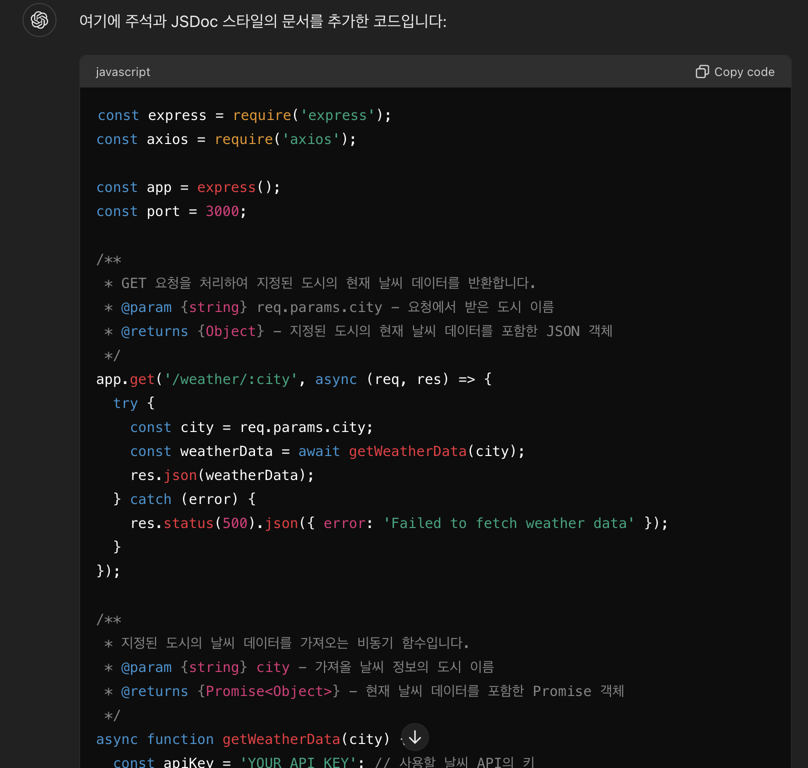
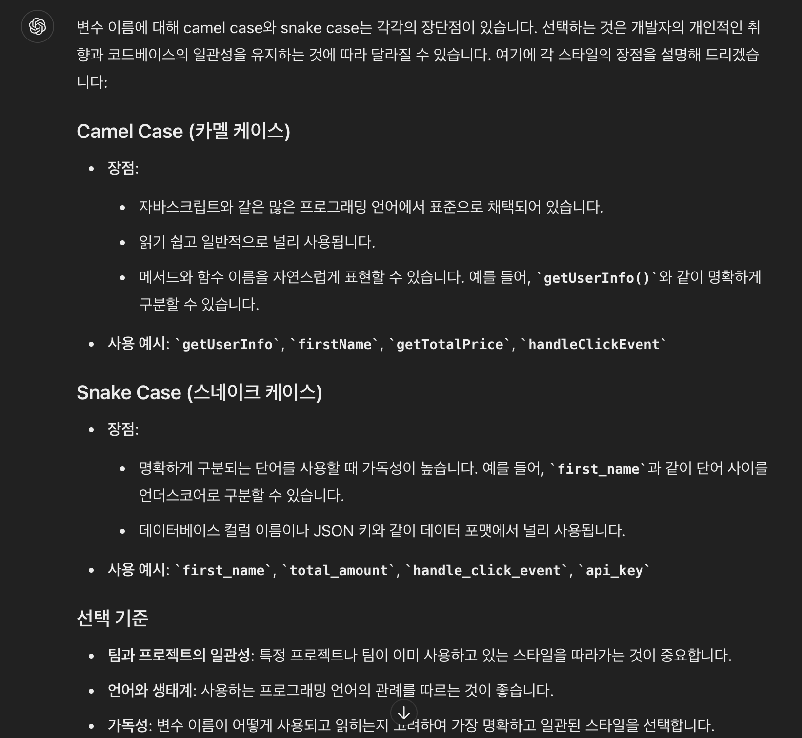
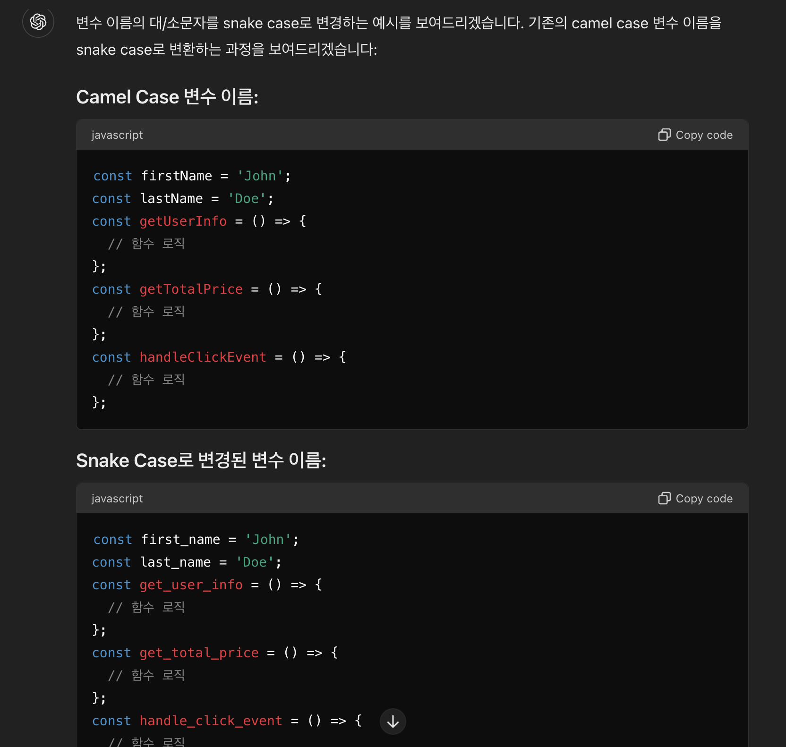
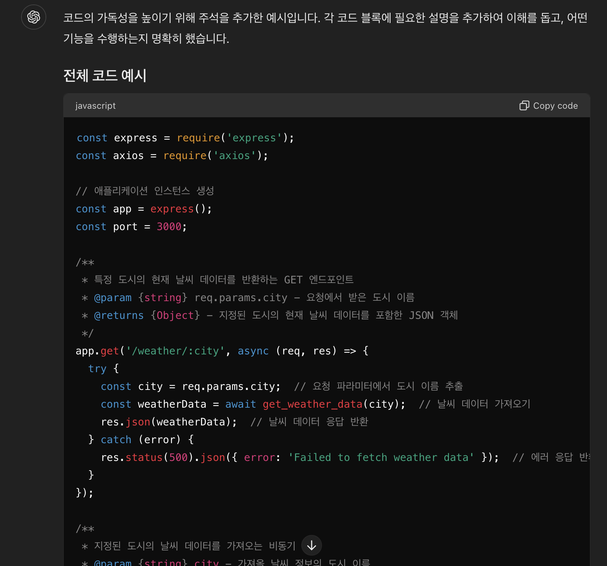

# 생성형 AI를 사용한 소프트웨어 문서화

예상 소요 시간: 15분

소프트웨어 개발자로서 코딩에는 익숙할 것입니다. 그러나 코딩 기술만으로는 현실 세계에서 충분하지 않습니다. 작성한 코드는 많은 사람들이 사용하고 유지보수하는 경우가 많습니다. 코드가 읽기 쉽고 이해 가능하도록 하기 위해 소프트웨어 문서를 포함해야 합니다. 이 활동은 매우 중요하지만, 시간이 많이 소요됩니다. 생성 AI의 도움을 받아 문서를 생성할 수 있습니다.

생성 AI에 제공하는 프롬프트는 주제 전문가와의 대화와 같으며, 연속된 프롬프트는 이전에 사용된 프롬프트와 받은 응답에 따라 달라집니다. 원하는 결과를 얻기 위해 필요에 따라 표현을 변경하십시오. 예제는 목표를 달성하기 위한 하나의 가능한 대화 예시를 보여줍니다.

## 학습 목표
이 실습을 마치면 다음 작업을 수행할 수 있습니다:

- 생성 AI를 사용하여 작성한 코드에 대한 문서를 생성합니다.
- JavaScript에 대한 문서 작성 방법을 배웁니다.

## 사전 요구 사항
JavaScript로 코딩하는 방법을 알고 있다면 좋습니다. 이 실습은 JavaScript 코드의 문서를 작성하는 것을 기반으로 합니다.

## 프롬프트 지시 설정
세션이 열리면 새로운 대화가 시작됩니다. 대화에 적절한 제목을 지정하십시오. 이는 대화를 다시 방문하는 데 도움이 됩니다. 주제별로 대화를 구분하는 것이 좋습니다. 이렇게 하면 나중에 대화를 계속하는 데 도움이 됩니다.

또한, 이 실습의 특정 대화에 대해 구체적인 프롬프트 지시를 제공하십시오. JavaScript 코드에 대한 소프트웨어 문서를 작성하는 작업을 시작합시다.

> **주의: 생성형 AI는 빠르게 발전하는 분야 입니다. 실습 결과가 여기서 보이는 것과 다를 수 있습니다.**

## 도구의 문서화 능력 확인
이미 JavaScript로 코딩에 익숙합니다. JavaScript로 코드를 작성했으며 이제 코드에 문서를 포함해야 합니다. 시간을 최적화하기 위해 생성 AI를 사용하여 문서를 작성하기로 결정했습니다.

먼저, 생성 AI 도구가 JavaScript에 필요한 소프트웨어 문서를 작성할 수 있는지 확인해야 합니다. 프롬프트에 다음과 같이 입력하십시오:

```
JavaScript로 작성된 코드가 있습니다. 코드에 문서를 추가하는 데 도움을 줄 수 있나요?
------
I have code written in JavaScript. Can you help me add documentation to the code?
```

생성 AI 모델이 코드에 소프트웨어 문서를 추가할 수 있다면 아래 이미지와 유사한 긍정적인 응답을 받게 됩니다. 응답의 정확성을 보장하기 위해 반복적인 프롬프트를 사용할 수 있습니다.



## 코드 제공
다음 요청과 함께 코드를 프롬프트에 붙여넣고 전송하십시오. 이 과정은 코드를 처리하고 문서와 함께 반환하는 데 몇 초가 소요될 수 있습니다.

```javascript
Add documentation to the following code.
다음 코드에 문서를 추가합니다.
const express = require('express');
const axios = require('axios');
const app = express();
const port = 3000;

app.get('/weather/:city', async (req, res) => {
  try {
    const city = req.params.city;
    const weatherData = await getWeatherData(city);
    res.json(weatherData);
  } catch (error) {
    res.status(500).json({ error: 'Failed to fetch weather data' });
  }
});

async function getWeatherData(city) {
  const apiKey = 'YOUR_API_KEY';
  const apiUrl = `https://api.weatherapi.com/v1/current.json?key=${apiKey}&q=${city}`;
  const response = await axios.get(apiUrl);
  const weatherData = response.data;
  return {
    city: weatherData.location.name,
    temperature: weatherData.current.temp_c,
    condition: weatherData.current.condition.text,
  };
}

app.listen(port, () => {
  console.log(`Server is running on http://localhost:${port}`);
});
```

JavaScript 코드와 함께 문서가 추가된 출력이 생성됩니다.

이것은 JavaScript 코드가 올바르게 입력되었음을 가정합니다. 코드에 사소한 오류가 있는 경우, 생성 AI는 이를 수정하고 올바른 출력을 제공할 수 있습니다.

문서가 의도한 모든 측면을 다루지 않을 수 있습니다. 특정 프롬프트로 후속 조치가 필요할 수 있습니다.



## 변수 이름 케이스 형식
특정 종류의 케이스 형식은 좋은 코딩 관행으로 권장됩니다. 여기서는 camel case가 사용되었습니다. camel case에서는 변수 이름이 소문자로 시작하고 모든 연속된 단어는 대문자로 시작합니다. 예를 들어, `studentNumber`. 다음 프롬프트를 입력하여 어느 케이스가 더 나은지 알아보십시오:

```
변수 이름에 camel case와 snake case 중 어떤 것이 더 좋은지 알려주세요.
------
Let me know which case is better for variable names: camel case or snake case?
```

아래와 유사한 출력이 생성됩니다. 더 구체적인 질문이 있으면 반복적으로 프롬프트를 사용할 수 있습니다.



## 케이스 변경
귀하의 조직이 가독성을 위해 snake case를 표준화하기로 결정했다고 가정해보겠습니다. 여기 있는 코드에는 너무 많은 코드 줄이 없습니다. 현실적인 시나리오에서는 드물게 발생합니다. 케이스를 수동으로 변경하는 것은 매우 어려울 수 있으며 오류가 발생할 수 있습니다. 생성 AI를 사용하여 이를 수행할 수 있습니다. 다음 프롬프트를 입력하십시오:

```
변수 이름의 대/소문자를 snake case로 변경합니다.
------
Change the case of the variable names to snake case.
```

아래와 유사한 출력이 생성됩니다. 모든 변수 이름이 동일하게 유지되며, 케이스만 변경된 것을 확인하십시오.



## 주석 추가
주석은 코드 가독성에 매우 중요합니다. 코드가 하는 일을 설명하는 주석을 포함하는 것은 항상 좋은 코딩 관행입니다. 다음 프롬프트를 입력하십시오:

```
코드 가독성을 높이는 데 도움이 되는 주석을 코드에 포함하세요.
------
Include comments in the code which will help in readability of the code.
```

아래와 유사한 출력이 생성됩니다.




## 요약
축하합니다! JavaScript 코드에 대한 완전한 문서를 매우 짧은 시간 안에 작성했습니다. 출력에 만족하면 코드를 복사하여 사용할 수 있습니다. 더 개선하고 싶다면 추가적인 관련 질문을 할 수 있습니다. 생성 AI는 응답을 보완하기 위해 외부 소스에 의존하지만, 소프트웨어 개발자로서 출력의 정확성을 확인하는 것은 귀하의 의무입니다.

