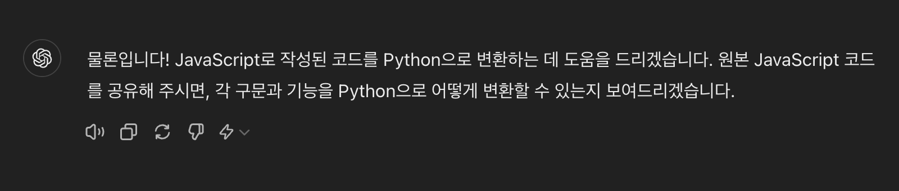
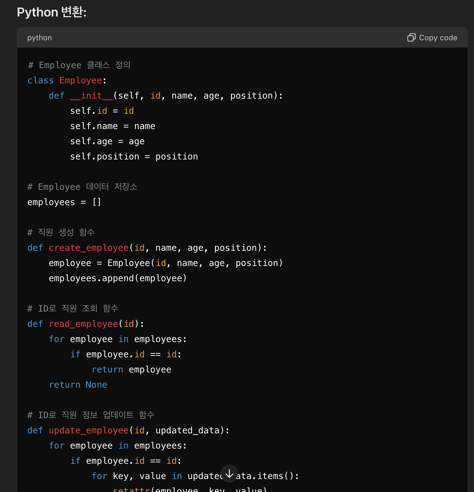
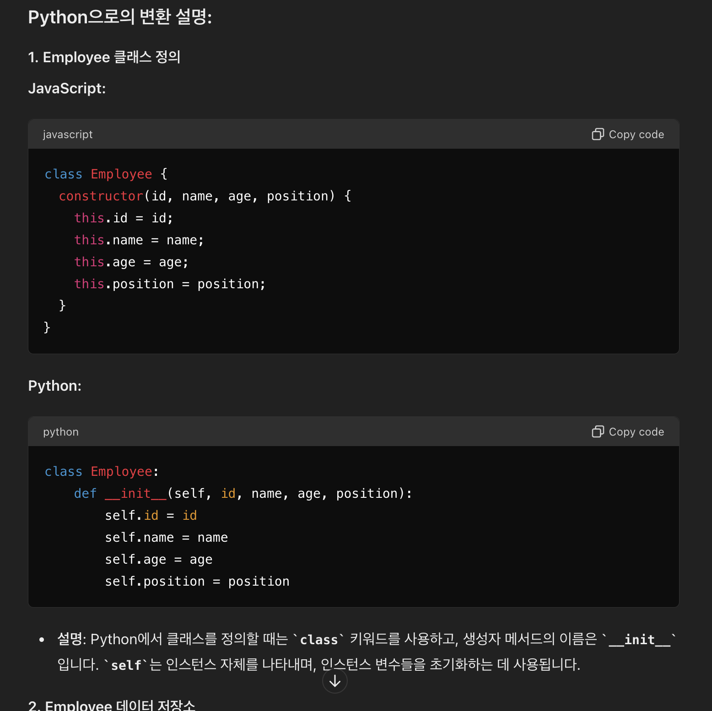
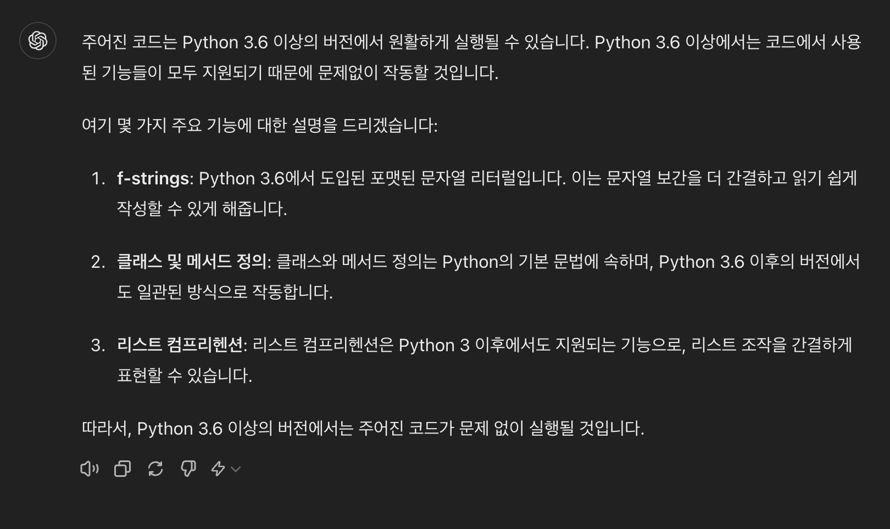
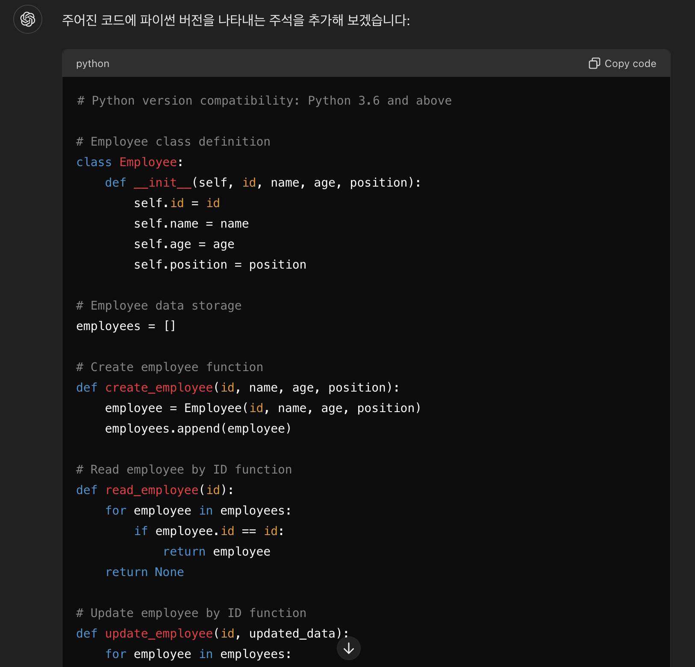
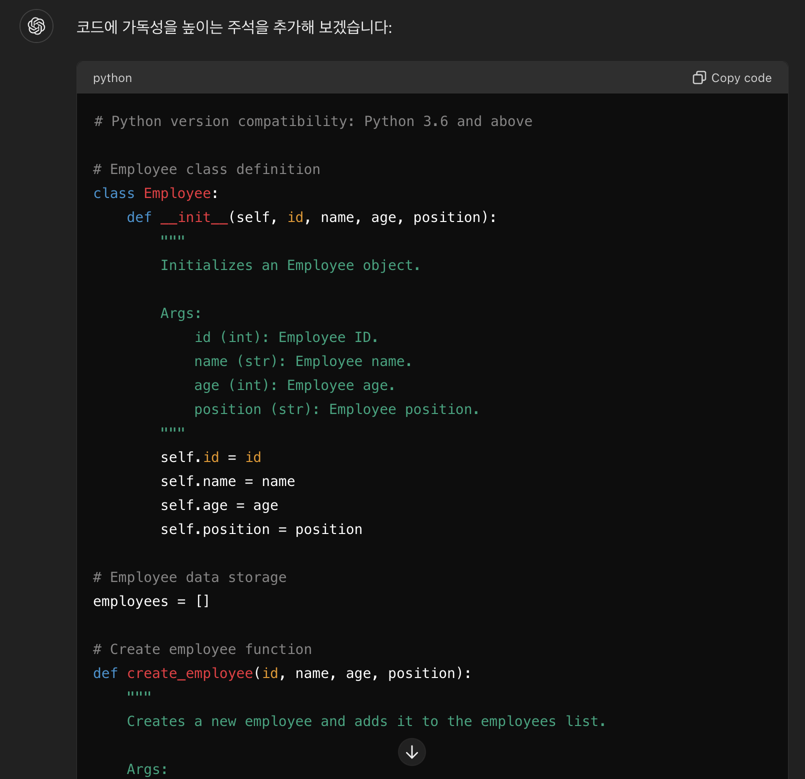

# 생성형 AI를 상용한 코드 번역

예상 소요 시간: 30분

소프트웨어 개발자로서 특정 언어로 코딩하는 데 매우 익숙할 수 있습니다. 그러나 종종 고객으로부터 익숙하지 않은 다른 언어를 사용해 달라는 요청을 받습니다. 과거에는 이러한 상황에서 언어를 배우거나 고객을 포기하고 비즈니스를 잃어야 했습니다. 그러나 오늘날 생성 AI는 개발자에게 훨씬 더 간단한 해결책을 제공합니다.

생성 AI에 제공하는 프롬프트는 주제 전문가와의 대화와 같으며, 연속된 프롬프트는 이전 프롬프트와 받은 응답에 따라 달라집니다. 원하는 결과를 얻기 위해 필요에 따라 표현을 변경하십시오. 예제는 목표를 달성하기 위한 하나의 가능한 대화 예시를 보여줍니다.

## 학습 목표
이 실습을 마치면 다음 작업을 수행할 수 있습니다:

- 생성 AI를 사용하여 한 언어로 작성된 코드를 다른 언어로 번역하되, 논리와 워크플로를 그대로 유지합니다.
- JavaScript CRUD 코드를 Python CRUD 코드로 스크립팅 없이 변환합니다.

## 사전 요구 사항
최소한 한 가지 프로그래밍 언어를 알고 있어야 합니다. 실습은 JavaScript의 샘플 코드로 작성되었습니다. JavaScript 코드를 읽을 줄 알면 좋습니다.

## 프롬프트 지시 설정
세션이 열리면 새로운 대화가 시작됩니다. 대화에 적절한 제목을 지정하십시오. 이는 대화를 다시 방문하는 데 도움이 됩니다. 주제별로 대화를 구분하는 것이 좋습니다. 이렇게 하면 나중에 대화를 계속하는 데 도움이 됩니다.

또한, 이 실습의 특정 대화에 대해 구체적인 프롬프트 지시를 제공하십시오. JavaScript 코드를 Python으로 번역하는 작업을 시작합시다.

> **주의: 생성형 AI는 빠르게 발전하는 분야 입니다. 실습 결과가 여기서 보이는 것과 다를 수 있습니다.**

## 도구의 번역 능력 확인
이미 JavaScript로 코딩에 익숙합니다. JavaScript로 코드를 작성했습니다. 이제 생성 AI 모델을 사용하여 동일한 코드를 Python으로 작성합니다.

먼저, 생성 AI 도구가 필요한 번역을 할 수 있는지 확인해야 합니다. 프롬프트에 다음과 같이 입력하십시오:

```
Python으로 코딩해야 하는 요구 사항이 있습니다. JavaScript 코드를 제공하면 Python에 해당하는 코드를 만드는 데 도움을 줄 수 있나요?
------
I have a requirement to code in Python. If I provide the JavaScript code, can you help me create the Python equivalent of the code?
```

생성 AI 모델이 번역할 수 있는 능력이 있다면 아래 이미지와 유사한 긍정적인 응답을 받게 됩니다. 




## 코드 제공
다음 코드를 프롬프트에 붙여넣고 전송하십시오. 이 과정은 제공된 코드를 처리하고 이에 상응하는 코드를 제공하는 데 몇 초가 소요됩니다.

```javascript
// Employee class
class Employee {
  constructor(id, name, age, position) {
    this.id = id;
    this.name = name;
    this.age = age;
    this.position = position;
  }
}
// Employee data storage
let employees = [];
// Create employee
function createEmployee(id, name, age, position) {
  const employee = new Employee(id, name, age, position);
  employees.push(employee);
}
// Read employee by ID
function readEmployee(id) {
  return employees.find((employee) => employee.id === id);
}
// Update employee by ID
function updateEmployee(id, updatedData) {
  const employee = employees.find((employee) => employee.id === id);
  if (employee) {
    Object.assign(employee, updatedData);
  }
}
 
// Delete employee by ID
function deleteEmployee(id) {
  employees = employees.filter((employee) => employee.id !== id);
}
```

JavaScript 코드가 올바르게 입력되었다는 가정 하에, 생성 AI는 이에 상응하는 Python 코드를 생성합니다. 코드에 사소한 오류가 있는 경우, 생성 AI는 이를 수정하고 올바른 출력을 제공할 수 있습니다.

응답의 마지막에 몇 줄의 설명이 종종 제공됩니다. 이는 매번 동일하지 않으며, 응답은 AI가 생성한 것이므로 프로그래밍되지 않습니다. 그러나 메시지의 본질은 일관성이 있습니다. 설명이 없는 경우 코드를 이해하기 위한 설명을 요청할 수 있습니다.



## Python 코드 설명
이전 단계의 설명이 충분하면 이 단계를 건너뛸 수 있습니다. 필요한 경우, 코드의 설명을 요청하십시오.

```
생성된 파이썬 코드의 각 단계를 설명하여 코드를 이해하는 데 도움을 주세요.
------
Explain each step in the python code produced to help me understand the code.
```

아래와 유사한 출력이 생성됩니다. 더 구체적인 질문이 있으면 반복적으로 프롬프트를 사용할 수 있습니다.




## Python 버전
코드가 어떤 버전의 Python에서 작동할지 아는 것이 중요합니다. 특히 다른 기존 소프트웨어에 맞추어 소프트웨어를 만들 때, 이전 버전에 대한 호환성을 제공해야 할 필요가 있을 수 있습니다. 다음 프롬프트를 입력하십시오:

```
이 코드가 원활하게 실행될 수 있는 Python 버전을 알려주세요.
------
Let me know the versions of Python that this code will run smoothly on.
```

아래와 유사한 출력이 생성됩니다.



## 버전 정보 포함
파일에 Python 버전 정보를 포함하는 것이 더 쉽습니다. 다음 프롬프트를 입력하십시오:

```
코드가 지원될 파이썬 버전을 적절한 위치에 주석으로 포함하세요.
------
Include the python versions in which the code will be supported, as a comment in the appropriate place.
```

버전에 대한 주석이 포함된 이전과 동일한 코드가 생성됩니다.



## 주석 포함
주석은 코드 가독성에 매우 중요합니다. 코드가 하는 일을 설명하는 주석을 포함하는 것은 항상 좋은 코딩 관행입니다. 다음 프롬프트를 입력하십시오:

```
코드 가독성에 도움이 되는 주석을 코드에 포함하세요.
------
Include comments in the code which will help in readability of the code
```

아래와 유사한 출력이 생성됩니다.



## 요약
축하합니다! Python 언어를 전혀 모르거나 조금 아는 상태에서 Python 코드를 작성했습니다. 생성된 출력에 만족하면 코드를 복사하여 사용할 수 있으며, 생성 AI를 사용하여 다른 기능으로 코드를 확장할 수 있습니다. 개선하고 싶다면 추가적인 관련 질문을 할 수 있습니다. 생성 AI는 응답을 보완하기 위해 외부 소스에 의존하지만, 소프트웨어 개발자로서 요구사항에 맞게 소프트웨어가 생성되었는지 확인하는 것은 귀하의 의무입니다.


