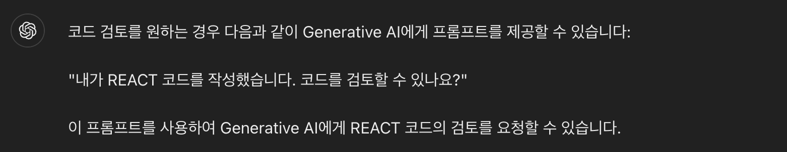
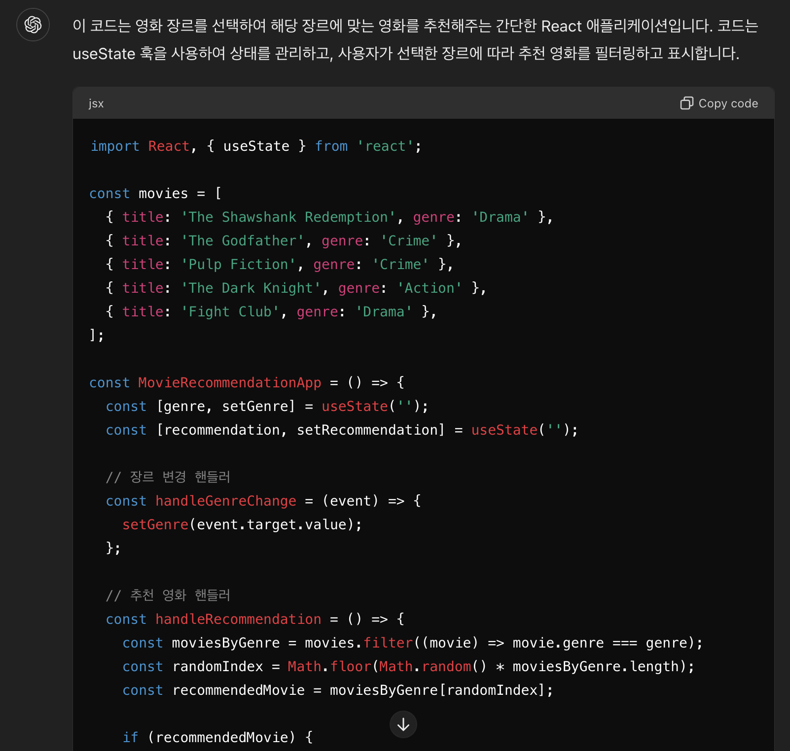
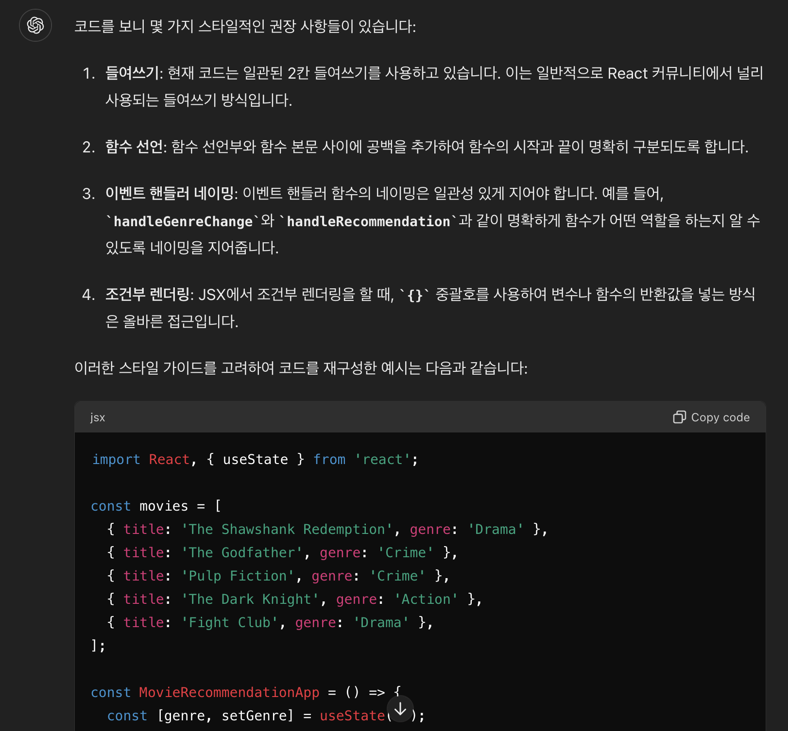
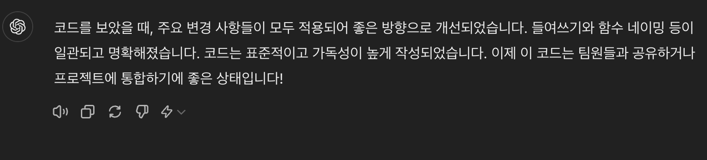
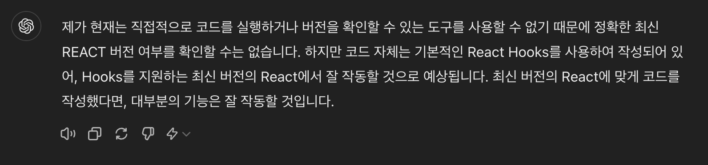

# 생성형 AI를 활용한 코드 리뷰

예상 소요 시간: 30분

소프트웨어 개발자로서 코드 작성에 익숙할 수 있습니다. 그러나 코딩 표준 유지, 보안 취약점 관리, 스타일링 및 기타 간과된 오류 관리에 대해 말할 때, 주로 코드와 논리에 집중하는 한이 있습니다. 생성적 AI는 검색 증강 생성을 사용하여 코드 검토를 지원하며 여러분을 도울 수 있습니다.

생성형 AI에 제공하는 프롬프트는 주제 전문가와의 대화와 같으며, 연이어 나오는 프롬프트는 이전 프롬프트와 받은 응답에 따라 달라집니다. 특정 원하는 결과를 얻기 위해 필요한 경우 문장을 변경할 수 있습니다. 예시는 목표 달성을 위한 한 가지 대화 예시를 보여줍니다.

## 학습 목표
이 실습을 마치면 다음을 할 수 있습니다:

- 생성형 AI를 사용하여 코드 검토하기
- 반복적으로 코드 문제 해결 및 확인하기

## 선행 조건
- REACT 코드 작성에 익숙해야 합니다.
- IDE에 접근할 수 있어야 합니다.

## 프롬프트 지시 설정
세션이 열리면 새로운 대화가 시작됩니다. 적절한 제목을 선택하여 채팅 대화에 제목을 붙입니다. 나중에 대화를 이어갈 때 유용하므로 대화를 주제별로 분리하는 것이 좋습니다.

또한, 이 특정 실습에서의 대화에 맞는 구체적인 프롬프트 지시를 제공하세요. REACT 코드 검토 작업을 시작합시다.

> **주의: 생성형 AI는 빠르게 발전하는 분야 입니다. 실습 결과가 여기서 보이는 것과 다를 수 있습니다.**


## 도구가 제공하는 리뷰 기능
REACT 코딩에 익숙합니다. JavaScript로 코드를 생성했습니다. 이제 동일한 코드를 Python으로 만드는 생성형 AI 모델을 사용합니다.

먼저, 생성형 AI 도구가 필요한 번역을 수행할 수 있는 능력이 있는지 확인해야 합니다. 프롬프트에 다음과 같이 입력하세요:

```
내가 REACT 코드를 작성했습니다. 코드를 검토할 수 있나요?
------
I have a written REACT code. Can you review the code?
```
보안 결함이나 스타일링에 대한 특정 검토를 원할 경우 이를 프롬프트에 추가할 수 있습니다.

```
내가 REACT 코드를 작성했습니다. 코드를 표준 스타일에 맞춰서 검토해 줄 수 있나요?
------
I have a written REACT code. Can you review the code for styling as per standards?
```
또는

```
내가 REACT 코드를 작성했습니다. 보안 취약점에 대해 코드를 검토해 줄 수 있나요?
------
I have a written REACT code. Can you review the code for security vulnerability?
```

생성형 AI 모델이 검토할 수 있는 능력이 있다면, 아래 이미지에 표시된 것과 유사한 긍정적인 응답을 받게 될 것입니다. 정확성을 확인하기 위해 반복적인 프롬프트를 사용할 수 있습니다.





## Gen AI에 코드 제공하기
아래의 코드를 프롬프트에 붙여넣고 전송하세요. 이 과정은 코드를 처리하고 리뷰를 제공하는 데 몇 초가 걸릴 수 있습니다.

```javascript
import React, { useState } from 'react';
const movies = [
{ title: 'The Shawshank Redemption', genre: 'Drama' },
{ title: 'The Godfather', genre: 'Crime' },
{ title: 'Pulp Fiction', genre: 'Crime' },
{ title: 'The Dark Knight', genre: 'Action' },
{ title: 'Fight Club', genre: 'Drama' },
];
const MovieRecommendationApp = () => {
const [genre, setGenre] = useState('');
const [recommendation, setRecommendation] = useState('');
const handleGenreChange = (event) => {
setGenre(event.target.value);
};
const handleRecommendation = () => {
const moviesByGenre = movies.filter((movie) => movie.genre === genre);
const randomIndex = Math.floor(Math.random() * moviesByGenre.length);
const recommendedMovie = moviesByGenre[randomIndex];
if (recommendedMovie) {
setRecommendation(recommendedMovie.title);
} else {
setRecommendation('No movies found for the selected genre');
}
};
return (
<div>
<h1>Movie Recommendation App</h1>
<label htmlFor="genre">Select a genre:</label>
<select id="genre" value={genre} onChange={handleGenreChange}>
<option value="">-- Select --</option>
<option value="Drama">Drama</option>
<option value="Crime">Crime</option>
<option value="Action">Action</option>
</select>
<button onClick={handleRecommendation}>Get Recommendation</button>
{recommendation && (<p>Recommended Movie: {recommendation}</p>)}
</div>
);
};
export default MovieRecommendationApp;
```


이전 프롬프트에서 필요한 검토 유형이 명시되지 않은 경우, 아래 이미지에 표시된 것처럼 응답이 너무 일반적일 수 있습니다.



## 특정 주제 검토
이전 응답이 너무 일반적이면 더 구체적인 요청으로 프롬프트를 제시해야 합니다. 이는 생성형 AI가 집중된 응답을 제공할 수 있게 돕습니다. 생성형 AI에게 명확한 대답을 얻기 위해 맥락을 제공하는 것이 좋습니다.

```
표준 스타일에 맞춰 코드를 검토해 주세요.
------
Review the code for styling as per standards.
```

다음과 유사한 출력이 표시될 것입니다. 더 구체적인 질문이 있을 경우 반복적으로 프롬프트를 제시할 수 있습니다.




노트패드나 vscode와 같은 편집기에서 건의 사항을 반영합니다.

## 수정 사항 확인을 위한 검토
노트패드나 vscode(또는 다른 코드 편집기)에서 건의된 변경 사항을 적용했다면, 해당 코드를 복사하여 제공된 공간에 붙여넣고 다시 수정된 코드를 검토하세요.

```
제안 사항대로 변경했습니다. 이제 확인해 주세요.
# 수정된 코드를 여기에 붙여넣으세요
------
I have made the changes as per suggestions. Please review to see if it ok now.
# Paste the corrected code here
---

```

모든 건의 사항이 구현되었다면, 아래에 제시된 결과와 유사한 것을 받게 될 것입니다. 모든 건의 사항이 구현되지 않았다면, 반복적으로 구현할 수 있습니다.




## 최신 버전 확인
생성형 AI 모델이 예를 들어 클래스 컴포넌트가 있는 오래된 REACT 버전을 사용하는 것을 지적할 것으로 예상할 수 있지만, 항상 확인하여 확인하는 것이 좋습니다.

다음과 같이 다음 프롬프트를 입력하세요.

```
이 코드는 최신 REACT 버전과 일치합니까?
------
Is this code inline with the latest version of REACT?
```



보안 취약점 검토, 프로그래밍 오류 검토 등의 추가 구체적인 질문을 위해 추가 프롬프트를 시도할 수 있습니다.

## 요약
축하합니다! REACT 코드를 검토하고 수정했습니다. 생성형 AI로 생성된 결과에 만족하면 최종 코드로 사용할 수 있습니다. 더 발전시키고 싶다면 추가 관련 질문을 할 수 있습니다. 생성형 AI는 외부 출처에서 추가적인 정보와 현실감 있는 응답을 제공받습니다. 생성형 AI는 아직 발전 중인 기술이므로 최종 판단은 사용자가 해야 합니다.

